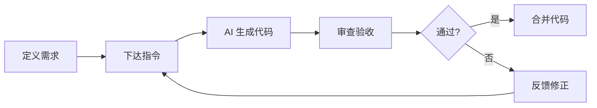

# 1.2 你不是一个人在战斗——Vibe Coding 心法：从"写代码"到"指挥 AI 写代码"

### 认知重构

传统编程的核心能力是"写代码"——你需要记住语法、理解 API、手搓每一行逻辑。而 Vibe Coding 的核心能力是"指挥 AI 写代码"——你需要清晰地定义需求、有效地沟通意图、准确地验收结果。

**这是一次角色的根本性转变：从"施工工人"变成"项目总设计师"。**

### 本节目标

学完本节后，你将建立以下核心能力：

1. **思维转变**：从编码员到指挥官的身份认知
2. **提示工程**：如何与 AI 有效沟通
3. **代码审查**：如何验收 AI 的产出
4. **工具选择**：不同场景下选择合适的 AI 模型

### Vibe Coding 的核心循环

这个循环的关键点：

- **定义需求**：你需要非常清楚自己想要什么（这比写代码更难）
- **下达指令**：用 AI 能理解的方式表达需求
- **审查验收**：判断 AI 的产出是否符合预期
- **反馈修正**：如果不对，告诉 AI 哪里不对、怎么改

### 子章节导航

| 章节 | 主题 | 核心问题 |
|------|------|----------|
| 1.2.1 | 从编码员到指挥官 | 如何转变思维？ |
| 1.2.2 | AI Native 应用特点 | AI 时代的应用有何不同？ |
| 1.2.3 | 提示工程基础 | 如何与 AI 有效沟通？ |
| 1.2.4 | 代码审查 | 如何验收 AI 的代码？ |

### 心法口诀

> **想清楚**：先明确你要什么，再开口
> **说明白**：用结构化的语言表达需求
> **看仔细**：AI 的代码不是写完就能用
> **改到位**：反馈要具体，不要泛泛而谈
