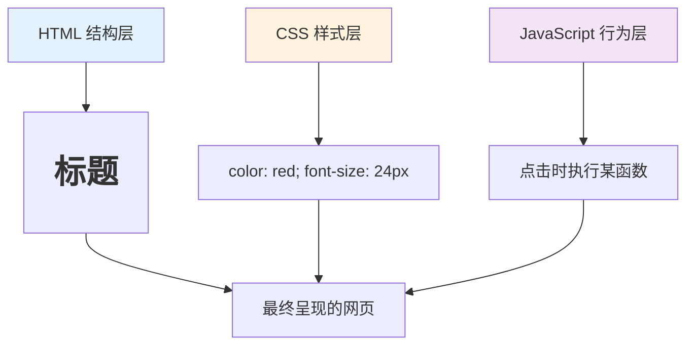
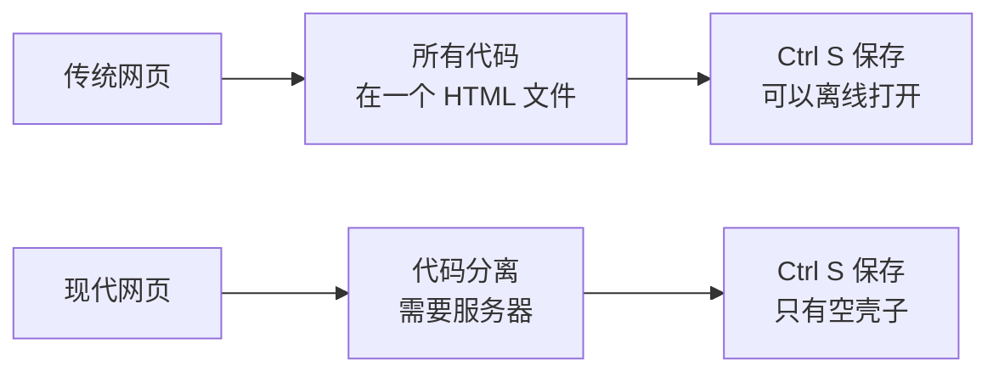
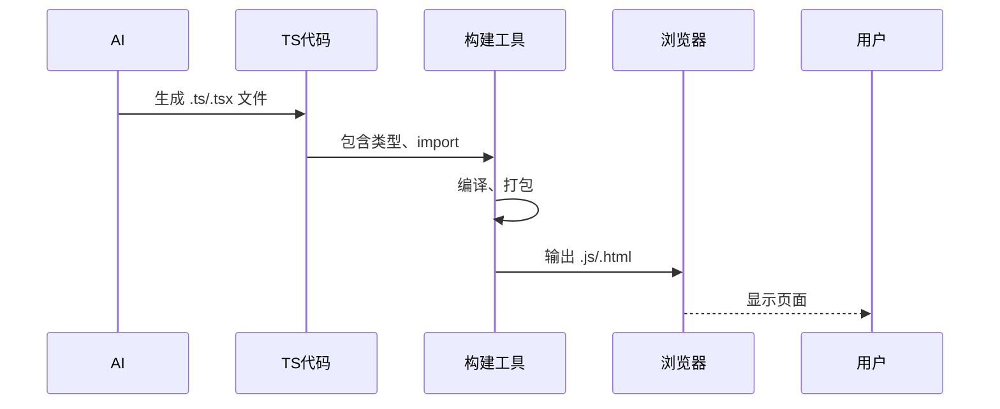

# 1.1 代码格式演变


> 序言中提到的 AI 有时给出 `.html` 文件，有时给出 `.ts` 文件，这是因为代码格式随着项目复杂度在演变。

## 前置知识

::: tip 什么是 HTML

HTML（HyperText Markup Language）定义网页的**结构**——有什么内容。浏览器可以直接打开 `.html` 文件并显示。

```html
<h1>标题</h1>
<p>段落</p>
<button>按钮</button>
```
:::

::: tip 什么是 CSS

CSS（Cascading Style Sheets）定义网页的**样式**——长什么样。

```css
h1 { color: red; font-size: 24px; }
button { background: blue; padding: 10px; }
```
:::

::: tip 什么是 JavaScript

JavaScript 定义网页的**行为**——怎么交互。

```javascript
button.addEventListener('click', () => {
  alert('被点击了');
});
```
:::

::: tip 什么是 TypeScript

TypeScript 是 JavaScript 的超集，添加了类型系统。浏览器不能直接运行 TypeScript，需要编译成 JavaScript。

```typescript
// TypeScript 指定类型
const count: number = 0;

// 编译成 JavaScript
const count = 0;
```
:::

## 核心概念

### HTML、CSS、JavaScript 的关系

网页由三层组成：



**一个完整的例子**：

```html
<!DOCTYPE html>
<html>
<head>
  <style>
    /* CSS: 样式层 */
    .box { background: #f0f0f0; padding: 20px; }
    .count { font-size: 24px; color: #333; }
  </style>
</head>
<body>
  <!-- HTML: 结构层 -->
  <div class="box">
    <span class="count">0</span>
    <button>增加</button>
  </div>

  <script>
    /* JavaScript: 行为层 */
    let count = 0;
    document.querySelector('button').addEventListener('click', () => {
      count++;
      document.querySelector('.count').textContent = count;
    });
  </script>
</body>
</html>
```

把这三种代码写在一个 `.html` 文件里，就是**单文件格式**——双击就能运行，不需要安装任何东西。

### 为什么保存的网页有的打不开？

你可能试过用 `Ctrl + S` 保存一个喜欢的网页，再次打开时出现不同情况：

| 情况 | 原因 |
|------|------|
| **完全正常** | 网页是单文件格式，所有代码都在一个 HTML 里 |
| **有样式但点不了** | CSS 在本地，但 JavaScript 从服务器加载，断网就失效 |
| **样式乱了** | CSS 和 JS 都从服务器加载，本地只有 HTML 结构 |
| **完全打不开** | 网页是"单页应用"，需要服务器支持，本地文件无法运行 |

**现代网站（如微博、B 站）为什么不能保存？**

它们使用 React/Next.js 等**框架**开发：

1. **代码分离**：HTML、CSS、JS 在不同文件
2. **动态加载**：内容通过 JavaScript 从服务器获取
3. **需要编译**：你看到的是编译后的结果，不是源代码

保存 `Ctrl + S` 只能得到一个空的 HTML 壳子，所有内容都需要服务器才能运行。



现代 Web 开发的代码格式演变，经历了从单文件到模块化的过程：


### 1. 单文件阶段（适合演示）

最简单的形式，所有代码在一个 `.html` 文件中：

```html
<!DOCTYPE html>
<html>
<head>
  <style>
    body { background: #f0f0f0; }
  </style>
</head>
<body>
  <h1>Hello World</h1>
  <script>
    console.log('Hello');
  </script>
</body>
</html>
```

**特点**：
- ✅ 简单，双击即可运行
- ✅ 适合快速演示
- ❌ 代码难以维护
- ❌ 无法使用现代开发工具

::: tip 单文件 HTML 的适用场景

单文件格式适合：
- **学习与教学**：理解基础概念
- **快速原型**：验证想法
- **简单工具**：计算器、转换器
- **代码演示**：分享代码片段

不适合：
- 复杂业务逻辑
- 需要数据持久化的应用
- 需要多人协作的项目
:::

### 2. 文件分离阶段

结构（HTML）、样式（CSS）、逻辑（JS）分开：

```
project/
├── index.html
├── style.css
└── script.js
```

```html
<!-- index.html -->
<link rel="stylesheet" href="style.css">
<script src="script.js"></script>
```

::: tip 什么时候需要分离文件？

当你的单文件 HTML 超过 200-300 行时，就应考虑分离：

- **样式超过 50 行**：独立 CSS 文件
- **脚本超过 50 行**：独立 JS 文件
- **多个页面共享样式**：必须分离

分离后代码更清晰，修改时更容易定位。

:::

**特点**：
- ✅ 职责分离清晰
- ❌ 文件依赖关系手动管理
- ❌ 无法使用 npm 包

### 3. 模块化阶段

使用 `import`/`export` 组织代码：

```javascript
// utils.js
export function formatDate(date) {
  return date.toISOString();
}

// app.js
import { formatDate } from './utils.js';
```

::: tip 什么时候需要模块化？

当出现以下情况时，应考虑模块化：

- **代码重复**：同一函数在多个文件中出现
- **文件过长**：单个文件超过 300 行
- **团队协作**：多人同时开发不同功能

模块化让代码可以像积木一样复用和组合。

:::

**特点**：
- ✅ 代码可复用
- ✅ 依赖关系清晰
- ❌ 浏览器需要构建工具支持

### 4. TypeScript 工程化阶段

使用 TypeScript + 构建工具：

```typescript
// utils.ts
export function formatDate(date: Date): string {
  return date.toISOString();
}

// App.tsx
import { formatDate } from './utils';
const dateStr: string = formatDate(new Date());
```

::: tip 什么时候需要 TypeScript？

当项目满足以下条件时，建议使用 TypeScript：

- **复杂逻辑**：涉及数据验证、状态管理
- **多人协作**：需要明确的接口约定
- **长期维护**：项目会持续迭代
- **使用 AI 开发**：AI 更擅长生成类型安全的代码

如果只是简单 Demo 或一次性脚本，JavaScript 足够。

:::

**特点**：
- ✅ 类型安全，减少错误
- ✅ 现代 JavaScript 特性
- ✅ 完整的工程化工具链
- ❌ 需要构建环境

::: danger TypeScript 编译流程

TypeScript 代码**不能直接在浏览器运行**，必须经过以下流程：

```
.ts/.tsx 文件 → TypeScript 编译器 → .js 文件 → 浏览器执行
```

**开发环境**：使用 `pnpm dev` 启动开发服务器，自动编译
**生产环境**：使用 `pnpm build` 打包优化后的代码

**常见错误**：
```bash
# 直接打开 .tsx 文件
# ❌ 错误：浏览器显示源代码或报错

# 正确做法
pnpm install
pnpm dev
# 访问 localhost:3000
```
:::

## 为什么 AI 生成的代码需要环境

当你让 AI 生成复杂功能时，它会使用：

- **TypeScript**：类型系统避免错误
- **React/Next.js**：现代前端框架
- **npm 包**：现成的功能模块（如 `dayjs`、`zod`）
- **import/export**：模块化组织

这些技术**不能直接在浏览器中运行**，需要：

1. **Node.js**：提供运行环境
2. **构建工具**：将 TS 编译成 JS
3. **包管理器**：安装 npm 包



## 实战步骤

### 判断代码类型

**单文件 HTML**：
```bash
# 直接打开
open index.html      # Mac
start index.html     # Windows
```

**TypeScript 项目**：
```bash
# 需要 Node.js 环境
pnpm install   # 安装依赖
pnpm dev       # 启动开发服务器
```

### 让 AI 选择合适的格式

根据项目复杂度提示 AI：

```
"生成一个简单的时间显示组件" → 可能是单文件 HTML
"生成一个完整的任务管理应用" → 一定是 TS + React 项目
```

## 常见问题

### Q1: 为什么不一直用单文件 HTML？

**A**: 复杂项目用单文件无法维护。

想象一个 1000 行的 HTML 文件，修改一个样式需要在 500 行处找到对应的 `<style>` 标签，这是灾难。模块化让每个文件只负责一件事。

### Q2: TypeScript 和 JavaScript 有什么区别？

**A**: TypeScript 是 JavaScript 的升级版，增加了类型检查。

```typescript
// TypeScript 写代码时会指出类型不匹配
const count: number = "hello";  // ❌ 编辑器会标红

// JavaScript 要运行后才报错
const count = "hello";
count.toFixed(2);  // 💥 运行时崩溃
```

**对你的影响**：AI 会用 TypeScript 写代码，因为它能减少错误。你不需要记住语法，只需要：
- 知道 `.ts` 或 `.tsx` 文件需要通过 `pnpm dev` 运行
- 看到类型标注（如 `: string`）时知道这是 TypeScript 即可

### Q3: 我只需要做一个简单 Demo，用什么格式？

**A**: 单文件 HTML 足够。

让 AI 知道你的需求："生成一个单文件 HTML 的计数器"。

## 核心理念

代码格式的选择是**复杂度与工具链的权衡**：

| 复杂度 | 推荐格式 | 运行方式 |
|--------|----------|----------|
| 简单 Demo | 单文件 HTML | 直接打开 |
| 中等项目 | 模块化 JS | 需要 build |
| 复杂应用 | TypeScript + 框架 | 需要 dev server |

**原则**：能用简单方案就不用复杂方案，但不要在复杂项目上强行使用简单方案。

## 相关内容

- 详见：[1.2 技术栈概念](./02-tech-stack.md)
- 详见：[1.3 浏览器与服务器基础](./03-browser-server-basics.md)
- 后续：[1.5 Node.js 环境与包管理](./05-nodejs-package-manager.md)
