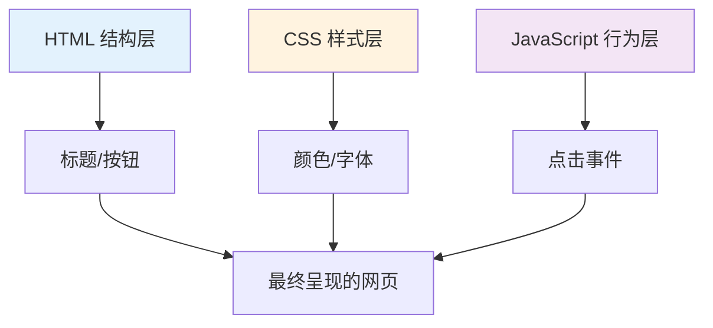
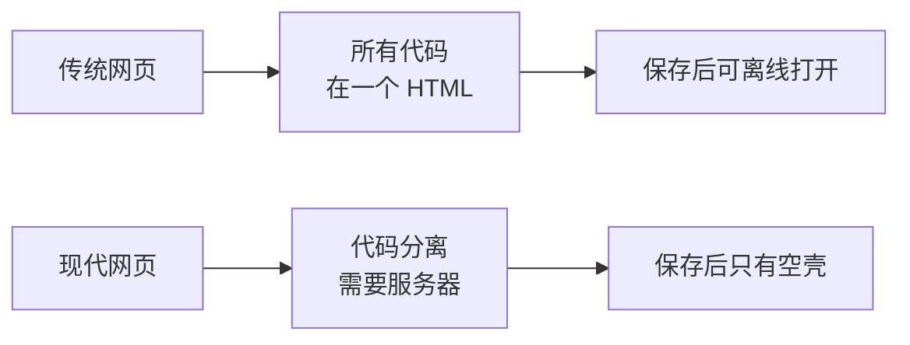

# 1.1 代码格式演变

> **阅读完本节后，你将会收获：**
> - 理解 HTML、CSS、JavaScript 三者如何协同工作构建网页
> - 了解代码格式从单文件到模块化、TypeScript 的演变过程
> - 知道什么时候用简单格式，什么时候用复杂格式
> - 理解为什么 AI 生成的代码需要特定的运行环境

> 序言中提到的 AI 有时给出 `.html` 文件，有时给出 `.ts` 文件，这是因为代码格式随着项目复杂度在演变。

## 网页的三层结构

网页就像一个三明治，由三层组成：



**一个完整的例子**：

```html
<!DOCTYPE html>
<html>
<head>
  <style>
    /* CSS: 样式层 — 长什么样 */
    .box { background: #f0f0f0; padding: 20px; }
    .count { font-size: 24px; }
  </style>
</head>
<body>
  <!-- HTML: 结构层 — 有什么内容 -->
  <div class="box">
    <span class="count">0</span>
    <button>增加</button>
  </div>

  <script>
    /* JavaScript: 行为层 — 怎么交互 */
    let count = 0;
    document.querySelector('button').addEventListener('click', () => {
      count++;
      document.querySelector('.count').textContent = count;
    });
  </script>
</body>
</html>
```

把这三种代码写在一个 `.html` 文件里，就是**单文件格式**——双击就能运行，不需要安装任何东西。

## 为什么保存的网页有的打不开？

你可能试过用 `Ctrl + S` 保存一个喜欢的网页，再次打开时出现不同情况：

| 现象 | 原因 |
|------|------|
| **完全正常** | 单文件格式，所有代码都在一个 HTML 里 |
| **有样式但点不了** | CSS 在本地，JS 从服务器加载，断网失效 |
| **样式全无** | CSS 和 JS 都从服务器加载，本地只有空壳 |
| **完全打不开** | 现代单页应用，需要服务器才能运行 |

现代网站（如微博、B 站）使用 React/Next.js 等框架开发：代码分离在不同文件，内容通过 JS 动态获取，保存下来的只是一个空 HTML 壳子。



## 代码格式的四个阶段


### 阶段 1：单文件 HTML

所有代码在一个 `.html` 文件中。

**适用场景**：简单 Demo、学习概念、快速原型

**局限**：代码超过 200 行后就难以维护

### 阶段 2：文件分离

结构（HTML）、样式（CSS）、逻辑（JS）分开：

```
project/
├── index.html
├── style.css
└── script.js
```

**适用场景**：代码超过 200 行，或多个页面共享样式

**局限**：文件依赖关系需要手动管理，无法使用 npm 包

### 阶段 3：模块化

使用 `import`/`export` 组织代码：

```javascript
// utils.js
export function formatDate(date) {
  return date.toISOString();
}

// app.js
import { formatDate } from './utils.js';
```

**适用场景**：代码有重复逻辑，或多人协作

**局限**：浏览器需要构建工具支持

### 阶段 4：TypeScript 工程化

使用 TypeScript + 构建工具：

```typescript
// utils.ts
export function formatDate(date: Date): string {
  return date.toISOString();
}
```

**适用场景**：复杂逻辑、多人协作、长期维护的项目

**为什么 AI 喜欢用 TypeScript？**

- 类型系统减少错误
- AI 更擅长生成类型安全的代码
- 现代前端开发的标配

::: danger TypeScript 不能直接运行

TypeScript 代码**不能直接在浏览器运行**，必须经过编译：

```
.ts/.tsx 文件 → TypeScript 编译器 → .js 文件 → 浏览器执行
```

**开发时**：`pnpm dev` 自动编译
**上线时**：`pnpm build` 打包优化

:::

## 如何选择代码格式

| 项目复杂度 | 推荐格式 | 运行方式 |
|------------|----------|----------|
| 简单 Demo、一次性脚本 | 单文件 HTML | 直接打开 |
| 中小型项目 | 模块化 JS | 需要 build |
| 复杂应用、多人协作 | TypeScript + 框架 | 需要 dev server |

**原则**：能用简单方案就不用复杂方案，但不要在复杂项目上强行用简单方案。

让 AI 知道你的需求，它会选择合适的格式：

```
"生成一个单文件 HTML 的计数器" → 单文件，双击可运行
"生成一个任务管理应用" → TypeScript 项目，需要 pnpm dev
```

## 常见问题

### Q1: TypeScript 和 JavaScript 有什么区别？

TypeScript 是 JavaScript 的升级版，增加了类型检查。

```typescript
// TypeScript 写代码时会指出错误
const count: number = "hello";  // ❌ 编辑器标红

// JavaScript 要运行后才报错
const count = "hello";
count.toFixed(2);  // 💥 运行时崩溃
```

你不需要记住语法，只需要知道：
- `.ts` 或 `.tsx` 文件需要通过 `pnpm dev` 运行
- 看到 `: string` 这种类型标注时，知道这是 TypeScript 即可

### Q2: 为什么不一直用单文件 HTML？

复杂项目用单文件无法维护。想象一个 1000 行的 HTML 文件，修改样式需要在 500 行处找对应的 `<style>` 标签——这是灾难。模块化让每个文件只负责一件事。

### Q3: AI 生成的代码跑不起来怎么办？

首先判断代码类型：

**单文件 HTML**：
```bash
# 直接双击，或
open index.html      # Mac
start index.html     # Windows
```

**TypeScript 项目**：
```bash
pnpm install   # 安装依赖
pnpm dev       # 启动开发服务器
```

如果还是报错，把错误信息发给 AI，它会告诉你具体原因。

## 相关内容

- 详见：[1.2 技术栈概念]
- 详见：[1.3 浏览器与服务器基础]
- 后续：[1.5 Node.js 环境与包管理]
