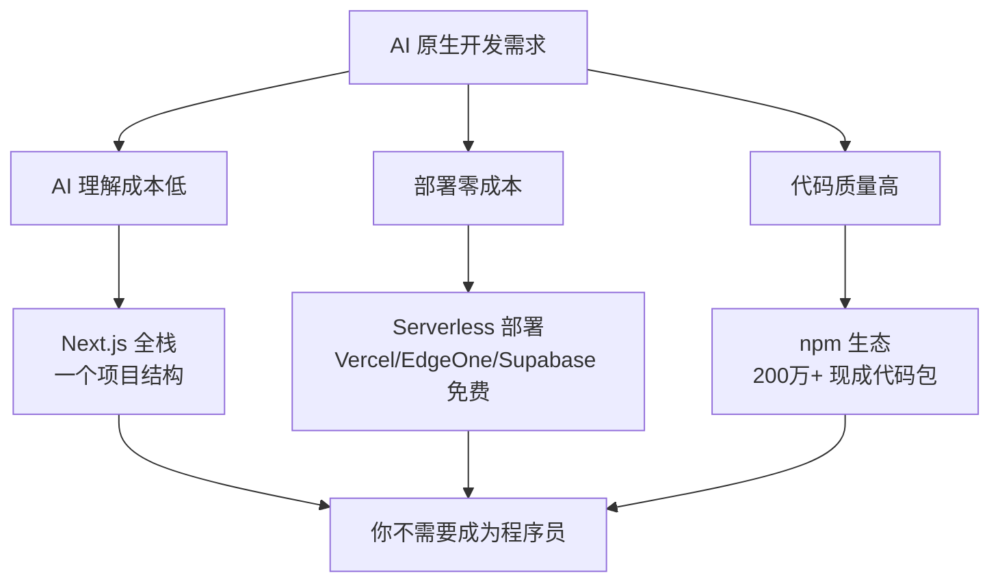

# 1.2 技术栈概念

> **阅读完本节后，你将会收获：**
> - 理解什么是技术栈以及前端、后端、数据库的分层架构
> - 了解本教程采用的 AI 原生全栈技术栈及其选择原因
> - 掌握通过 package.json 快速识别项目技术栈的方法
> - 理解为什么这套技术栈更适合 AI 辅助开发和产品快速落地
> - 知道各技术（Next.js、TypeScript、Prisma、PostgreSQL 等）的作用

> 序言中提到的 TypeScript、Next.js 等名词，构成了现代 Web 开发的技术栈。

## 前置知识

::: tip 什么是 技术栈

技术栈（Tech Stack）是开发项目时使用的技术组合，包括前端、后端、数据库等层级。
:::

::: tip 什么是 前端与后端

**前端**：用户看到的界面，运行在浏览器中（HTML、CSS、JavaScript）。

**后端**：服务器端逻辑，处理数据、业务逻辑（Node.js、Python、Go）。

**数据库**：存储数据（PostgreSQL、MongoDB）。
:::

## 核心概念

现代 Web 应用的技术分层：

```
用户界面
  ├─ 浏览器
  └─ 移动端
        ↓
全栈框架（Next.js 等）
        ↓
前端层
  ├─ React 组件
  ├─ TypeScript
  └─ Tailwind CSS
        ↓
后端层
  ├─ API Routes
  ├─ Server Actions
  └─ Middleware
        ↓
数据存储
  ├─ Drizzle ORM
  ├─ PostgreSQL
  └─ Supabase
```

### 全栈技术栈

本教程采用的**全栈技术栈**：

| 层级 | 技术选型 | 作用 |
|------|----------|------|
| **框架** | Next.js 16 | 前后端一体的全栈框架 |
| **语言** | TypeScript | 类型安全的 JavaScript |
| **样式** | Tailwind CSS | 实用优先的 CSS 框架 |
| **组件库** | shadcn/ui | 可复用的 UI 组件 |
| **数据库 ORM** | Drizzle ORM | 类型安全的数据库操作 |
| **数据库** | PostgreSQL | 关系型数据库 |
| **AI 集成** | Vercel AI SDK | 流式 AI 交互 |

::: tip 什么时候需要全栈开发？

当你的项目需要以下功能时，应考虑全栈技术栈：

- **用户系统**：登录、注册、权限管理
- **数据持久化**：保存用户数据到数据库
- **业务逻辑**：支付、通知、邮件发送
- **API 接口**：与其他服务集成

如果只是纯静态展示（如公司官网），简单的 HTML + CSS 足够。

:::

### 为什么选择这套技术栈

这套技术栈是**专为 AI 原生开发**选择的，每个决策都为了让 AI 更高效、让你更省钱。

**为什么网上教程教 Java/Python/Go，而这套技术栈少见？**

| 传统教学路径 | AI 原生路径 |
|-------------|-------------|
| 教 Java/Python/Go → 面向大学课程、企业后端 | 教 Next.js/TypeScript → 面向产品快速落地 |
| 强调"计算机基础"：数据结构、算法、并发 | 强调"解决问题"：选对工具、快速迭代 |
| 目标是"成为程序员" | 目标是"用产品解决问题" |
| 学习周期：6-24 个月 | 学习周期：跟着教程做项目即学会 |
| 适合：科班教育、大厂招聘 | 适合：个人开发者、创业者、产品人 |

**根本原因**：大多数编程教程是**教你找工作**，而这套教程是**教你做产品**。

传统路径把编程当作职业技能来教，需要系统学习。但 AI 时代，你不需要成为程序员——你需要的是理解工具、描述需求、让 AI 帮你实现。

**1. Next.js 全栈：AI 理解成本低，一个命令启动**

| 传统方式 | Next.js 全栈 |
|---------|-------------|
| 前端一个项目，后端另一个项目 | 前后端在同一个项目 |
| 需要配置 API 跨域、CORS | 写 API 就在 `app/api/` 目录，无需配置 |
| 本地需要启动两个服务 | 一个 `pnpm dev` 全部启动 |

**对你的影响**：AI 只需要理解一个项目结构，生成的代码更不容易出错。你只需要记住一个命令。

::: tip Serverless 与云原生

**Serverless**：不需要管理服务器，上传代码就能运行。

**云原生**：为云环境设计，天然支持自动扩展、零停机部署。

Next.js + Vercel 的组合让部署变成"推送代码即上线"，详见第12章。
:::

::: tip 什么是"造轮子"

"造轮子"指从头实现已有功能，比如自己写用户认证、时间处理等。但 npm 上已经有数百万个现成的"轮子"——代码包，直接拿来用即可。
:::

**2. 部署方便，且免费**

| 平台 | 说明 |
|------|------|
| **Vercel** | Next.js 官方平台，一键部署，支持 Next.js 全栈项目 |
| **EdgeOne** | 腾讯云 Edge Platform，支持 Next.js 全栈项目，国内访问更快 |
| **Supabase** | PostgreSQL + 实时订阅 + 认证 |
| **Cloudflare** | 边缘计算，全球加速 |

**对比**：传统方案需要租服务器（¥50-200/月），这套技术栈可以**几乎零成本上线**。

**3. npm 生态：不重复造轮子**

npm 是世界上最大的开源代码仓库，有超过 200 万个包。

```bash
# 需要用户认证？安装现成的包
pnpm add next-auth

# 需要处理时间？安装现成的包
pnpm add dayjs

# 需要验证数据？安装现成的包
pnpm add zod
```

**对你的影响**：AI 不会从零写代码，而是组合这些现成的"积木"。你获得的是经过数百万次验证的可靠代码。

**4. PostgreSQL：强大且有免费方案**

::: tip 为什么国内教程教 MySQL，而这里用 PostgreSQL？

国内教程教 MySQL 是因为早年它免费且被广泛采用。但选择 PostgreSQL 的关键原因是有**免费 BaaS 平台**：

| 数据库 | 免费托管平台 |
|--------|-------------|
| **PostgreSQL** | Supabase、Neon、Railway |
| **MySQL** | 几乎没有 |

:::

**5. 仅需 API 成本**

| 项目 | 传统成本 | 本教程 |
|------|----------|--------|
| 部署 | ¥50-200/月 | 免费 |
| 域名 | ¥50-100/年 | 免费（实践篇投稿成功可获专属二级域名，或使用网上免费二级域名） |
| **总计** | **¥100-500/年** | **仅需 AI API 成本** |

## 实战步骤

### 识别项目的技术栈

::: tip 什么时候需要查看技术栈？

接手一个新项目时，需要先了解技术栈：

- **本地运行**：确认需要安装哪些依赖（Node.js 版本、数据库等）
- **问题排查**：知道该搜索什么关键词
- **功能开发**：了解项目规范和代码风格

查看 `package.json` 是最快的方式。

:::

当接手或学习一个项目时，快速了解它使用了哪些技术：

**常见依赖识别**（查看 `package.json`）：

| 依赖名 | 技术类型 |
|--------|----------|
| `next` | Next.js 全栈框架 |
| `react` | React 前端库 |
| `typescript` | TypeScript 类型系统 |
| `drizzle-orm` | Drizzle 数据库 ORM |
| `tailwindcss` | Tailwind CSS 样式框架 |
| `@vercel/node` | Vercel 部署相关 |
| `ai` | Vercel AI SDK |

这能帮助你：知道项目是什么类型、需要哪些环境、遇到问题时该搜索什么。

## 常见问题

### Q1: 我需要理解这些技术吗？

**A**: 需要知道它们是什么，不需要会写。

| 层级 | 你需要知道 | 不需要 |
|------|-----------|--------|
| 概念 | Next.js 是全栈框架，TypeScript 有类型检查 | 记住语法 |
| 作用 | Drizzle ORM 用来操作数据库，Tailwind 写样式 | 手写代码 |
| 识别 | 看到 `.tsx` 知道是 TypeScript 文件 | 理解底层原理 |

AI 会负责写代码，你只需要：
- 知道每个技术解决什么问题
- 能看懂项目的结构
- 能描述你想要的功能

### Q2: 为什么不直接用 JavaScript，要用 TypeScript？

**A**: TypeScript 在开发阶段就能发现错误。AI 会用 TypeScript 写代码，因为它能减少错误。你只需要看到后缀（如 `.ts`）时知道这是 TypeScript 即可。
## 核心理念

**这套技术栈的核心优势：让 AI 高效，让你省钱。**



**记住**：
1. **AI 的效率**：项目结构越统一，AI 生成的代码越可靠
2. **你的成本**：用免费工具 + 免费部署 = 零成本上线
3. **国内加速**：EdgeOne 等 Serverless 平台让国内用户访问更快

## 相关内容

- 详见：[1.1 代码格式演变]
- 详见：[1.3 浏览器与服务器基础]
- 后续：[1.5 Node.js 环境与包管理]
