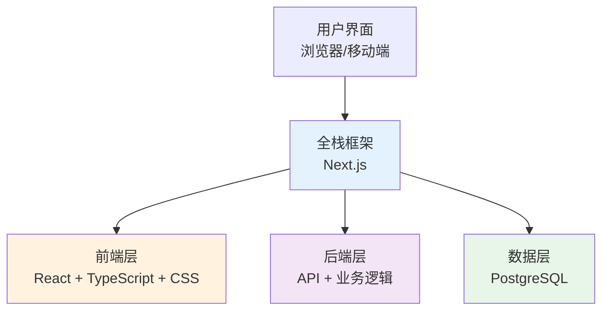

# 1.2 技术栈概念

> **阅读完本节后，你将会收获：**
> - 理解技术栈的分层架构（前端、后端、数据库）
> - 了解本教程采用的技术栈及其选择原因
> - 掌握通过 package.json 快速识别项目技术栈

> 序言中提到的 TypeScript、Next.js 等名词，构成了现代 Web 开发的技术栈。

## 技术栈是什么

**技术栈（Tech Stack）**是开发项目时使用的技术组合。

现代 Web 应用分三层：



- **前端**：用户看到的界面（HTML、CSS、JavaScript）
- **后端**：服务器端逻辑，处理数据（Node.js、Python）
- **数据库**：存储数据（PostgreSQL、MongoDB）

本教程用的是 **Next.js 全栈框架**——前后端在同一个项目中，一个命令全部启动。

## 本教程的技术栈

| 层级 | 技术选型 | 作用 |
|:-----|:---------|:----|
| **框架** | Next.js | 前后端一体 |
| **语言** | TypeScript | 类型安全 |
| **样式** | Tailwind CSS | 实用优先的 CSS |
| **组件库** | shadcn/ui | 可复用的 UI 组件 |
| **用户认证** | better-auth | 类型安全的认证 |
| **数据库 ORM** | Drizzle ORM | 类型安全的数据库操作 |
| **数据库** | PostgreSQL | 关系型数据库 |
| **AI 集成** | Vercel AI SDK | 流式 AI 交互 |

::: tip 常用"轮子"参考

npm 上有数百万个现成的代码包，以下是常用的：

| 功能 | 推荐包 |
|------|--------|
| **表单验证** | `zod` |
| **表单管理** | `react-hook-form` |
| **数据请求** | `@tanstack/react-query` |
| **时间处理** | `date-fns` 或 `dayjs` |
| **HTTP 客户端** | `axios` 或 `ofetch` |
| **图标** | `lucide-react` |
| **工具函数** | `lodash` |

AI 会根据需求选择合适的包，你只需要知道"不重复造轮子"这个原则。

:::

## 为什么选这套技术栈

这套技术栈是**为 AI 原生开发**选择的，核心原则：让 AI 更高效、让你更省钱。

**1. AI 理解成本低**

Next.js 全栈 = 前后端在同一个项目。传统方式需要两个项目、配置跨域、启动两个服务；Next.js 只需一个 `pnpm dev`。项目结构越统一，AI 生成的代码越不容易出错。

**2. 部署零成本**

| 方案 | 成本 |
|------|------|
| 传统：租服务器 | ¥50-200/月 |
| 本教程：Vercel/EdgeOne | 免费 |

**3. npm 生态：不重复造轮子**

npm 是世界最大的开源代码仓库，有超过 200 万个包。

```bash
# 需要用户认证？现成的
pnpm add next-auth

# 需要处理时间？现成的
pnpm add dayjs

# 需要验证数据？现成的
pnpm add zod
```

AI 不会从零写代码，而是组合这些现成的"积木"。

**4. PostgreSQL 有免费托管**

| 数据库 | 免费托管平台 |
|--------|-------------|
| PostgreSQL | Supabase、Neon、Railway |
| MySQL | 几乎没有 |

**5. 什么时候需要全栈？**

如果只是纯静态展示（如公司官网），HTML + CSS 足够。当你的项目需要：
- 用户系统（登录、注册、权限）
- 数据持久化（保存用户数据）
- 业务逻辑（支付、通知、邮件）

就考虑全栈技术栈。

## 快速识别项目技术栈

接手新项目时，查看 `package.json` 就能快速了解技术栈：

| 依赖名 | 技术类型 |
|--------|----------|
| `next` | Next.js 全栈框架 |
| `react` | React 前端库 |
| `typescript` | TypeScript 类型系统 |
| `drizzle-orm` | Drizzle 数据库 ORM |
| `tailwindcss` | Tailwind CSS 样式 |
| `ai` | Vercel AI SDK |

知道技术栈后，你就知道：
- 项目是什么类型
- 需要哪些环境
- 遇到问题该搜索什么关键词

## 常见问题

### Q1: 我需要理解这些技术吗？

知道它们是什么、解决什么问题即可，不需要会写。AI 会负责写代码，你只需要：
- 能看懂项目的结构
- 能描述你想要的功能

### Q2: 为什么用 TypeScript 而不是 JavaScript？

TypeScript 在开发阶段就能发现错误，AI 会用它写代码。你只需要看到 `.ts` 后缀时知道这是 TypeScript 即可。

### Q3: 和大学教的 Java/Python 有什么区别？

| 传统教学 | AI 原生路径 |
|---------|-------------|
| 面向找工作 | 面向做产品 |
| 学 6-24 个月 | 跟着做项目即学会 |
| 成为程序员 | 用工具解决问题 |

根本区别：大多数教程教你成为程序员，而这套教程教你用产品解决问题。AI 时代，你不需要成为程序员——你需要的是理解工具、描述需求、让 AI 帮你实现。

## 相关内容

- 详见：[1.1 代码格式演变]
- 详见：[1.3 浏览器与服务器基础]
- 后续：[1.5 Node.js 环境与包管理]
