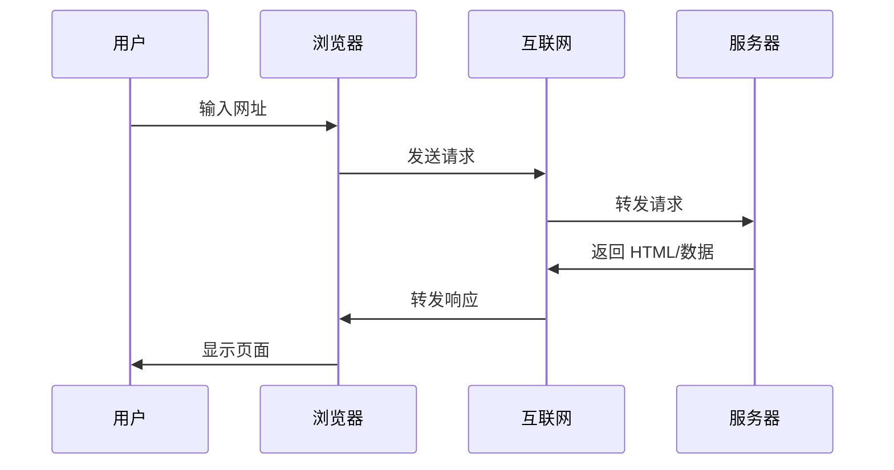
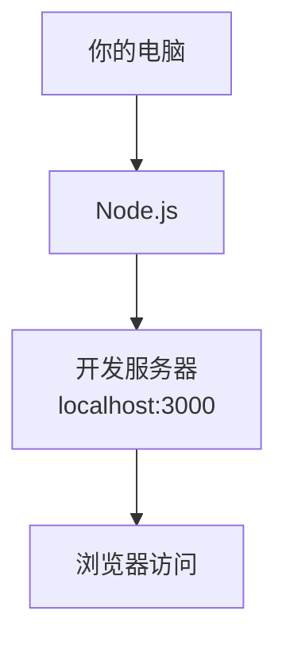
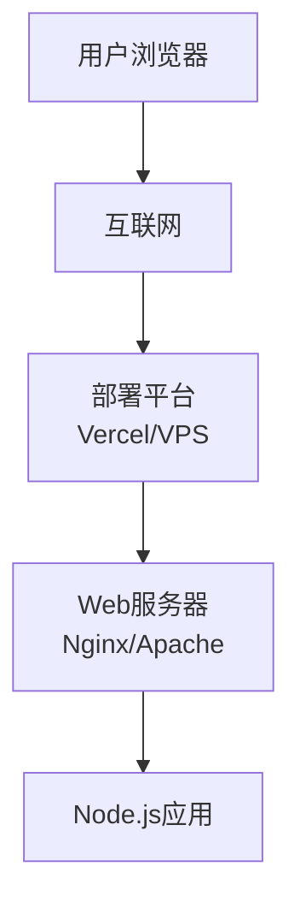

# 1.3 浏览器与服务器基础


> 序言中提到的"浏览器看不懂 TypeScript"，是因为浏览器和服务器的职责不同。

## 前置知识

::: tip 什么是 浏览器

浏览器（Chrome、Firefox、Safari）是运行在用户电脑上的软件，负责显示网页。它只能理解 HTML、CSS、JavaScript。
:::

::: tip 什么是 服务器

服务器是远程的计算机，运行着 Web 服务器软件（如 Nginx、Apache），响应浏览器的请求，返回网页或数据。
:::

::: tip 什么是 客户端与服务端

**客户端（Client）**：用户使用的设备（浏览器、手机 App）。

**服务端（Server）**：提供服务的一方（服务器、API）。
:::

## 核心概念

Web 应用的基本工作流程：



### 浏览器的职责

浏览器是**客户端环境**，它负责：

1. **渲染页面**：将 HTML 转换为可视界面
2. **执行 JavaScript**：运行交互逻辑
3. **发送请求**：向服务器获取数据
4. **管理状态**：存储 Cookie、LocalStorage

**浏览器能直接运行的**：
- ✅ HTML
- ✅ CSS
- ✅ JavaScript
- ❌ TypeScript（需要编译）
- ❌ Python、Go（后端语言）

### 服务器的职责

服务器是**服务端环境**，它负责：

1. **处理请求**：接收浏览器的请求
2. **业务逻辑**：计算、验证、数据处理
3. **查询数据库**：存储和检索数据
4. **返回响应**：返回 HTML 或 JSON

**服务器能运行的**：
- ✅ Node.js（JavaScript 运行时）
- ✅ TypeScript（编译后）
- ✅ Python、Go、Java
- ❌ 浏览器 API（如 `window`、`document`）

### 为什么需要 Node.js

TypeScript 代码需要编译才能在浏览器运行，这个编译过程需要一个运行环境：


::: tip 什么时候需要 Node.js？

只要涉及以下情况，就必须安装 Node.js：

- **TypeScript 项目**：需要编译 TS 为 JS
- **使用 npm 包**：需要安装和管理依赖
- **运行构建工具**：Vite、Webpack、Next.js 等
- **本地开发**：启动开发服务器预览效果

简单说：现代前端开发几乎都需要 Node.js。

:::

**Node.js 的作用**：
- 在你的电脑上运行构建工具
- 编译 TypeScript
- 打包代码
- 启动开发服务器

## 开发环境 vs 生产环境

### 开发环境（Localhost）



**特点**：
- 运行在你的电脑上
- 地址是 `localhost:3000`
- 支持热重载（修改代码自动刷新）
- 显示详细错误信息

### 生产环境（公网服务器）



**特点**：
- 运行在远程服务器
- 地址是公网域名（如 `https://example.com`）
- 优化后的代码（压缩、混淆）
- 只显示必要的错误信息

### Server vs Client 代码

在现代 Web 开发中，代码分为**服务端**和**客户端**：

```typescript
// Server Component（服务端）
// 在服务器上运行，可以访问数据库
export default async function Home() {
  const data = await prisma.user.findMany();  // ✅ 可以访问数据库
  return <div>{data.length}</div>;
}

// Client Component（客户端）
// 在浏览器上运行，可以处理交互
'use client';
export function Button() {
  const [count, setCount] = useState(0);  // ✅ 可以使用 React Hooks
  return <button onClick={() => setCount(count + 1)}>{count}</button>;
}
```

**区别**：

| 特性 | 服务端代码 | 客户端代码 |
|------|-----------|-----------|
| 运行位置 | 服务器 | 浏览器 |
| 访问数据库 | ✅ | ❌ |
| 使用 React Hooks | ❌ | ✅（需要 'use client'） |
| 访问环境变量 | ✅ | 仅特定的公开变量 |
| 显示时间 | 服务器时间 | 用户本地时间 |

::: tip 如何判断代码应该写在服务端还是客户端？

**服务端**（默认，不加 'use client'）：
- 需要查询数据库
- 需要访问秘密的 API Key
- 不需要用户交互
- 需要首屏渲染（SEO）

**客户端**（需要加 'use client'）：
- 需要响应用户点击、输入
- 需要使用浏览器 API（localStorage）
- 需要实时更新状态
- 使用 React Hooks（useState、useEffect）

:::

## 实战步骤

### 判断代码运行位置

```typescript
// 服务端代码特征
export async function ServerComponent() {
  // ✅ 使用 async/await
  // ✅ 直接查询数据库
  // ✅ 使用服务端 API
}

// 客户端代码特征
'use client';
export function ClientComponent() {
  // ✅ 使用 useState、useEffect
  // ✅ 处理用户交互（onClick）
  // ✅ 访问浏览器 API（localStorage）
}
```

### 本地启动开发服务器

```bash
# 安装依赖
pnpm install

# 启动开发服务器（在本地运行）
pnpm dev
```

浏览器访问 `http://localhost:3000`，看到你的应用。

::: tip 什么时候需要重启开发服务器？

修改以下内容后需要重启 `pnpm dev`：

- **配置文件**：next.config.js、tsconfig.json
- **环境变量**：.env 文件
- **依赖包**：安装新包后

以下情况不需要重启（会自动刷新）：
- 修改组件代码
- 修改样式
- 修改页面内容

:::

## 常见问题

### Q1: 为什么有些代码在服务器能用，浏览器不能用？

**A**: 运行环境不同。

服务器可以访问文件系统、数据库、环境变量。浏览器只能访问页面内容和用户设备（有限权限）。

### Q2: localhost 只能我自己访问吗？

**A**: 默认是的。

但可以通过局域网共享（见第9章），或部署到公网。

### Q3: 开发环境和生产环境有什么区别？

**A**:

| 特性 | 开发环境 | 生产环境 |
|------|----------|----------|
| 代码 | 未压缩的源码 | 压缩优化 |
| 错误 | 详细错误堆栈 | 简化错误信息 |
| 性能 | 未优化 | 构建优化 |
| 访问 | 仅本地 | 公网访问 |

## 核心理念

**浏览器是展示层，服务器是逻辑层**。

- 浏览器负责**显示**和**交互**
- 服务器负责**计算**和**数据**

现代开发框架（如 Next.js）让前端和后端代码可以在同一个项目中写，但它们仍然运行在不同的环境中。

理解这个区别，能帮你理解：
- 为什么需要 Node.js（运行构建工具）
- 为什么有些代码只能在服务器运行
- 为什么需要部署（把代码放到服务器）

## 相关内容

- 详见：[1.1 代码格式演变](./01-code-evolution.md)
- 详见：[1.8 Localhost与端口](./08-localhost-and-ports.md)
- 详见：[第6章 环境变量与安全机制](../../06-env-vars-security/index.md)
- 前置：[1.2 技术栈概念](./02-tech-stack.md)
- 后续：[1.5 Node.js环境与包管理](./05-nodejs-package-manager.md)
