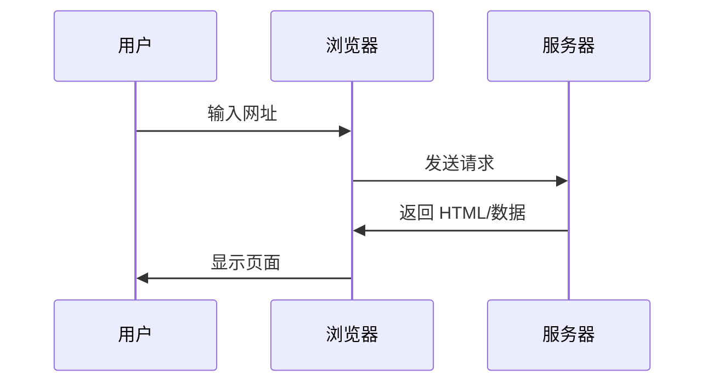
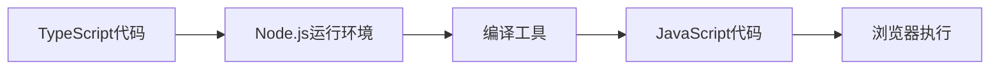

# 1.3 浏览器与服务器基础

> **阅读完本节后，你将会收获：**
> - 理解浏览器和服务器的基本职责及协作方式
> - 掌握开发环境（localhost）与生产环境的区别
> - 了解为什么 TypeScript 需要编译以及 Node.js 的作用
> - 区分客户端代码与服务端代码的运行位置

> 序言中提到的"浏览器看不懂 TypeScript"，是因为浏览器和服务器的职责不同。

## 基本概念

**浏览器**（Chrome、Firefox、Safari）运行在用户电脑上，只能理解 HTML、CSS、JavaScript。

**服务器**是远程计算机，运行 Web 服务器软件（如 Nginx、Apache），响应浏览器请求并返回数据。

**客户端** = 用户设备（浏览器、手机 App），**服务端** = 提供服务的一方（服务器、API）。

## Web 应用工作流程

## 浏览器 vs 服务器

| | 浏览器（客户端） | 服务器（服务端） |
|---|-----------------|-----------------|
| **职责** | 渲染页面、执行交互、请求数据 | 处理业务、查询数据库、返回结果 |
| **存储** | Cookie、LocalStorage | 文件系统、数据库 |
| **能运行** | HTML、CSS、JavaScript | Node.js、Python、Go |
| **不能运行** | TypeScript、后端语言 | 浏览器 API |

## 为什么需要 Node.js

TypeScript 代码需要编译才能在浏览器运行，这个编译过程需要一个运行环境：

**Node.js 的作用**：
- 在你的电脑上运行构建工具
- 编译 TypeScript 为 JavaScript
- 打包代码
- 启动开发服务器

::: tip 现代前端开发都需要 Node.js

涉及以下情况就必须安装：
- TypeScript 项目（需要编译）
- 使用 npm 包（需要管理依赖）
- 运行构建工具（Vite、Webpack、Next.js）
- 本地开发（启动开发服务器）

:::

## 开发环境 vs 生产环境

| | 开发环境（Localhost） | 生产环境（公网） |
|---|---------------------|-----------------|
| **位置** | 你的电脑 | 远程服务器 |
| **地址** | `localhost:3000` | `https://example.com` |
| **代码** | 未压缩、带调试信息 | 压缩、混淆 |
| **错误** | 显示详细堆栈 | 只显示必要信息 |
| **更新** | 热重载（自动刷新） | 需要重新部署 |

## 运行环境差异

**服务器可以访问**：文件系统、数据库、环境变量、所有网络请求

**浏览器只能访问**：页面内容、用户设备（有限权限）、同源请求

::: tip 代码运行在哪里？

写代码时要清楚代码在哪里执行：
- **前端代码**：在浏览器运行，用户能看到
- **后端代码**：在服务器运行，用户看不到
- **API 路由**：Next.js 特殊，既能访问服务器资源，又能响应前端请求

:::

## 相关内容

- 详见：[1.1 代码格式演变]
- 详见：[1.2 技术栈概念]
- 后续：[1.5 Node.js 环境与包管理]
- 详见：[第十章 Localhost 与公网访问]
