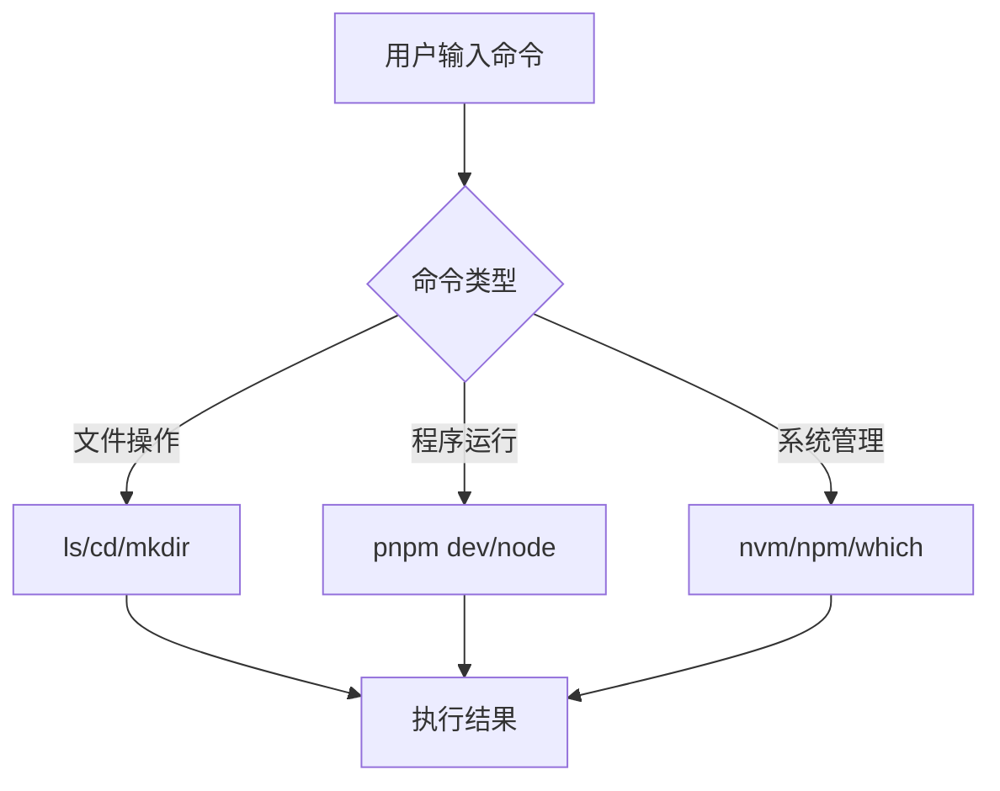
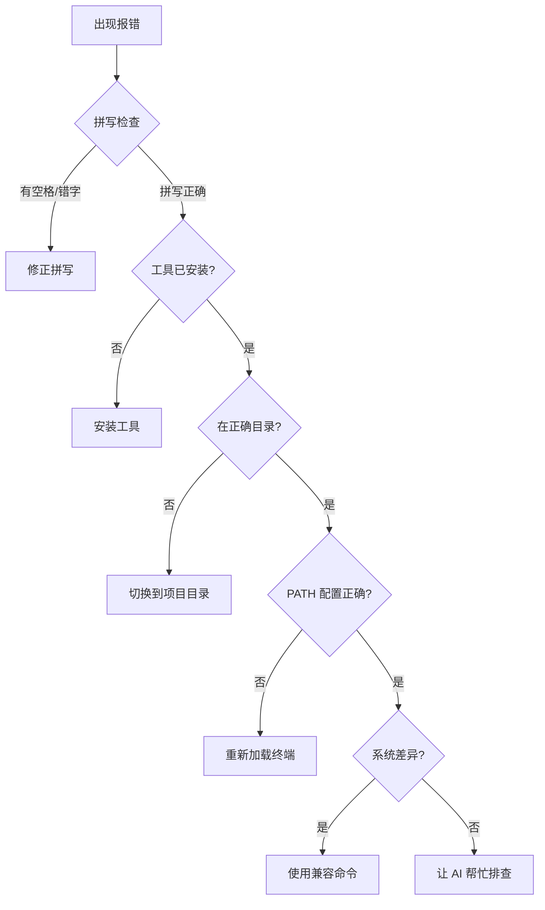

# 1.4 Terminal 终端入门

> **阅读完本节后，你将会收获：**
> - 掌握终端的基本操作（打开、文件导航、命令执行）
> - 学会常用的开发命令（pnpm、npm、node 等）及其用途
> - 理解环境变量和 PATH 的作用及配置方法
> - 掌握终端快捷键和常用操作技巧
> - 学会命令报错的系统化排查流程

> 序言中提到的 Terminal（终端），是通过文字指令与操作系统对话的方式。

## 前置知识

::: tip 什么是 终端

终端（Terminal）是输入命令行指令的界面。Windows 上有 CMD、PowerShell、Git Bash，Mac 上有 Terminal、iTerm2。
:::

::: tip 什么是 Shell

Shell 是命令解释器，读取你输入的命令并执行。常见的 Shell 有 bash、zsh（Mac 默认）、PowerShell（Windows）。
:::

::: tip 什么是 命令行

命令行（CLI）是通过文本指令操作计算机的方式，相比图形界面更高效、更精确。
:::

## 核心概念

终端是开发者的主要工作界面。理解终端的基本操作：



## 实战步骤

### 打开终端

**Mac**：
- 按 `Command + Space`，输入 "Terminal"
- 或在 Finder → 应用程序 → 实用工具 → 终端

**Windows**：
- 按 `Win + R`，输入 `powershell`（推荐）或 `Windows Terminal`
- 或右键文件夹 → "在终端中打开"

**VS Code 内置终端**：
- 点击菜单：终端 → 新建终端
- 推荐：在项目目录直接打开

### 基本文件操作

这些命令在 Mac、Linux、Windows 的 PowerShell/CMD 上都是通用的：

```bash
# 查看当前目录
pwd

# 列出文件
ls          # Mac/Linux PowerShell
dir         # Windows CMD

# 切换目录
cd folder-name
cd ..         # 返回上一级
cd ~          # 返回用户主目录（Mac/Linux PowerShell）

# 创建目录
mkdir folder-name
```

### 复制粘贴操作

**Windows PowerShell**：
- **粘贴**：右键单击窗口（直接粘贴，Ctrl+V 可能不生效）
- **复制**：选中文字后右键，或使用快捷键

**Mac Terminal**：
- **复制**：`Command + C`
- **粘贴**：`Command + V`
- **从其他地方粘贴**：`Command + Shift + V`（有时需要）

### 停止运行中的程序

当你在终端运行命令时，如果程序持续运行或卡住：

**停止当前程序**：按 `Ctrl + C`

::: tip 什么时候需要停止程序？

- **完成测试**：开发服务器不需要一直开着
- **释放端口**：同一端口不能被多个程序占用
- **程序卡死**：命令没有响应，需要强制终止
- **关闭电脑**：下班前停止所有后台服务

:::

### 环境变量与 PATH

::: tip 什么是 环境变量

环境变量是操作系统存储的配置信息，程序可以通过它们获取系统设置。比如 `PATH` 就是一个环境变量，告诉系统去哪些目录查找可执行程序。

:::

当你输入 `node`、`pnpm` 这样的命令时，系统是如何找到它们的？

**PATH 的工作原理**：

1. 你输入 `pnpm`
2. Shell 在 PATH 列出的目录中逐个查找名为 `pnpm` 的文件
3. 找到后执行该文件
4. 如果所有目录都找不到，显示 `command not found`

::: tip 命令找不到怎么办？

如果输入命令提示 `command not found`，说明工具没有安装或没有在 PATH 中。

按照下一节（1.5 Node.js 环境与包管理）完成安装后，命令就能正常使用了。

:::

### 终端快捷键

| 快捷键 | 作用 |
|--------|------|
| `Ctrl + C` | 停止当前运行的程序 |
| `Ctrl + L` | 清屏（相当于输入 `clear`） |
| `↑ / ↓` | 浏览历史命令 |
| `Tab` | 自动补全文件名或命令 |
| `Ctrl + A` | 光标移到行首 |
| `Ctrl + E` | 光标移到行尾 |

## 常见问题

### Q1: 为什么我的终端显示 `$` 或 `>`？

**A**: 这是**提示符**（prompt），不是命令的一部分。

```bash
$ ls -l    # 不要输入 $ 符号
> dir      # 不要输入 > 符号
```

### Q2: 如何在 VS Code 中打开当前文件夹的终端？

**A**: 点击菜单：终端 → 新建终端

### Q3: 终端显示中文乱码怎么办？

**A**: 修改终端编码设置。

- **Mac**：Terminal → 偏好设置 → 描述文件 → 高级 → 字符编码 → UTF-8
- **Windows**：PowerShell 属性 → 字体 → 选择支持中文的字体

### Q4: 如何同时运行多个命令？

**A**: 使用 `&&` 连接命令。

```bash
# 清理并重新安装
rm -rf node_modules && pnpm install
```

## 核心理念

**终端是精确控制计算机的工具**。

- 图形界面：点击图标 → 操作完成
- 命令行：输入指令 → 操作完成

命令行的优势：
- ✅ 更快：键盘比鼠标快
- ✅ 更精确：参数明确
- ✅ 可脚本化：命令可以保存和复用
- ✅ 远程操作：SSH 服务器只能用命令行

**开发者的终端工作流**：


## 命令报错排查

当遇到 `command not found` 或其他命令报错时，按以下顺序逐层排查：



### 排查清单

**1. 拼写检查**

```bash
# 常见错误
pnpm instal  # 错误：少写 l
l s          # 错误：中间有空格

# 正确写法
pnpm install
ls
```

**2. 确认工具已安装**

```bash
# 查看版本（确认可执行）
pnpm -v
node -v
nvm version
```

如果提示命令不存在，需要先安装。

**3. 确认在正确目录**

```bash
# 查看当前目录
pwd

# 检查是否有 package.json
ls package.json
```

**4. 重新加载终端**

刚安装工具或修改 PATH 后，需要重启终端：

```bash
# Mac：重新加载配置
source ~/.zshrc

# 或直接关闭终端重新打开
```

::: tip 不确定问题出在哪？

直接把报错信息发给 AI，它会告诉你具体原因和解决方法。

你不需要记忆所有错误，只需要知道排查的顺序。

:::

## 相关内容

- 详见：[1.5 Node.js环境与包管理]
