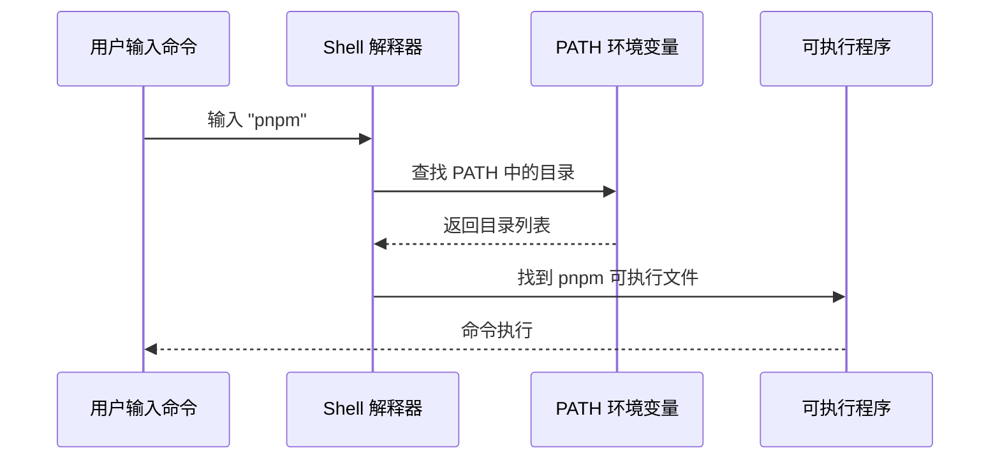

# 1.4 Terminal 终端入门


> 序言中提到的 Terminal（终端），是通过文字指令与操作系统对话的方式。

## 前置知识

::: tip 什么是 终端

终端（Terminal）是输入命令行指令的界面。Windows 上有 CMD、PowerShell、Git Bash，Mac 上有 Terminal、iTerm2。
:::

::: tip 什么是 Shell

Shell 是命令解释器，读取你输入的命令并执行。常见的 Shell 有 bash、zsh（Mac 默认）、PowerShell（Windows）。
:::

::: tip 什么是 命令行

命令行（CLI）是通过文本指令操作计算机的方式，相比图形界面更高效、更精确。
:::

## 核心概念

终端是开发者的主要工作界面。理解终端的基本操作：


## 实战步骤

### 打开终端

**Mac**：
- 按 `Command + Space`，输入 "Terminal"
- 或在 Finder → 应用程序 → 实用工具 → 终端

**Windows**：
- 按 `Win + R`，输入 `cmd` 或 `powershell`
- 或右键文件夹 → "在终端中打开"

**VS Code 内置终端**：
- 点击菜单：终端 → 新建终端
- 推荐：在项目目录直接打开

### 基本文件操作

这些命令在 Mac、Linux、Windows 上都是通用的：

```bash
# 查看当前目录
pwd

# 列出文件
ls

# 切换目录
cd folder-name
cd ..         # 返回上一级
cd ~          # 返回用户主目录（Mac/Linux）

# 创建目录
mkdir folder-name
```

### 常用开发命令

```bash
# 运行开发服务器
pnpm dev
npm run dev

# 安装依赖
pnpm install
npm install

# 构建项目
pnpm build
npm run build

# 查看版本
node -v
pnpm -v
nvm version
```

### 停止运行中的程序

当你在终端运行 `pnpm dev` 或其他命令时，程序会持续运行直到你主动停止。

**停止当前程序**：
- 按 `Ctrl + C` 即可停止

::: tip 什么时候需要停止程序？

以下情况需要手动停止运行的程序：

- **完成测试**：开发服务器不需要一直开着
- **释放端口**：同一端口不能被多个程序占用
- **程序卡死**：命令没有响应，需要强制终止
- **关闭电脑**：下班前停止所有后台服务

停止后可以随时重新运行 `pnpm dev` 启动。

:::

这是开发者最常用的操作之一——启动开发服务器 → 测试 → 停止服务器。

### 环境变量与 PATH

::: tip 什么是 环境变量

环境变量是操作系统存储的配置信息，程序可以通过它们获取系统设置。比如 `PATH` 就是一个环境变量，告诉系统去哪些目录查找可执行程序。

:::

当你输入 `node`、`pnpm`、`claude` 这样的命令时，系统是如何找到它们的？



::: tip 输入 pnpm 时发生了什么？

你输入 `pnpm` 后，Shell 在 PATH 中查找可执行文件并启动。如果提示 `command not found`，说明 pnpm 没有安装或 npm 全局目录不在 PATH 中。

```bash
# 检查方法
npm prefix -g    # 查看 npm 全局安装路径
echo $PATH        # 确认该路径在 PATH 中
```

:::

**PATH 的工作原理**：

1. 你输入 `pnpm`
2. Shell 在 PATH 列出的目录中逐个查找名为 `pnpm` 的文件
3. 找到后执行该文件
4. 如果所有目录都找不到，显示 `command not found`

### 将程序添加到 PATH

当你安装了新软件（如 Git）后，如果输入命令提示"不存在"，需要将其路径添加到 PATH。

::: tip 什么时候需要配置 PATH？

出现以下情况时，说明需要配置 PATH：

- **新安装的工具**：输入命令提示 `command not found`
- **全局安装失败**：`npm install -g` 后命令无法使用
- **切换 Shell 后**：从 bash 切换到 zsh 后旧命令失效

配置一次后永久生效，不需要每次都设置。

:::

**Mac / Linux**：

编辑 shell 配置文件。不同 Shell 使用不同的配置文件：

| Shell | 配置文件 | 说明 |
|-------|----------|------|
| **zsh** | `~/.zshrc` | Mac 默认 Shell |
| **bash** | `~/.bashrc` | Linux 常用 Shell |

**如何查看当前 Shell**：

```bash
echo $SHELL
# 输出 /bin/zsh 表示使用 zsh
# 输出 /bin/bash 表示使用 bash
```

**添加到 PATH**（以 zsh 为例）：

```bash
# 1. 编辑配置文件
nano ~/.zshrc

# 2. 在文件末尾添加（将 /path/to/bin 替换为实际路径）
export PATH="/path/to/bin:$PATH"

# 3. 保存后重新加载配置
source ~/.zshrc
```

**Windows**：

1. 右键"此电脑" → 属性 → 高级系统设置 → 环境变量
2. 在"用户变量"中找到 `Path`，点击编辑
3. 点击"新建"，添加程序路径
4. 确定并重启终端

### 终端快捷键

| 快捷键 | Mac/Linux | Windows | 作用 |
|--------|-----------|---------|------|
| 中断 | `Ctrl + C` | `Ctrl + C` | 停止当前命令 |
| 清屏 | `Cmd + K` | `Ctrl + L` | 清空屏幕 |
| 历史 | `↑ / ↓` | `↑ / ↓` | 浏览历史命令 |
| 光标 | `Ctrl + A` | `Home` | 跳到行首 |
| 光标 | `Ctrl + E` | `End` | 跳到行尾 |

## 常见问题

### Q1: 为什么我的终端显示 `$` 或 `>`？

**A**: 这是**提示符**（prompt），不是命令的一部分。

```bash
$ ls -l    # 不要输入 $ 符号
> dir      # 不要输入 > 符号
```

### Q2: 如何在 VS Code 中打开当前文件夹的终端？

**A**: 点击菜单。

终端 → 新建终端

### Q3: 终端显示中文乱码怎么办？

**A**: 修改终端编码设置。

Mac：Terminal → 偏好设置 → 描述文件 → 高级 → 字符编码 → UTF-8

Windows：PowerShell 属性 → 字体 → 选择支持中文的字体

### Q4: 如何同时运行多个命令？

**A**: 使用 `&&` 连接命令。

```bash
# 清理并重新安装
rm -rf node_modules && pnpm install

# 或并行执行（Mac/Linux）
pnpm dev & pnpm test
```

### Q5: 命令太长怎么换行？

**A**: 使用反斜杠续行。

```bash
npm install \
  package-one \
  package-two \
  package-three
```

### Q6: 修改环境变量后为什么终端不生效？

**A**: 需要重启终端。

终端在启动时会读取环境变量，之后修改系统环境变量，已打开的终端不会自动更新。

**解决方法**：
- 关闭当前终端，重新打开
- 或在编辑器（如 VS Code）中关闭终端面板后重新打开

## 核心理念

**终端是精确控制计算机的工具**。

- 图形界面：点击图标 → 操作完成
- 命令行：输入指令 → 操作完成

命令行的优势：
- ✅ 更快：键盘比鼠标快
- ✅ 更精确：参数明确
- ✅ 可脚本化：命令可以保存和复用
- ✅ 远程操作：SSH 服务器只能用命令行

**开发者的终端工作流**：


## 命令报错排查

当遇到 `command not found` 或其他命令报错时，按以下顺序逐层排查：


### 排查清单

**1. 拼写检查**

```bash
# 常见错误
pnpm instal  # 错误：少写 l
l s          # 错误：中间有空格

# 正确写法
pnpm install
ls
```

**2. 确认工具已安装**

```bash
# 查看版本（确认可执行）
pnpm -v
node -v
nvm version
```

如果提示命令不存在，需要先安装。

**3. 确认在正确目录**

```bash
# 查看当前目录
pwd

# 检查是否有 package.json
ls package.json
```

**4. 重新加载终端**

刚安装工具或修改 PATH 后，需要重启终端：

```bash
# Mac：重新加载配置
source ~/.zshrc

# 或直接关闭终端重新打开
```

::: tip 不确定问题出在哪？

直接把报错信息发给 AI，它会告诉你具体原因和解决方法。

你不需要记忆所有错误，只需要知道排查的顺序。

:::

## 相关内容

- 详见：[1.5 Node.js环境与包管理](./05-nodejs-package-manager.md)
