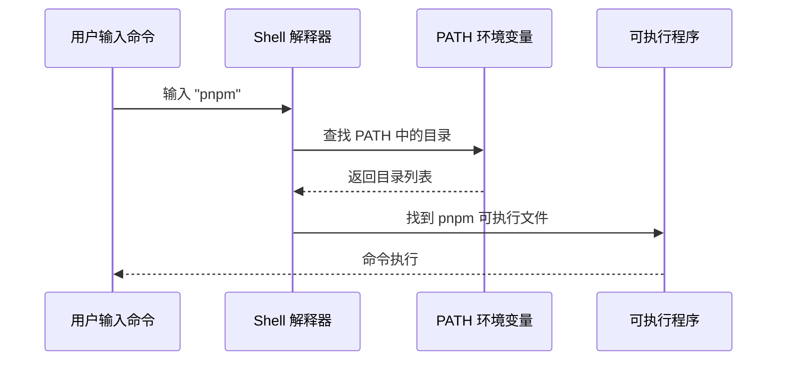

# 1.4 Terminal 终端入门

> **阅读完本节后，你将会收获：**
> - 掌握终端的基本操作（打开、文件导航、命令执行）
> - 理解终端、Shell、命令行的区别
> - 掌握终端快捷键和复制粘贴操作
> - 理解环境变量和 PATH 的作用
> - 学会命令报错的系统化排查流程

> 序言中提到的 Terminal（终端），是通过文字指令与操作系统对话的方式。

## 前置知识

::: tip 终端、Shell、命令行的区别

这三个概念经常被混淆，其实层次不同：

- **终端（Terminal）**：你看到的**界面窗口**，用来输入命令。Windows 上叫 PowerShell/CMD，Mac 上叫 Terminal/iTerm2
- **Shell（壳）**：隐藏在终端后的**命令解释器**，读取你的输入并执行。常见的是 bash、zsh（Mac 默认）、PowerShell（Windows）
- **命令行（CLI）**：通过文本指令操作计算机的**方式**，相比图形界面更高效、更精确

:::

::: tip 为什么 Windows 推荐 PowerShell？

Windows 有两种终端：CMD（老式）和 PowerShell（现代）。

PowerShell 功能更强大，命令更统一（如 `ls` 在 PowerShell 中也能用），且是微软官方推荐的现代终端。**本教程所有 Windows 命令均以 PowerShell 为准**。

:::

## 核心概念

终端是开发者的主要工作界面。理解终端的基本操作：


## 实战步骤

### 打开终端

**Mac**：
- 按 `Command + Space`，输入 "Terminal"
- 或在 Finder → 应用程序 → 实用工具 → 终端

**Windows**：
- 按 `Win + R`，输入 `powershell` 或 `Windows Terminal`
- 或右键文件夹 → "在终端中打开"

**VS Code 内置终端**：点击菜单：终端 → 新建终端，推荐在项目目录直接打开

### 提示符是什么？

打开终端后，你会看到一行前面有符号的文字：

```bash
user@MacBook ~ $     # Mac/Linux 的提示符是 $
PS C:\Users\user>    # Windows PowerShell 的提示符是 >
```

这叫**提示符（prompt）**，**不是命令的一部分**，输入命令时不要把它也复制进去。

`$` 表示你在使用 bash/zsh Shell，`>` 表示你在使用 PowerShell。后面的命令示例会省略这些提示符。

### 复制粘贴操作

**Windows PowerShell**：
- **粘贴**：右键单击窗口（直接粘贴，Ctrl+V 可能不生效）
- **复制**：选中文字后右键

**Mac Terminal**：
- **复制**：`Command + C`
- **粘贴**：`Command + V`
- **从其他地方粘贴**：`Command + Shift + V`（有时需要）

### 基本文件操作

这些命令在 Mac、Linux、Windows 的 PowerShell/CMD 上都是通用的：

```bash
# 查看当前目录
pwd

# 列出文件
ls          # Mac/Linux/PowerShell
dir         # Windows CMD

# 切换目录
cd folder-name
cd ..         # 返回上一级
cd ~          # 返回用户主目录（Mac/Linux PowerShell）

# 创建目录
mkdir folder-name
```

### 终端快捷键

| 快捷键 | 作用 |
|--------|------|
| `Ctrl + C` | 停止当前运行的程序 |
| `Ctrl + L` | 清屏（相当于输入 `clear`） |
| `↑ / ↓` | 浏览历史命令 |
| `Tab` | 自动补全文件名或命令 |
| `Ctrl + A` | 光标移到行首 |
| `Ctrl + E` | 光标移到行尾 |

::: tip Ctrl + C 的两种用途

在终端里，`Ctrl + C` 有两个作用：
1. **停止运行中的程序**（如开发服务器）
2. **中断当前输入**（如果你正在输入一行命令，想放弃重新输入）

:::

### 环境变量与 PATH

::: tip 什么是 环境变量

环境变量是操作系统存储的配置信息，程序可以通过它们获取系统设置。比如 `PATH` 就是一个环境变量，告诉系统去哪些目录查找可执行程序。

:::

当你输入 `node`、`pnpm` 这样的命令时，系统是如何找到它们的？



**PATH 的工作原理**：

1. 你输入 `pnpm`
2. Shell 在 PATH 列出的目录中逐个查找名为 `pnpm` 的文件
3. 找到后执行该文件
4. 如果所有目录都找不到，显示 `command not found`

::: tip 命令找不到怎么办？

如果输入命令提示 `command not found`，说明工具没有安装或没有在 PATH 中。

按照下一节（1.5 Node.js 环境与包管理）完成安装后，命令就能正常使用了。

:::

### CLI 软件与命令参数

**什么是 CLI 软件？**

CLI 软件（Command Line Interface）没有菜单和按钮，一切通过输入命令完成。你可能会疑惑：**为什么开发工具偏爱这种简陋的方式？**

原因很简单：输入命令比点击菜单快得多，命令可以带参数精确控制行为，而且可以写成脚本自动执行，占用内存也更少。当你熟练后，会发现效率远超图形界面。

**命令参数入门**

命令后面常跟参数来修改行为。参数有两种格式：
- **短参数**：一个减号加字母，如 `-v`（version）、`-h`（help）
- **长参数**：两个减号加单词，如 `--version`、`--help`

```bash
# 查看版本（短参数）
node -v
pnpm -v

# 查看帮助（长参数）
git --help
npm --help
```

短参数和长参数效果相同，短参数输入更快，长参数更易读。大多数命令同时支持两种形式。

## 常见问题

### Q1: 如何同时运行多个命令？

使用 `&&` 连接命令，只有前一个成功才执行下一个：

```bash
# 清理并重新安装
rm -rf node_modules && pnpm install
```

使用 `;`（或换行）连接命令，无论前一个是否成功都执行下一个：

```bash
mkdir new-folder ; cd new-folder    # new-folder 是示例文件夹名
```

### Q2: 终端显示中文乱码怎么办？

修改终端编码设置。

- **Mac**：Terminal → 偏好设置 → 描述文件 → 高级 → 字符编码 → UTF-8
- **Windows**：PowerShell 属性 → 字体 → 选择支持中文的字体

### Q3: 如何在 VS Code 中打开当前文件夹的终端？

点击菜单：终端 → 新建终端

## 命令报错排查

当遇到 `command not found` 或其他命令报错时，按以下顺序逐层排查：


### 排查清单

**1. 拼写检查**

```bash
# 常见错误
pnpm instal  # 错误：少写 l
l s          # 错误：中间有空格

# 正确写法
pnpm install
ls
```

**2. 确认工具已安装**

```bash
# 查看版本（确认可执行）
node -v
pnpm -v
```

如果提示命令不存在，需要先安装。

**3. 确认在正确目录**

```bash
# 查看当前目录
pwd

# 检查是否有 package.json
ls package.json
```

**4. 重新加载终端**

刚安装工具或修改 PATH 后，需要重启终端：

```bash
# Mac：重新加载配置
source ~/.zshrc

# 或直接关闭终端重新打开
```

::: tip 不确定问题出在哪？

直接把报错信息发给 AI，它会告诉你具体原因和解决方法。

你不需要记忆所有错误，只需要知道排查的顺序。

:::

## 相关内容

- 详见：[1.5 Node.js环境与包管理]
