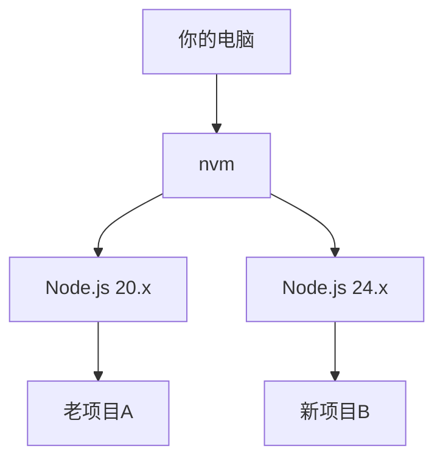

# 1.5 Node.js 环境与包管理

> **阅读完本节后，你将会收获：**
> - 掌握使用 nvm 安装和管理多个 Node.js 版本的方法
> - 学会配置并使用 pnpm 包管理器进行依赖管理
> - 理解 package.json、pnpm-lock.yaml 等核心配置文件的作用

本节将完成 Node.js 环境的完整搭建：使用 nvm 安装 Node.js LTS，配置 pnpm 包管理器。

::: tip 如何执行下面的命令？

下方灰色代码块中的命令需要在 **终端** 中执行。如果你还不熟悉终端，请先阅读 [1.4 Terminal 终端入门](./04-terminal-basics.md)。

:::

## 基本概念

**Node.js** 是 JavaScript 运行时环境，让 JS 能在服务器端运行。现代前端构建工具都依赖它。

**LTS**（Long Term Support）是长期支持版本，比 Current 更稳定，推荐用于开发。

**nvm**（Node Version Manager）让你在同一台电脑上安装和切换多个 Node.js 版本。

**pnpm** 是包管理器，用于安装项目依赖。相比 npm，它更快、更节省磁盘空间。

## 安装步骤

### Windows 用户

#### 方案 A：使用 nvm（推荐）

**下载 nvm**：https://nvm.uihtm.com/nvm-1.2.2-setup.zip

安装完成后**打开新的 PowerShell 窗口**，执行：

::: tip 如何复制粘贴命令？

1. 点击代码块**右上角复制按钮**
2. 在 PowerShell 中**右键单击**（Ctrl+V 可能不生效）
3. 按回车执行

:::

```powershell
nvm install lts; nvm use lts; npm config set registry https://registry.npmmirror.com/; npm install -g pnpm; pnpm setup; pnpm config set registry https://registry.npmmirror.com/; node -v; pnpm -v
```

> 这条命令安装 Node.js 24 LTS → 配置国内源 → 安装 pnpm → 配置 pnpm 国内源。命令可重复执行。

#### 方案 B：直接安装 Node.js

**下载 Node.js**：https://npmmirror.com/mirrors/node/v24.13.0/node-v24.13.0-x64.msi

双击安装，**打开新的 PowerShell 窗口**执行：

```powershell
npm config set registry https://registry.npmmirror.com/; npm install -g pnpm; pnpm setup; pnpm config set registry https://registry.npmmirror.com/; node -v; pnpm -v
```

### Mac / Linux 用户

**注意**：Mac 用户安装 nvm 前必须先运行 `xcode-select --install`。

```bash
# 一键安装（自动识别 Shell，幂等性，安装完成需要重启终端）
export NVM_DIR="$HOME/.nvm" && RC="${ZSH_VERSION:+$HOME/.zshrc}" && [ -z "$RC" ] && RC="$HOME/.bashrc"
[ ! -d "$NVM_DIR" ] && git clone https://gitee.com/mirrors/nvm.git "$NVM_DIR" && cd "$NVM_DIR" && git checkout v0.40.3 && cd - >/dev/null
grep -q "NVM_DIR" "$RC" || printf '\nexport NVM_DIR="$HOME/.nvm"\n[ -s "$NVM_DIR/nvm.sh" ] && . "$NVM_DIR/nvm.sh"\nexport NVM_NODEJS_ORG_MIRROR=https://npmmirror.com/mirrors/node/\nexport PNPM_HOME="$HOME/.local/share/pnpm"\nexport PATH="$PNPM_HOME:$PATH"\n' >> "$RC"
export NVM_NODEJS_ORG_MIRROR=https://npmmirror.com/mirrors/node/ && [ -s "$NVM_DIR/nvm.sh" ] && . "$NVM_DIR/nvm.sh"
nvm install --lts && nvm use --lts && nvm alias default "lts/*"
npm config set registry https://registry.npmmirror.com/ && npm install -g pnpm && pnpm config set registry https://registry.npmmirror.com/
pnpm setup >/dev/null 2>&1 && export PNPM_HOME="$HOME/.local/share/pnpm" && export PATH="$PNPM_HOME:$PATH"
echo "✅ Node: $(node -v) / pnpm: $(pnpm -v)"
```

## pnpm 常用命令

| 命令 | 作用 |
|------|------|
| `pnpm init` | 初始化项目 |
| `pnpm install` | 安装所有依赖 |
| `pnpm add xxx` | 安装生产依赖（xxx 替换为包名，如 React） |
| `pnpm add -D xxx` | 安装开发依赖（xxx 替换为包名，如 TypeScript） |
| `pnpm remove xxx` | 卸载包 |
| `pnpm dev` | 运行脚本（等同于 pnpm run dev） |

::: tip add 和 add -D 的区别？

- **add xxx**：生产依赖，项目运行时需要
- **add -D xxx**：开发依赖，仅开发时需要

不确定的话，让 AI 决定用哪个。

:::

## 为什么需要 nvm？

不同项目可能需要不同版本的 Node.js：



**什么时候需要切换版本**：老项目维护、兼容性测试。大多数新项目用最新 LTS 即可。

## 为什么选择 pnpm？

| 特性 | npm | pnpm |
|------|-----|------|
| 速度 | 基准 | **快 2-3 倍** |
| 磁盘空间（10项目） | ~5GB | **~1.5GB** |

pnpm 使用**硬链接**让所有项目共享同一份依赖文件，而不是每个项目都复制一份。

## 核心配置文件

### package.json

项目描述文件，记录依赖和脚本：

```json
{
  "dependencies": {
    "react": "^18.0.0"
  },
  "devDependencies": {
    "typescript": "^5.0.0"
  }
}
```

### pnpm-lock.yaml

自动生成的锁文件，记录每个依赖的精确版本。确保所有人安装的版本**完全一致**，避免"在我电脑上能跑"问题。

**注意事项**：
- 自动生成，**不要手动修改**
- 必须提交到 Git

### .nvmrc（可选）

指定项目推荐的 Node.js 版本：

```bash
# .nvmrc 文件内容
24
```

大多数项目没有这个文件，用最新 LTS 即可。有此文件时，运行 `nvm use` 自动切换。

## 常见问题

### Q: nvm 命令提示 `command not found`

需要重新加载配置或重启终端：

```bash
source ~/.zshrc   # 如果使用 zsh
source ~/.bashrc  # 如果使用 bash
```

### Q: 如何查看项目需要哪个 Node.js 版本？

查看 `package.json` 中的 `engines` 字段，或项目根目录的 `.nvmrc` 文件。

### Q: npm 项目可以迁移到 pnpm 吗？

可以，完全兼容：

```bash
rm -rf node_modules package-lock.json
pnpm install
```

> **这条命令做了什么**：删除 npm 的依赖文件夹和锁文件，然后用 pnpm 重新安装。

## 核心理念

**nvm 解决版本冲突，pnpm 提升安装效率**。

- ✅ 多项目可以使用不同 Node.js 版本
- ✅ pnpm 复用依赖，安装快速、节省空间
- ✅ pnpm 严格模式，避免"幽灵依赖"

## 相关内容

- 详见：[1.4 Terminal 终端入门](./04-terminal-basics.md)
- 详见：[nvm 中文官网](https://nvm.uihtm.com/)
- 前置：[1.2 技术栈概念](./02-tech-stack.md)
