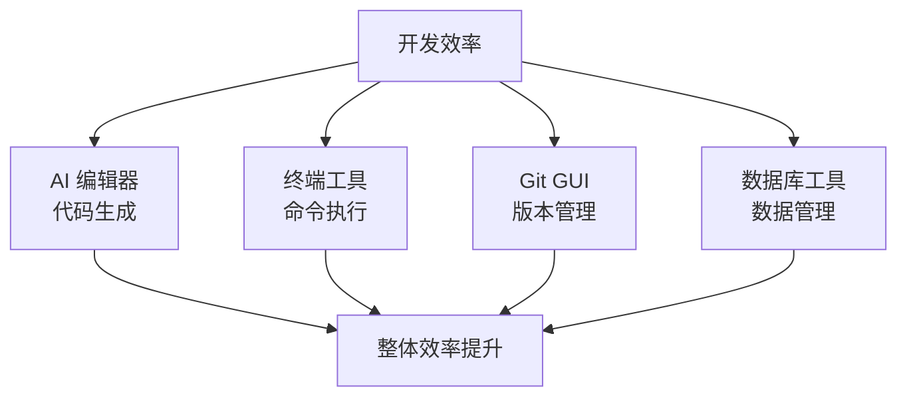

# 1.6 模型与工具

> **阅读完本节后，你将会收获：**
> - 理解 AI 模型、CLI 工具和 IDE 工具的区别与联系
> - 掌握 Claude Code + GLM-4.7 的安装配置方法
> - 了解主流 AI 编程工具的特点及选择原则
> - 学会根据需求选择合适的开发工具组合

> 环境搭建完成后，选择合适的模型与工具组合能让 AI 编程事半功倍。

## 前置知识

::: tip 什么是 AI 编程工具

AI 编程工具是集成了 AI 能力的编辑器，能帮你写代码、查错误、解释代码。

:::

## 前置知识

### 大模型

**模型**：负责理解意图和生成内容。比如你问"怎么写登录功能"，模型分析后返回代码方案。

**工具**：负责执行具体操作。比如读取文件、运行命令、提交代码。

工具需要接入模型才能工作。

::: details 查看大模型列表

| 分类 | 名称 |
|------|------|
| **国内** | GLM、MiniMax、DeepSeek、Kimi、Doubao |
| **国际** | GPT、Gemini、Claude |

:::

### AI CLI 工具

CLI 工具在终端里运行，通过文字交互。没有图形界面，但能做同样的事：读取文件、搜索代码、运行命令、提交 Git。

你告诉它"修复这个 Bug"，它会自己找出问题、修改代码、运行测试。你扮演产品经理的角色，告诉它要做什么，它负责实现。

::: details 查看 AI CLI 工具列表

| 名称 | 开发商 | 官网 |
|------|--------|------|
| **Claude Code** | Anthropic | https://claude.com/product/claude-code |
| **Codex CLI** | OpenAI | https://openai.com/codex |
| **Qoder CLI** | 阿里巴巴 | https://qoder.com |
| **Factory Droid** | Factory AI | https://factory.ai/product/cli |
| **Warp** | Warpdotdev | https://www.warp.dev |

> Claude Code 支持接入多种模型。

:::

### AI IDE 工具

IDE 是图形界面的开发环境：左侧是文件目录，中间是代码编辑区，底部是终端和输出窗口。你可以直接查看文件、安装可视化插件、在界面内调试和运行代码。

AI IDE 在此基础上集成了 AI Agent。这些 Agent 可以使用内置终端执行命令，读取和编辑项目文件，调用 Git 操作——**和 AI CLI 工具的能力完全相同**。区别只在于交互方式：IDE 用图形界面，CLI 用命令行。

本质上，IDE 里的 AI 和 CLI 工具里的 AI 是同一个东西，只是住的地方不同。

::: details IDE 与 VS Code 的关系

大部分 AI IDE 基于 **VS Code** 开发（VS Code 是开源项目）：
- **Cursor**：VS Code 的分支，深度集成 AI
- **Windsurf**：基于 VS Code，由 Codeium 开发
- **Trae**、**Qoder**：兼容 VS Code 生态

这意味着：
- 界面和操作习惯与 VS Code 一致
- 大部分 VS Code 插件可以通用
- 学习成本很低

:::

::: details 查看 AI IDE 工具列表

**国际厂商**

| 名称 | 开发商 | 官网 |
|------|--------|------|
| **Cursor** | Anysphere | https://cursor.com |
| **Windsurf** | Windsurf (原 Codeium) | https://windsurf.com |
| **Zed** | Zed Collective | https://zed.dev |
| **GitHub Copilot** | GitHub + OpenAI | https://github.com/features/copilot |
| **JetBrains AI** | JetBrains | https://www.jetbrains.com/ai-assistant |
| **Tabnine** | Tabnine | https://www.tabnine.com |
| **Antigravity** | Google | https://antigravity.google |
| **Kiro** | Kiro Team | https://kiro.dev |

**国内厂商**

| 名称 | 开发商 | 官网 |
|------|--------|------|
| **Trae** | 字节跳动 | https://www.trae.cn |
| **Qoder** | 阿里巴巴 | https://qoder.com |
| **CodeBuddy** | 腾讯 | https://copilot.tencent.com |
| **Comate** | 百度 | https://comate.baidu.com |
| **CodeGeeX** | 清华大学 + 智谱AI | https://codegeex.cn |

:::

### 其他开发工具

#### Git GUI 工具

::: tip 什么时候需要 Git GUI？

- **新手入门**：还不熟悉 Git 命令
- **复杂操作**：需要解决冲突、查看历史
- **可视化需求**：想直观看到分支结构

如果只是简单的提交和推送，命令行更快。

:::

::: details 查看 Git GUI 工具列表

| 工具 | 平台 | 官网 |
|------|------|------|
| **GitHub Desktop** | 全平台 | https://desktop.github.com |
| **Sourcetree** | 全平台 | https://www.sourcetreeapp.com |
| **Fork** | Mac/Windows | https://git-fork.com |

:::

#### 数据库管理工具

::: tip 什么时候需要数据库工具？

- **频繁查看数据**：需要经常检查数据库内容
- **调试问题**：需要手动修改数据排查问题
- **不熟悉 SQL**：想用图形界面代替命令

如果只是偶尔操作，让 AI 写 SQL 脚本执行即可。

:::

::: details 查看数据库工具列表

| 工具 | 用途 | 官网 |
|------|------|------|
| **DBeaver** | 通用数据库客户端（开源） | https://dbeaver.io |
| **Drizzle Studio** | 可视化 Drizzle 数据库 | https://orm.drizzle.team/drizzle-studio/overview |
| **TablePlus** | 通用数据库客户端 | https://tableplus.com |
| **Beekeeper Studio** | 开源数据库客户端 | https://www.beekeeperstudio.io |
| **HeidiSQL** | Windows 开源数据库工具 | https://www.heidisql.com |
| **DataGrip** | JetBrains 数据库 IDE | https://www.jetbrains.com/datagrip |
| **Adminer** | 轻量级 Web 数据库管理 | https://www.adminer.org |

:::

## 本教程推荐：Claude Code + GLM-4.7

::: tip 为什么推荐 Claude Code？

**Claude Code** 是 Anthropic 官方的 AI 原生 CLI 工具，发布在 npm 仓库，全球开发者都可以使用。

**核心优势**：
- **公开可用**：发布在 npm 仓库，任何人都可以 `npm install` 安装
- **多模型支持**：不强制使用 Claude，可接入国内模型（GLM、DeepSeek 等）
- **工作流强大**：文件操作、代码搜索、Git 集成、子代理协作
- **成本可控**：使用国内模型 API，价格远低于官方 Claude

**关于地域限制**：
- Anthropic 的 **Claude Web 服务**对中国有访问限制
- **Claude Code CLI 工具**发布在 npm 仓库，无地域限制
- 我们使用国内模型（如 GLM-4.7）替代 Claude 模型，通过正规渠道获取 API 服务

:::

### 安装配置

::: danger 步骤 0：安装 Git（必装）

**没有 Git，无法进行版本控制，无法提交代码。**

AI 编程工具依赖 Git 来跟踪代码变更、创建提交、管理分支。请确保在开始开发前安装。

:::

- **Windows**：下载 Git for Windows (https://registry.npmmirror.com/-/binary/git-for-windows/v2.52.0.windows.1/Git-2.52.0-64-bit.exe)
- **Mac**：系统自带，或 `brew install git`
- **Linux**：`sudo apt install git` (Ubuntu/Debian)

安装后验证：
```bash
git --version
```

#### 步骤 1：安装 Claude Code

```bash
# 全局安装 Claude Code
npm install -g @anthropic-ai/claude-code
```

#### 步骤 2：购买编码套餐

访问 智谱 AI 开放平台 (https://open.bigmodel.cn/)，购买官方编码套餐，获取 API Key。

::: tip 什么是 API Key

API Key 是调用大模型服务的"通行证"。它是你与智谱 AI 服务器通信的身份凭证，每次调用模型时需要提供这个密钥来验证你的账户和套餐额度。

:::

#### 步骤 3：自动配置

```bash
# 执行自动配置脚本
npx @z_ai/coding-helper

# 输入获取到的 API Key
# 工具会自动完成所有配置
```

### 成本对比

使用 GLM-4.7 编码套餐的优势：

| 对比项 | Claude 官方 | GLM-4.7 编码套餐 |
|--------|-------------|------------------|
| 价格 | 约 ¥110/¥540 每 1M Token | 约 API 价格的 0.1 折 |
| 单次 prompt 调用 | ~¥0.22 | ~¥0.02 |
| 每月总量（假设） | 几十万 Token | 几十亿 Token |
| 网络环境 | 需要中转 | 国内直连 |

**结论**：对于日常开发，GLM-4.7 编码套餐的性价比极高，完全够用。

配置完成后，详见第2章"Claude Code 工作流详解"学习使用方法。

## 我需要安装全部工具吗？

**不需要**。

最低配置：Claude Code + GLM-4.7 + 系统自带终端 + 浏览器，就能开始开发。

其他工具根据需要安装：频繁查数据库就装 DBeaver，不熟悉 Git 就装 GUI 工具。

## 常见问题

### Q1: 必须用 AI 编辑器吗？

**A**: 是的，这是本教程的核心。

Vibecoding 理念建立在 AI 原生开发之上，AI 编辑器能显著提升开发效率，特别是对于新手。你可以选择任意喜欢的 AI IDE（Cursor/Windsurf/Trae/Qoder 等），或使用 Claude Code 这样的 CLI 工具。

### Q2: Cursor 和 VS Code 什么区别？

**A**: Cursor 是 VS Code 的 AI 增强版。

- VS Code：传统编辑器，手动安装 AI 插件
- Cursor：AI 原生，深度集成 AI 能力

如果你已经熟悉 VS Code，切换到 Cursor 成本很低。

### Q3: 数据库管理工具必须装吗？

**A**: 最好装，或者让 AI 帮你完成数据库操作。

Drizzle Studio 随 Drizzle Kit 安装，启动即可：

```bash
npx drizzle-kit studio
```

推荐安装 DBeaver，功能强大且开源。你也可以让 AI 通过命令行或脚本来完成数据库操作，无需手动管理。

## 核心理念

**工欲善其事，必先利其器**。



**工具选择原则**：
1. **AI 原生优先**：现代开发离不开 AI
2. **跨平台考虑**：工具在 Mac/Windows 都可用
3. **学习成本低**：避免过于复杂的工具
4. **社区活跃**：有文档、有更新

**最低配置**：
- Claude Code + GLM-4.7
- 系统自带终端
- 浏览器（Chrome/Firefox）

**进阶配置**：
- Git GUI 工具
- 数据库管理工具（DBeaver）
- API 测试工具（Postman/Thunder Client）

## 相关内容

- 详见：[第2章 AI调教指南]
- 详见：[2.2 VibeCoding工作流详解]
- 前置：[1.4 Terminal终端入门]
- 前置：[1.5 Node.js环境与包管理]
