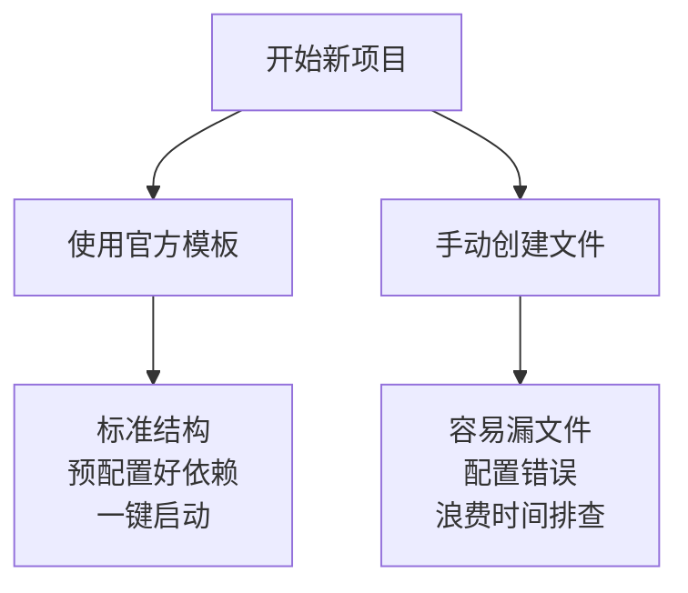

# 1.7 创建项目


> 新手最容易犯的错误是：拿到 AI 生成的代码，逐个文件手动创建，然后运行。这种方式在简单 Demo 上没问题，但一遇到复杂项目就会崩溃。正确的做法是使用项目模板，或者让 AI 通过命令行工具帮你创建标准项目。

::: tip 开始之前：创建项目文件夹

在创建项目前，请先在文件管理器中创建一个**英文路径**的文件夹。

**重要**：完整路径中每一级都不能有中文或空格。

**错误示例**：
```
❌ C:/用户/软件 A/my-projects     ← "用户"是中文，"软件 A"有空格
❌ C:/Users/张三/projects          ← "张三"是中文
❌ C:/Users/李/my project          ← "my project"有空格
```

**正确示例**：
```
✅ C:/Users/YourName/projects     ← 全英文，无空格
✅ D:/dev/my-projects             ← 全英文，无空格
✅ /Users/yourname/projects       ← macOS 用户目录
✅ /home/yourname/projects        ← Linux 用户目录
```

**文件夹结构**：
```
my-projects/          ← 总文件夹（放在英文路径下）
├── my-first-app/     ← 项目1
├── blog-app/         ← 项目2
└── store-app/        ← 项目3
```

这样组织项目的好处：
- ✅ 所有项目集中管理
- ✅ 避免中文路径问题
- ✅ 方便备份和迁移

:::

::: tip 在当前文件夹打开终端

创建好文件夹后，必须在其中打开终端来执行命令或启动 AI 工具。

**方式一：文件管理器右键（推荐）**

| 系统 | 操作 |
|------|------|
| **Windows** | 在文件夹空白处按住 `Shift + 右键` → "在此处打开 PowerShell 窗口" |
| **Windows 11** | 文件夹空白处右键 → "在终端中打开" |
| **Mac** | Finder → 服务 → 新建位于文件夹位置的终端窗口（需先设置） |
| **Mac 推荐** | 安装 [OpenInTerminal](https://github.com/Ji4n1ng/OpenInTerminal) 右键菜单工具 |

**方式二：AI IDE 打开文件夹**

Cursor / Windsurf / VS Code / Trae / Qoder / Code Buddy：文件 → 打开文件夹

打开后内置终端会自动定位到该目录。

**方式三：终端中 cd 进入**

```bash
# Windows
cd D:\dev\my-projects

# macOS
cd /Users/yourname/dev/my-projects

# Linux
cd /home/yourname/dev/my-projects
```

::: tip 什么是文件路径

文件路径（File Path）是文件在文件系统中的位置，用于唯一标识文件。

**绝对路径**：从根目录开始的完整路径

```
Windows:  C:\Users\YourName\projects\my-app\package.json
macOS:    /Users/yourname/projects/my-app/package.json
Linux:    /home/yourname/projects/my-app/package.json
```

**相对路径**：从当前目录开始的路径

```
# 当前在 /home/yourname/projects/my-app (Linux) 或 /Users/yourname/projects/my-app (macOS) 时
./package.json        # 当前目录下的 package.json
../other-project      # 上一级目录的 other-project
src/app/page.tsx      # 当前目录下 src/app/page.tsx
```

**为什么重要**：告诉 AI "修改 src/app/page.tsx" 时，AI 需要通过路径找到这个文件。理解路径概念后，你就能准确告诉 AI 文件的位置。

:::

## 前置知识

::: tip 什么是 项目模板

项目模板是预先配置好的项目骨架，包含标准的文件夹结构、配置文件和基础代码。使用模板可以避免从零开始搭建项目环境。

:::

::: tip 什么是 脚手架

脚手架（Scaffold）是自动化创建项目的工具，如 `create-next-app`、`npm create` 等。它们会根据你的选择自动生成项目结构。

:::

## 文件夹命名规范

在创建项目之前，先了解命名规范。许多开发工具对**非 ASCII 字符**支持不佳，中文路径往往是各种离奇报错的根源。

::: tip 为什么不能用中文和空格？

开发工具对非 ASCII 字符支持不佳的原因：

- **编码问题**：不同系统使用不同编码，中文可能乱码
- **路径解析**：空格会被误解析为命令分隔符
- **工具兼容性**：很多命令行工具无法正确处理中文路径
- **部署问题**：Linux 服务器通常不支持中文路径

**常见报错**：`ENOENT: no such file or directory`、`MODULE_NOT_FOUND`

避免这些问题最好的方式是从一开始就使用英文命名。

:::

### 推荐的命名方式

| 类型 | 正确示例 | 错误示例 |
|------|----------|----------|
| **项目名** | `my-project` | `我的项目`、`my project`、`my/project` |
| **文件夹** | `user-profile` | `user profile`、`用户资料` |
| **文件名** | `app.tsx` | `应用.tsx`、`app 文件.tsx` |

### 命名规则

**✅ 应该的**：
- 使用小写英文字母
- 使用连字符 `-` 分隔单词
- 使用下划线 `_`（部分场景）
- 使用驼峰命名 `camelCase`（文件名较少用）

**❌ 避免的**：
- 中文字符：`项目文件夹`
- 空格：`my project`
- 特殊字符：`user/profile`、`user\profile`、`user:profile`
- 大小写混合（Linux 大小写敏感）：`MyProject` vs `myproject`

## 创建项目的两种方式

### 方式一：使用项目模板（推荐）

::: tip 什么时候使用官方模板？

在以下情况应该使用官方脚手架创建项目：

- **开始新项目**：从零开始一个完整应用
- **学习框架**：想了解标准的文件结构
- **快速原型**：需要快速验证想法
- **生产项目**：需要可靠、可维护的代码结构

如果只是修改单个文件或简单调试，可以手动创建。

:::

现代框架都提供了官方脚手架，一条命令即可创建标准项目。

::: tip 包管理器选择

本教程使用 **pnpm** 作为包管理器。`npm create` 命令实际上是下载脚手架包，pnpm 也支持相同的语法。你也可以使用 `pnpm create`，效果完全一致。

:::

#### 使用 pnpm create

```bash
# 语法：pnpm create <模板名> <项目名>
# 等同于：npx create-<模板名> <项目名>

# 创建 Next.js 项目
pnpm create next-app@latest my-app

# 创建 Vite + React 项目
pnpm create vite@latest my-app -- --template react
```

#### 交互式创建

```bash
# 框架会询问你一系列配置选项
# 根据项目需求选择即可

pnpm create next-app@latest my-next-app
```

### 方式二：让 AI 帮你创建

::: tip 为什么不让 AI 逐个创建文件？

让 AI 通过脚手架创建项目，而不是逐个文件创建：

| 方式 | 优点 | 缺点 |
|------|------|------|
| **脚手架创建** | 标准结构、预配置、一键启动 | 需要了解命令 |
| **逐个文件创建** | 看起来更"可控" | 容易遗漏、耗时、可能不兼容 |

脚手架创建的项目有：
- 正确的依赖配置
- 标准的文件夹结构
- 预设的构建脚本
- 最佳实践的配置

让 AI 帮你选择脚手架并执行命令，效率最高。

:::

如果你不想记这么多命令，可以直接告诉 AI 你的需求，让它帮你选择合适的模板并执行命令。

**示例对话**：

> 你：我要做一个全栈项目，需要前端页面、后端 API、数据库连接
>
> AI：推荐使用 Next.js 模板。执行以下命令：
>
> ```bash
> pnpm create next-app@latest my-app --typescript --tailwind --eslint --app --src-dir
> cd my-app
> ```
>
> 然后初始化数据库（Prisma）：
> ```bash
> npx prisma init
> ```

## 标准项目结构

了解标准项目结构后，你就能更快理解 AI 生成的代码应该放在哪里。

### Next.js 全栈项目结构

```
my-next-prisma-app/
├── prisma/                  <-- 【数据库层】Prisma 的核心文件夹
│   ├── schema.prisma        # 数据库模型定义文件 (最重要)
│   └── migrations/          # 数据库变更历史记录 (自动生成)
│
├── src/
│   ├── app/                 <-- 【核心应用层】(前端页面 + 后端路由)
│   │   ├── api/             # --- 这里就是你的"后端" ---
│   │   │   └── users/
│   │   │       └── route.ts # 定义 GET/POST 接口 (对应 /api/users)
│   │   │
│   │   ├── users/           # 前端页面路由
│   │   │   └── page.tsx     # 用户列表页 (对应 /users)
│   │   │
│   │   ├── layout.tsx       # 全局布局 (导航栏、页脚)
│   │   └── page.tsx         # 首页 (对应 /)
│   │
│   ├── components/          <-- 【UI 组件层】
│   │   └── UserCard.tsx     # 可复用的展示组件
│   │
│   ├── lib/                 <-- 【工具配置层】
│   │   └── prisma.ts        # Prisma 客户端实例 (连接数据库的单例)
│   │
│   └── types/               <-- 【类型定义】(可选，TypeScript定义)
│       └── index.ts
│
├── .env                     <-- 环境变量 (存放数据库连接字符串 DATABASE_URL)
├── next.config.js           <-- Next.js 配置文件
├── package.json             <-- 依赖管理
└── tsconfig.json            <-- TypeScript 配置
```

### 各文件夹的职责

| 文件夹 | 职责 | 示例 |
|--------|------|------|
| `prisma/` | 数据库层 | 定义表结构、运行迁移 |
| `src/app/api/` | 后端 API | 定义 RESTful 接口 |
| `src/app/` | 前端页面 | 定义页面路由 |
| `src/components/` | UI 组件 | 可复用的界面元素 |
| `src/lib/` | 工具函数 | 数据库连接、工具函数 |
| `.env` | 环境变量 | API 密钥、数据库连接 |

::: tip prisma/ — 数据库层

存放数据库相关的所有文件：

- `schema.prisma`：定义数据库模型（表结构），如 User、Post 表
- `migrations/`：数据库变更历史，每次修改模型后会自动生成迁移文件

**AI 生成的数据库代码放在这里**：当 AI 说"添加一个 User 模型"时，修改 `schema.prisma` 文件。

:::

::: tip src/app/api/ — 后端 API

Next.js 的 Route Handlers，相当于后端服务器：

- `src/app/api/users/route.ts`：对应 `/api/users` 接口
- 导出 `GET()` 函数处理 GET 请求
- 导出 `POST()` 函数处理 POST 请求

**AI 生成的 API 代码放在这里**：当 AI 说"创建一个获取用户列表的接口"时，创建对应的 `route.ts` 文件。

:::

::: tip src/app/ — 前端页面

Next.js 的 App Router，通过文件结构定义页面路由：

- `src/app/page.tsx`：对应首页 `/`
- `src/app/users/page.tsx`：对应 `/users` 页面
- `src/app/layout.tsx`：全局布局（导航栏、页脚等）

**AI 生成的前端页面放在这里**：当 AI 说"创建用户列表页面"时，创建对应的 `page.tsx` 文件。

:::

::: tip src/components/ — UI 组件

可复用的界面组件，不直接对应路由：

- `UserCard.tsx`：用户卡片组件
- `Header.tsx`：页面头部组件
- `Button.tsx`：按钮组件

**AI 生成的组件代码放在这里**：当 AI 说"提取一个可复用的按钮组件"时，在这里创建文件。

:::

::: tip src/lib/ — 工具函数

工具函数、配置文件、第三方客户端初始化：

- `prisma.ts`：Prisma 客户端单例（连接数据库）
- `utils.ts`：通用工具函数
- `api.ts`：封装的 API 请求函数

**AI 生成的工具代码放在这里**：当 AI 说"创建一个格式化日期的函数"时，在这里创建文件。

:::

::: tip .env — 环境变量

存放敏感配置，**不要提交到 Git**：

```env
DATABASE_URL="postgresql://..."
API_KEY="sk-..."
```

**AI 不会让你把敏感信息写死在代码里**：当需要数据库连接时，AI 会提示你在 `.env` 文件中添加配置。

:::

## 实战步骤

### 创建一个完整的全栈项目

```bash
# 1. 创建 Next.js 项目（交互式）
pnpm create next-app@latest my-fullstack-app
# 选择：TypeScript、ESLint、Tailwind、src目录、App Router

# 2. 进入项目目录
cd my-fullstack-app

# 3. 初始化 Prisma（数据库）
npx prisma init

# 4. 安装依赖（如果需要）
pnpm add @prisma/client
pnpm add -D prisma

# 5. 启动开发服务器
pnpm dev
```

### 让 AI 完成上述步骤

你只需要一句话：

> 创建一个 Next.js 全栈项目，使用 TypeScript、Tailwind CSS、App Router

AI 会给出完整的命令序列，你只需要复制粘贴执行即可。

## 常见问题

### Q1: 我应该用哪个模板？

**A**: 根据项目类型选择：

| 项目类型 | 推荐模板 | 命令 |
|----------|----------|------|
| 全栈应用 | Next.js | `pnpm create next-app@latest` |
| 前端 SPA | Vite + React | `pnpm create vite@latest --template react` |
| 静态站点 | Astro | `pnpm create astro@latest` |

::: tip 技术栈选择

本教程技术栈为 **Next.js + Prisma + Tailwind CSS**，这是目前最成熟的全栈方案之一。如果你是初学者，直接使用这个组合即可，无需纠结。

:::

**不确定？直接问 AI**："我要做一个 X 类型的项目，推荐用什么模板？"

### Q2: 已经用了中文路径，怎么办？

**A**: 在文件资源管理器中操作即可。

1. 打开旧项目，**先删除 `node_modules` 文件夹**（这个文件夹很大，删除后复制会快很多）
2. 创建一个新的、正确命名的文件夹（如 `my-project`）
3. 把旧项目的剩余文件复制/粘贴到新文件夹
4. 在终端中进入新文件夹，运行 `pnpm install`

不需要记命令，直接用系统自带的复制粘贴功能。

### Q3: 可以让 AI 从零开始一个个创建文件吗？

**A**: 理论上可以，但非常不推荐。

让 AI 逐个创建文件的问题是：
- 容易遗漏文件
- 文件夹结构可能混乱
- 耗时很长，效率极低

**正确做法**：先用脚手架创建标准项目，再让 AI 在现有结构上修改和添加功能。这就像盖房子，先搭好框架再装修，而不是一块砖一块砖从零开始。

## 核心理念

**使用模板，而不是从零开始**。



**原则**：
1. **优先使用官方模板**：`npm create <template-name>`
2. **让 AI 选择模板**：描述需求，让 AI 推荐合适的模板
3. **理解项目结构**：知道不同类型的代码应该放在哪里
4. **命名规范优先**：创建项目时就使用正确的命名

**创建项目检查清单**：
- [ ] 项目名不含中文和空格
- [ ] 使用官方脚手架或 AI 推荐的模板
- [ ] 理解各文件夹的职责
- [ ] 项目能正常启动（`pnpm dev`）

## 相关内容

- 详见：[1.5 Node.js环境与包管理](./05-nodejs-package-manager.md)
- 详见：[1.8 Localhost与端口](./08-localhost-and-ports.md)
- 后续：[第2章 AI使用说明书](../02-ai-tuning-guide/index.md)
