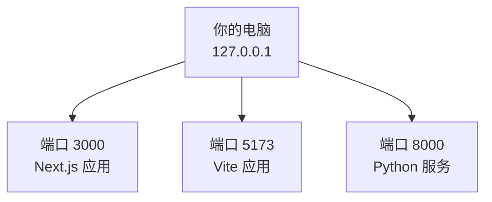
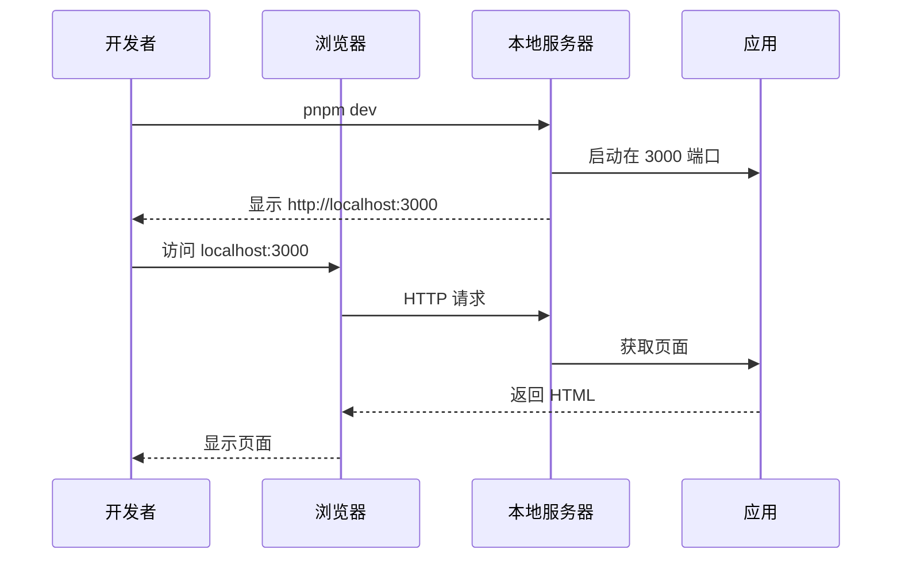

# 1.8 Localhost 与端口

> **阅读完本节后，你将会收获：**
> - 理解 localhost、IP 地址和端口的概念及相互关系
> - 掌握启动开发服务器并通过浏览器访问的方法
> - 学会排查端口占用问题，处理 EADDRINUSE 错误
> - 了解开发环境与生产环境的网络配置差异

> 序言中提到的 `localhost:3000`，是本地开发服务器的地址。

## 前置知识

::: tip 什么是 IP 地址

IP 地址是设备在网络上的唯一标识，如 `192.168.1.1`。在互联网上，每个设备都有一个 IP 地址。
:::

::: tip 什么是 Localhost

Localhost（localhost）是本地主机的域名，指向 `127.0.0.1`，代表"你自己的电脑"。
:::

::: tip 什么是 端口

端口（port）是网络服务的通道编号，范围 0-65535。一个 IP 地址可以有多个端口，每个端口对应一个服务。
:::

## 核心概念

### Localhost 与 127.0.0.1

```
localhost  →  127.0.0.1
(域名)        (IP 地址)
```

两者是等价的，都指向本地计算机：

```bash
# 下面两个命令效果相同
ping localhost
ping 127.0.0.1
```

**为什么有两个形式**：
- `localhost`：域名形式，易读
- `127.0.0.1`：IP 地址形式，更底层

### 端口的作用

如果把 IP 地址比作**大楼地址**，端口就是**房间号**：



**同一个 IP，不同端口可以运行不同服务**：

| 端口 | 服务 | 应用 |
|------|------|------|
| 3000 | Next.js 开发服务器 | `http://localhost:3000` |
| 5173 | Vite 开发服务器 | `http://localhost:5173` |
| 8000 | Python HTTP 服务器 | `http://localhost:8000` |

### 端口号规则

- **0-1023**：系统端口，需要管理员权限
- **1024-49151**：注册端口，常见服务使用
- **49152-65535**：动态端口，临时使用

**常见开发端口**：
- `3000`：Next.js、Express
- `5173`：Vite
- `8080`：常见替代端口
- `5000`：Flask、macOS 默认

## 实战步骤

### 启动开发服务器

```bash
# 安装依赖
pnpm install

# 启动开发服务器
pnpm dev

# 输出：
# Ready in 2345ms
# - Local: http://localhost:3000
```

浏览器访问 `http://localhost:3000`，看到你的应用。

::: tip 为什么先安装依赖？

`pnpm install` 会下载项目所需的所有代码包（依赖），没有这一步，项目无法运行。

这就像拼装家具前，需要先确认所有零件都齐全了。

:::

::: tip 什么时候需要运行 pnpm dev？

**每次开始工作**时都需要运行：

- 第一次打开项目
- 修改代码后想看效果（服务器会自动刷新，不需要重启）
- 关闭服务器后想继续工作

服务器启动后可以一直开着，直到你完成工作。

:::

::: warning 服务器关闭后页面会失效

当你关闭终端或按 `Ctrl+C` 停止服务器后，`localhost:3000` 的页面会无法访问。

**这是正常的**：开发服务器只在运行时提供服务。下次工作只需重新运行 `pnpm dev`。

:::

### 查看端口占用

**什么时候需要检查端口？**

- 启动服务器时报错 `EADDRINUSE`
- 想知道某个端口是否被占用
- 旧的开发服务器没有正常关闭

```bash
# Mac/Linux
lsof -i :3000

# 输出：
# COMMAND   PID   USER   FD   TYPE  DEVICE SIZE/OFF NODE NAME
# node    12345 user   23u  IPv6  0t0   TCP    *:3000  (LISTEN)

# Windows
netstat -ano | findstr :3000

# 输出：
# TCP    0.0.0.0:3000    0.0.0.0    0    LISTENING    12345
```

::: tip 什么是 PID？

PID（Process ID）是进程编号，每个运行的程序都有一个唯一的 PID。

查看端口占用后，你会看到 PID，用它来结束对应的进程。

:::

### 结束端口占用

**什么时候需要结束进程？**

- 端口被占用且不需要该程序
- 开发服务器卡死无法通过 `Ctrl+C` 关闭
- 需要释放端口给其他服务

```bash
# Mac/Linux：杀死进程
kill 12345

# Windows：结束进程
taskkill /PID 12345 /F
```

::: danger 不要随意杀死系统进程

在结束进程前，确认 PID 对应的是你自己的开发服务器（如 node、pnpm 等），而不是系统重要进程。

不确定？直接问 AI："这个 PID 是什么进程？"

:::

### 更换端口

**什么时候需要更换端口？**

- 默认端口（如 3000）被占用
- 同时运行多个项目
- 特殊需求避免端口冲突

```bash
# Next.js
pnpm dev -- -p 3001

# 或修改 package.json
"scripts": {
  "dev": "next dev -p 3001"
}
```

::: tip 端口冲突的自动处理

现代开发工具（如 Next.js 14+）会自动检测端口占用，如果 3000 被占用，会自动尝试 3001、3002...

**但如果看到 EADDRINUSE 报错**，说明自动检测失败，需要手动处理。

:::

## 常见问题

### Q1: 为什么启动服务器后浏览器自动打开 localhost？

**A**: 开发工具的便利功能。

Vercel、Vite 等工具会自动检测到服务器启动并打开浏览器。可以关闭这个行为：

```javascript
// next.config.js
module.exports = {
  devIndicators: {
    buildActivity: false,
  },
}
```

### Q2: EADDRINUSE 错误是什么？

**A**: 端口被占用。

```
Error: listen EADDRINUSE: address already in use :::3000
```

**解决**：

```bash
# 查找占用端口的进程
lsof -i :3000    # Mac/Linux
netstat -ano | findstr :3000   # Windows

# 杀死进程
kill PID         # Mac/Linux
taskkill /PID PID /F   # Windows
```

### Q3: 可以在局域网访问 localhost 吗？

**A**: 不可以。

`localhost` 只能在本机访问。局域网访问需要使用本机的局域网 IP：

```bash
# 查看本机 IP
ipconfig        # Windows
ifconfig        # Mac/Linux

# 局域网访问
http://192.168.1.100:3000
```

详见第10章"Localhost与公网访问"。

### Q4: 生产环境也用 3000 端口吗？

**A**: 不一定。

生产环境通常使用：
- `80`：HTTP 默认端口（可省略）
- `443`：HTTPS 默认端口（可省略）
- 或其他配置的端口


## 核心理念

**Localhost 是本地开发的基础**。



**关键点**：
1. **localhost = 127.0.0.1**：都指向本地计算机
2. **端口区分服务**：同一台电脑可运行多个服务
3. **开发 vs 生产**：开发用 localhost，生产用域名
4. **端口占用**：一个端口同时只能有一个进程

## 相关内容

- 详见：[1.4 Terminal终端入门]
- 详见：[第10章 Localhost与公网访问]
- 前置：[1.3 浏览器与服务器基础]
- 前置：[1.7 创建项目]
