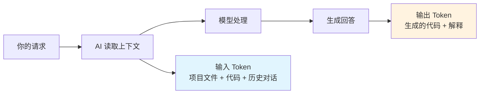

# 2.1 AI 编程的经济学 🔴

> 序言中提到的"模型决定代码能力的速度和上限"，以及成本意识在 AI 开发中的重要性。**Token 就是钱**，每次调用模型都在消耗真实的费用。

> 工具安装与配置详见：[1.6 模型与工具](../01-environment-setup/06-models-and-tools.md)

## 前置知识

::: tip 什么是 LLM

LLM（Large Language Model，大语言模型）是基于海量文本训练的 AI 模型，能够理解和生成人类语言、代码等。
:::

::: tip 什么是 Token

Token 是 AI 模型的计价单位，也是模型处理文本的基本单元。

**换算关系**：
- 1 个汉字 ≈ 1 Token
- 1 个英文单词 ≈ 0.75 Token
- 1 行代码 ≈ 5-15 Token

模型按照输入（Prompt）和输出（Completion）的 Token 数量计费。
:::

::: tip 什么是 输入/输出 Token

**输入 Token（Input）**：你发送给模型的内容（提示词、代码、上下文）

**输出 Token（Output）**：模型生成的内容（代码、解释、回答）

**花费怎么算**：输入和输出的 Token 数量都会计费，输出通常比输入贵一些。

但作为用户，你不需要记住具体单价——工具会显示每次调用的花费，用完了充值即可。重要的是理解：**上下文越大，花费越高**。
:::

::: tip 什么是 Context Window

Context Window 是模型能处理的上下文长度上限，以 Token 为单位。GLM-4.7 支持 200K 上下文，足够处理完整的大型文件和长对话。

**超出上限会自动压缩**：当上下文接近或超出限制时，模型会自动压缩早期的对话内容，保留最新和最相关的信息。这可能导致部分历史细节被简化或忽略。
:::

## 核心概念

### 花费从哪里来



**核心理解**：
- 单次调用很便宜，但累积起来也是钱
- **上下文越大 = 花费越高**：读取整个项目 vs 只读一个文件，差异是数量级的
- 频繁调试时要注意：循环修改会不断累积 Token

::: tip 如何控制花费

大多数 AI 编程工具都会：
- 显示每次调用的 Token 数和花费
- 提供套餐或使用额度
- 额度用完后提醒你充值

**你不需要记住具体单价**，但需要养成好习惯（见下一节）来减少不必要的消耗。
:::

## 成本与质量优化策略

**关键认知**：提示词本身通常很少，**真正消耗 Token 的是 AI 读取的上下文**——也就是为了让 AI 理解你的需求而必须加载的项目文件、代码、历史对话等。

因此，提示词优化不是在"打磨话术"，而是**减少 AI 需要读取的上下文范围**，同时**控制输出长度**。

**上下文范围既影响成本，也影响质量**：精准的上下文让 AI 聚焦问题，输出更准确；无关的上下文会分散注意力，增加错误概率。

**优化原则**：

- 指定文件/文件夹路径 —— 缩小 AI 搜索范围
- 指明功能范围 —— "登录功能有问题"比"项目有问题"更聚焦
- 删除客套话 —— 无需"请"、"谢谢"、"如果可能的话"

**示例对比**：

```
❌ 模糊提示（AI 读取更多上下文）：
"帮我看看项目里有没有什么问题，然后修复它"
→ AI 不确定从哪里开始，可能读取大量无关文件

✅ 精准提示（AI 聚焦相关区域）：
"帮我看看登录功能有什么问题，然后修复它"
→ AI 自己定位登录相关文件，只读取必要上下文
→ 或者更直接："修复 src/auth/login.ts 第42行的类型错误：user可能为null"
```

::: tip 不需要设定"专家角色"

很多人习惯在提示词开头加"你是一位资深的 React 专家..."——**这是多余的**。

CLI 工具或 AI IDE 的系统提示词已经包含了角色设定和编程语言上下文。你只需要直接描述任务，AI 会根据项目类型自动适配。

**直接说事**比"先设定角色再说事"更高效。
:::

## 实战建议

### 关注使用情况

AI 编程工具通常会显示每次调用的 Token 数和花费。你也可以在对应模型的开放平台查看详细使用情况。

**额度用完就充值**——就像话费流量一样，不需要过度焦虑，但要有意识地避免浪费。

### 成本意识检查清单

- 指定文件/文件夹路径
- 指明功能范围
- 删除客套话
- 定期清理对话历史

## 常见问题

### Q1: Token 超限怎么办？

通常不会超限 —— AI 会自动切分读取大文件。但如果遇到超限错误，说明项目规模已经需要工程化了：

- 考虑拆分项目（monorepo 或微服务）
- 清理对话历史，开启新会话
- 使用 `.gitignore` 排除不需要 AI 读取的文件

### Q2: 为什么有时候模型会瞎编？

这是"幻觉"问题，所有模型都有。解决方法：提供明确的上下文，让 AI 不确定时明确说出来。

### Q3: GLM-4.7 能力够用吗？

够用。

## 核心理念

**上下文决定花费和质量，直接比客套更重要。**

指定路径或功能范围，让 AI 只读取必要上下文。精准上下文既省钱，又让输出更准确。

## 相关内容

- 前置：[1.6 模型与工具](../01-environment-setup/06-models-and-tools.md)
- 详见：[2.2 VibeCoding工作流](./02-vibecoding-workflow.md)
