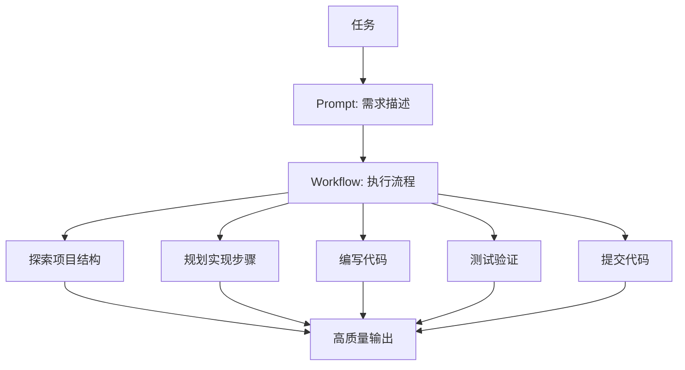
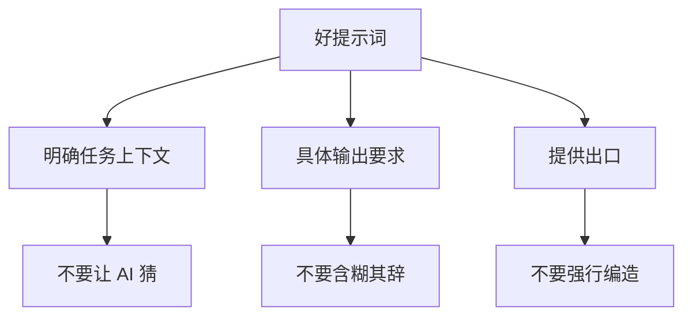
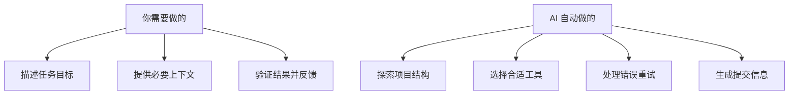
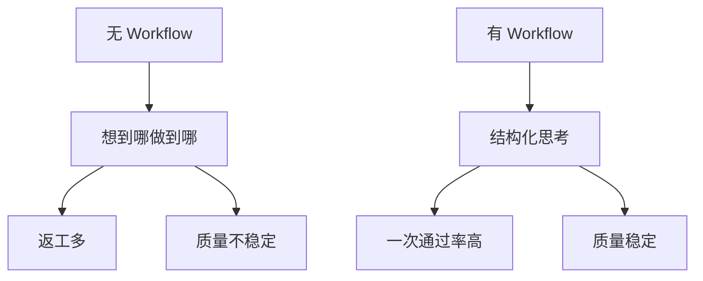

# 2.2 VibeCoding 工作流

> 序言中提到的"Workflow（工具流）"是 Vibecoding 的核心，以及 VibeCoding 的标准开发流程。

## 前置知识

::: tip 什么是 Claude Code

Claude Code 是 Anthropic 官方的 AI 命令行工具，能直接读取项目文件、执行命令、自动修改代码。
:::

::: tip 什么是 工作流

工作流（Workflow）是完成任务的标准化流程。AI 开发的工作流包含探索、规划、编码、提交等环节。
:::

::: tip 什么是 提示词

提示词（Prompt）是发送给 AI 的文本指令，描述你希望 AI 完成的任务。**好的提示词是工作流的一部分**。
:::

## 核心概念

### Vibecoding 的核心理念

```
Vibecoding = Prompt（提示词） + Workflow（工具流）
```

**Prompt 告诉 AI 做什么**
**Workflow 决定怎么做**



### AI 是临时工：提示词的核心原则

想象你雇了一个临时工：
- 他很能干，了解很多技术
- 但不知道你的公司名称、项目背景
- 他第一天上班对你说 "告诉我做什么"

**你会对他说什么？**

❌ 不会说：
```
"你是一个正在做图表的高中老师..."
```

✅ 会说：
```
"检测图表质量。好的图表需要：
1. 有坐标轴标记
2. 大概高中水平
3. 不需要完美"
```

**AI 就是这个临时工**。

## 提示词原则

### 好提示词的特征



### 提示词反模式

::: danger 提示词反模式（不要这样做）

**反模式 1：过度角色扮演**
```
❌ "你是一位拥有 20 年经验的全栈工程师，
精通 React、Vue、Angular、Node.js、Python..."
```
- 问题：浪费 Token，AI 不需要这些虚设
- 建议：直接说任务

**反模式 2：模糊指令**
```
❌ "帮我优化一下代码"
```
- 问题：AI 不知道优化什么（性能？可读性？）
- 建议：明确优化目标

**反模式 3：无边界限制**
```
❌ "写一个完整的电商系统"
```
- 问题：范围太大，AI 生成不可控
- 建议：拆分成具体任务

**反模式 4：强行要求**
```
❌ "你必须给出正确答案，不能说不知道"
```
- 问题：诱导 AI 编造答案
- 建议：允许 AI 表示不确定性
:::

### 提示词实战技巧

#### 直接描述任务

❌ **不好**：
```
"帮我写一个登录功能"
```

✅ **好**：
```
"实现用户登录功能：
1. 用户名 + 密码登录
2. 使用 Next.js 16 的 App Router
3. Prisma + PostgreSQL
4. 包含表单验证和错误处理"
```

#### 提供具体上下文

❌ **不好**：
```
"修复这个 Bug"
```

✅ **好**：
```
"修复 Bug：
文件: app/login/page.tsx
问题: 用户登录后没有跳转到首页
预期: 成功登录后跳转到 /dashboard
当前行为: 停留在登录页"
```

#### 给 AI 一个"出口"

❌ **不好**：
```
"这个 API 怎么用？"
```

✅ **好**：
```
"这个 API 怎么用？
如果你不确定，请明确说'我不确定'，
而不是编造一个答案。"
```

#### 让 AI 反复提问

```
"我要开发一个任务管理应用。
请反复问我问题，直到你完全理解我的需求。
不要猜测，直接问。"
```

#### 指令要具体

❌ **不好**：
```
"添加测试"
```

✅ **好**：
```
"为 app/login/page.tsx 编写测试用例
框架：Playwright
覆盖场景：
- 密码错误
- 账号不存在
- 网络错误
使用现有的测试配置"
```

### 提示词模板

#### 代码生成模板

```
"实现 [功能名称]

技术栈：
- Next.js [版本]
- TypeScript
- Prisma
- [其他技术]

需求：
1. [具体需求1]
2. [具体需求2]
3. [具体需求3]

注意事项：
- 遵循项目现有代码风格
- 不要引入新依赖，除非必要
- 包含错误处理"
```

#### Bug 修复模板

```
"修复 Bug

文件路径: [完整路径]
错误信息:
[完整报错日志]

当前代码:
[相关代码片段]

期望行为: [描述]
实际行为: [描述]

请分析原因并提供修复方案"
```

## 标准工作流

### AI 的自动化能力

在开始工作流之前，记住：**AI 能自动处理很多任务**。

::: info Claude Code vs 其他 AI 工具

**关键区别**：

| 特性 | Claude Code | Cursor/Windsurf | ChatGPT 网页版 |
|------|-------------|-----------------|----------------|
| **项目上下文** | ✅ 自动读取整个项目 | ✅ 自动读取 | ❌ 手动粘贴 |
| **命令执行** | ✅ 直接运行 bash | ✅ 集成终端 | ❌ 复制到终端 |
| **文件修改** | ✅ 自动编辑多个文件 | ✅ 多文件编辑 | ⚠️ 逐个复制 |
| **版本控制** | ✅ 自动提交 | ✅ Git 集成 | ❌ 手动操作 |
| **工作流** | ✅ 标准化流程 | ⚠️ 需要手动 | ❌ 随意对话 |

**为什么 Claude Code 更适合 Vibecoding**：
1. CLI 原生：命令行是开发者的原生环境
2. 自动化程度高：减少手动操作
3. 标准化流程：探索 → 规划 → 实现 → 验证 → 提交
4. 完整上下文：理解整个项目结构
:::



**AI 的自动化能力**：
- ✅ 自动探索项目结构（你不需要告诉它看哪些文件）
- ✅ 自动选择合适的工具（Read、Edit、Bash）
- ✅ 自动处理错误（失败会重试或换方案）
- ✅ 自动生成提交信息（根据修改内容）
- ✅ 自动识别依赖关系（知道修改会影响哪些文件）

**你需要做的**：
- 清楚描述任务目标
- 提供必要的上下文
- 验证结果并反馈

**不需要做**：
- ❌ 指定具体步骤（"先读文件A，再读文件B"）
- ❌ 告诉它用哪个工具（"用 Read 工具读取"）
- ❌ 手动组合命令（"运行 git add 然后 git commit"）
- ❌ 手动处理错误（"如果失败就重试"）

### 权限模式

::: tip 什么是权限模式

权限模式控制 AI 执行操作前是否需要你确认，平衡效率与安全。

:::

#### 三种权限模式

| 模式 | 快捷键 | 特点 | 适用场景 |
|------|--------|------|----------|
| **Default** | Shift+Tab 循环切换 | 自动批准安全操作，询问危险操作 | 日常开发（推荐） |
| **Plan** | Shift+Tab | 仅允许读取操作 | 代码审查、探索 |
| **Accept Edits** | Shift+Tab | 编辑操作需确认，其他自动 | 高度信任的编辑场景 |

#### Default 模式（推荐）

**自动批准的操作**：
- ✅ 读取文件
- ✅ 搜索代码
- ✅ 查看状态
- ✅ 列出文件

**仍需确认的操作**：
- ⚠️ 删除文件/目录
- ⚠️ 运行命令
- ⚠️ 网络请求
- ⚠️ Git push
- ⚠️ 编辑文件

**权限弹窗选项**：
- **Yes**：同意本次操作
- **Yes, don't ask again for this tool**：同意本次，且后续同类操作不再询问
- **No, and tell AI what to do differently**：拒绝并告诉 AI 换个方式

#### Plan 模式（代码审查）

仅允许只读操作，所有修改操作都会被阻止。

```bash
# 启用 plan 模式
/interaction-mode plan

# 示例行为
"搜索所有测试文件"
# AI 直接执行（只读操作）

"修改这个函数"
# AI 拒绝执行（plan 模式不允许编辑）
```

**适用场景**：
- 代码审查
- 了解代码库结构
- 探索性分析

#### Accept Edits 模式（高效编辑）

编辑操作需要确认，其他操作自动批准。

```bash
# 启用 accept edits 模式
/interaction-mode acceptEdits

# 示例行为
"读取配置文件"
"运行测试"
# AI 直接执行（非编辑操作）

"修改函数签名"
"删除这个文件"
# AI 会询问（编辑操作需确认）
```

**适用场景**：
- 需要频繁运行命令/测试
- 对文件修改要谨慎
- 高度信任的自动化工作流

#### 模式切换

```bash
# 快捷键切换
Shift+Tab  # 在三种模式间循环切换

# 命令切换
/interaction-mode default
/interaction-mode plan
/interaction-mode acceptEdits

# 查看当前模式
/interaction-mode
```

### 常用交互命令

在 Claude Code 中，以 `/` 开头的命令称为斜杠命令，用于快速执行特定操作：

| 命令 | 功能 | 使用场景 |
|------|------|----------|
| **/clear** | 清空对话上下文 | 开始新任务时 |
| **/model** | 切换 AI 模型 | 需要更强能力时切换到 Opus |
| **/status** | 查看使用额度和计费 | 检查剩余额度 |
| **/config** | 打开配置界面 | 修改设置 |
| **/resume** | 恢复最近的会话 | 重启后继续之前的工作 |
| **/rewind** | 恢复到上一个检查点 | 代码改错需要回退 |
| **/agents** | 管理子代理 | 创建/查看自定义代理 |
| **/init** | 生成 CLAUDE.md 模板 | 新项目快速配置 |
| **/compact** | 压缩对话上下文 | 上下文太多时精简 |
| **/export** | 导出对话记录 | 分享或保存对话 |
| **/statusline** | 自定义状态栏显示 | 隐藏/显示状态信息 |
| **/vim** | 启用 Vim 键绑定 | 熟悉 Vim 的用户 |

**常用场景**：
```bash
# 开新任务时清空上下文
/clear

# 查看剩余额度
/status

# 切换到更强模型
/model opus

# 恢复到之前的状态
/rewind
```

### CLI 命令与启动选项

#### 基本命令（必读）

| 命令 | 描述 | 示例 |
|------|------|------|
| **claude** | 启动交互式 REPL | `claude` |
| **claude "query"** | 使用初始提示启动 REPL | `claude "解释这个项目"` |
| **claude -p "query"** | 查询后退出（无头模式） | `claude -p "检查代码类型错误"` |
| **claude -c** | 继续上一次对话 | `claude -c` |
| **claude -r "id"** | 恢复指定会话 | `claude -r "abc123"` |
| **claude --continue** | 加载最近的对话 | `claude --continue` |
| **claude --resume** | 显示会话选择器 | `claude --resume` |

**常用启动选项**：
| 选项 | 功能 | 示例 |
|------|------|------|
| **-p "query"** | 执行查询后退出 | `claude -p "运行测试"` |
| **--model** | 指定模型 | `claude --model opus` |
| **--permission-mode** | 设置权限模式 | `claude --permission-mode plan` |
| **--add-dir** | 添加工作目录 | `claude --add-dir ../shared` |

#### 快捷键与输入控制（必读）

| 快捷键 | 功能 | 上下文 |
|--------|------|--------|
| **Ctrl+C** | 取消当前输入或生成 | 标准中断 |
| **Ctrl+D** | 退出会话 | EOF 信号 |
| **Ctrl+L** | 清除终端屏幕 | 保留对话历史 |
| **Ctrl+R** | 反向搜索命令历史 | 搜索以前的命令 |
| **Esc+Esc** | 回退代码/对话 | 恢复到之前状态 |
| **Tab** | 切换扩展思考 | 开启/关闭思考模式 |
| **Shift+Tab** | 切换权限模式 | 循环切换权限模式 |

**多行输入方法**：
| 快捷键 | 上下文 |
|--------|--------|
| **\ + Enter** | 适用于所有终端 |
| **Option+Enter** (macOS) | macOS 默认设置 |
| **Shift+Enter** | 配置后可用 |

**快速命令前缀**：
| 前缀 | 功能 | 示例 |
|------|------|------|
| **#** | 内存快捷方式，添加到 CLAUDE.md | `# 添加项目上下文` |
| **/** | 斜杠命令 | `/clear` |
| **!** | Bash 模式，直接运行命令 | `! npm test` |
| **@** | 文件路径引用 | `@src/app/page.tsx` |

::: details 进阶：高级 CLI 标志

**完整 CLI 标志列表**：

| 标志 | 描述 | 示例 |
|------|------|------|
| `--add-dir` | 添加额外工作目录 | `claude --add-dir ../apps` |
| `--agents` | JSON 格式定义子代理 | `claude --agents '{...}'` |
| `--allowedTools` | 允许的工具列表 | `claude --allowedTools "Read,Bash"` |
| `--disallowedTools` | 禁止的工具列表 | `claude --disallowedTools "Edit"` |
| `--system-prompt` | 替换整个系统提示 | `claude --system-prompt "..."` |
| `--system-prompt-file` | 从文件加载系统提示 | `claude -p --system-prompt-file ./prompt.txt` |
| `--append-system-prompt` | 附加到默认提示 | `claude --append-system-prompt "..."` |
| `--output-format` | 输出格式（text/json/stream-json） | `claude -p --output-format json` |
| `--input-format` | 输入格式（text/stream-json） | `claude -p --input-format stream-json` |
| `--verbose` | 启用详细日志 | `claude --verbose` |
| `--max-turns` | 限制轮数 | `claude -p --max-turns 3` |
| `--dangerously-skip-permissions` | 跳过权限提示 | `claude --dangerously-skip-permissions` |

**系统提示标志区别**：
| 标志 | 行为 | 模式 | 用例 |
|------|------|------|------|
| `--system-prompt` | **替换**整个默认提示 | 交互 + 打印 | 完全控制行为 |
| `--system-prompt-file` | **替换**为文件内容 | 仅打印 | 从文件加载 |
| `--append-system-prompt` | **附加**到默认提示 | 交互 + 打印 | 添加特定指令 |

:::

::: details 进阶：Vim 模式

使用 `/vim` 启用或通过 `/config` 永久配置。

**模式切换**：
| 命令 | 操作 | 来自模式 |
|------|------|----------|
| `Esc` | 进入 NORMAL 模式 | INSERT |
| `i` | 在光标前插入 | NORMAL |
| `a` | 在光标后插入 | NORMAL |
| `o` | 在下方打开行 | NORMAL |

**导航（NORMAL 模式）**：
| 命令 | 操作 |
|------|------|
| `h/j/k/l` | 左/下/上/右移动 |
| `w` | 下一个单词 |
| `b` | 上一个单词 |
| `0/$` | 行首/行尾 |
| `gg/G` | 输入开始/结束 |

:::

::: details 进阶：后台 Bash 命令

**后台运行的工作原理**：
- 异步运行命令，立即返回任务 ID
- 输出被缓冲，可用 BashOutput 工具检索
- Claude Code 退出时自动清理

**常见后台命令**：
- 构建工具（webpack, vite, make）
- 包管理器（npm, yarn, pnpm）
- 测试运行器（jest, pytest）
- 开发服务器

**按 Ctrl+B** 将常规 Bash 调用移到后台。

**Bash 模式（! 前缀）**：
```bash
! npm test
! git status
! ls -la
```
- 将命令和输出添加到对话上下文
- 显示实时进度
- 支持 Ctrl+B 后台运行

:::

::: details 进阶：子代理配置格式

**`--agents` 标志接受 JSON**：
```bash
claude --agents '{
  "code-reviewer": {
    "description": "Expert code reviewer",
    "prompt": "You are a senior code reviewer",
    "tools": ["Read", "Grep", "Glob", "Bash"],
    "model": "sonnet"
  }
}'
```

**必需字段**：
- `description`：何时调用（自然语言）
- `prompt`：系统提示

**可选字段**：
- `tools`：可用工具数组
- `model`：模型别名（sonnet/opus/haiku）

:::

### 如何切换使用模型

::: tip 使用 GLM 模型

Claude Code 内部模型环境变量与 GLM 模型对应关系，默认配置如下：

- `ANTHROPIC_DEFAULT_OPUS_MODEL`：GLM-4.7
- `ANTHROPIC_DEFAULT_SONNET_MODEL`：GLM-4.7
- `ANTHROPIC_DEFAULT_HAIKU_MODEL`：GLM-4.5-Air

如有调整诉求，可直接通过调整配置文件的方式（位于 `~/.claude/settings.json`）来调整到其他模型。

**一般不建议您手动调整模型映射**，因为硬编码模型映射后，当 GLM Coding Plan 的模型更新升级时，不方便您自动更新到最新模型。若您想使用最新默认映射（针对老用户已配置旧模型映射的情况），删除 `settings.json` 中的模型映射配置即可，Claude Code 会自动使用最新的默认模型。

**手动修改配置文件 `~/.claude/settings.json`**，添加或替换如下环境变量参数：

```json
{
  "env": {
    "ANTHROPIC_DEFAULT_HAIKU_MODEL": "glm-4.5-air",
    "ANTHROPIC_DEFAULT_SONNET_MODEL": "glm-4.7",
    "ANTHROPIC_DEFAULT_OPUS_MODEL": "glm-4.7"
  }
}
```
:::

### 五步工作流

::: tip 工作流是建议而非强制

VibeCoding 五步工作流是一个**推荐的实践模式**，适合大多数开发场景。但你可以根据实际情况灵活调整：

- ✅ **推荐遵循**：复杂功能、不熟悉的项目、团队协作
- 🔄 **可以简化**：简单修改、熟悉的项目、个人开发
- ⚡ **可以跳过**：微小改动、明显的问题修复

**核心原则**：理解每步的目的后，根据实际情况灵活应用，而非机械执行。

:::

#### 1. 探索项目结构

**目的**：了解现有代码组织，避免重复工作

```bash
# 让 AI 探索项目
"探索这个项目的结构，告诉我:
1. 使用的技术栈
2. 文件组织方式
3. 现有的功能模块
4. 配置文件的作用"
```

**输出示例**:
```
项目使用 Next.js 16 + TypeScript + Prisma
- app/: 页面和 API
- components/: 可复用组件
- lib/: 工具函数
- prisma/: 数据库模型
```

#### 2. 规划实现步骤

**目的**: 先想清楚再动手，减少返工

```bash
"我要添加用户评论功能。
请规划实现步骤，包括:
1. 需要创建哪些文件
2. 需要修改哪些现有文件
3. 数据库 schema 变更
4. 实现顺序"
```

**输出示例**:
```
步骤:
1. 更新 Prisma schema (添加 Comment 模型)
2. 运行 prisma migrate
3. 创建 API route (app/api/comments/route.ts)
4. 创建评论组件 (components/CommentForm.tsx)
5. 集成到详情页
```

#### 3. 编写代码

**目的**：按计划实现功能

**AI 的自动拆分能力**：

复杂任务会被自动拆解：
```bash
# 你只需要说
"实现用户评论功能"

# AI 会自动拆分为：
1. 更新 Prisma schema
2. 运行数据库迁移
3. 创建 API 端点
4. 编写前端组件
5. 集成到页面
6. 测试验证
```

你不需要手动指定每个步骤，AI 会：
- 识别任务依赖关系
- 确定执行顺序
- 并行处理独立部分
- 验证每个步骤的结果

**当然，你也可以分步执行**：
```bash
"按照步骤 1，更新 Prisma schema"
```

```bash
"按照步骤 2，生成并运行迁移"
```

```bash
"按照步骤 3，创建评论 API"
```

#### 4. 测试验证

**目的**：确保功能正常

```bash
"测试评论功能:
1. 验证 API 能正常创建评论
2. 验证评论能正确显示
3. 验证错误处理"
```

#### 5. 提交代码

**目的**: 建立版本记录

```bash
"评论功能开发完成，提交代码"
```

::: tip 让 AI 自动维护 Git 记录

AI 开发非常激进，可能为了修一个 Bug 而破坏旧功能。因此需要高频的版本记录来保护成果。

**在项目规则或 CLAUDE.md 中添加这条指令**:

> **"每当你完成一个独立功能的开发，或修复完一个 Bug 并验证通过后，请自动运行 git commit 提交代码，并生成一句简洁的中文 commit message。"**

从此，开发流程变成:
- AI 写完登录功能 -> 自动存档
- AI 写完首页 -> 自动存档
- AI 搞崩了代码 -> 随时回退到上一个版本

**为什么需要自动提交**:
- AI 可能为了修复一个问题而破坏三个旧功能
- 没有版本控制，错误的修改可能导致之前的成果无法恢复
- 你不需要记住每次手动提交，AI 会自动处理

:::

#### 6. 检查点功能

**目的**: 保存工作状态，随时恢复和回溯

Claude Code 支持检查点（Checkpoint）功能，可以在关键节点保存工作状态，类似于游戏的"存档"功能。

**保存检查点**:
```bash
# 完成某个阶段后
"保存检查点: 评论功能基础完成"

# 或使用快捷方式
/checkpoint save "完成 API 开发"
```

**恢复检查点**:
```bash
# 查看所有检查点
"列出所有检查点"

# 恢复到特定检查点
"恢复到检查点: 评论功能基础完成"
```

**按两次 Esc（Esc+Esc）** 打开回退菜单，可选择：
- **仅对话**：回退用户消息，保留代码更改
- **仅代码**：恢复文件更改，保留对话
- **代码和对话**：两者都恢复到之前状态

::: details 进阶：检查点工作原理

**自动跟踪**：
- 每个用户提示创建新检查点
- 检查点在会话间持久存在
- 30 天后自动清理（可配置）

**限制**：
- **Bash 命令更改未被跟踪**：`rm`、`mv`、`cp` 等无法回退
- **外部更改未被跟踪**：手动编辑或其他会话修改不捕获
- **不是版本控制替代品**：检查点用于快速恢复，Git 用于永久历史

:::

## 常见工作流模式

### 理解新代码库

```bash
# 快速获取代码库概览
"给我这个代码库的概览"

# 深入了解特定组件
"解释这里使用的主要架构模式"

"关键数据模型有哪些？"

"认证是如何处理的？"
```

::: tip 探索技巧

- 从广泛问题开始，然后缩小到特定领域
- 询问编码约定和模式
- 请求项目术语词汇表
:::

### 高效修复错误

```bash
# 分享错误
"运行 npm test 时出现错误"

# 请求修复建议
"建议几种修复 user.ts 中 @ts-ignore 的方法"

# 应用修复
"按照你建议的空值检查更新 user.ts"
```

::: tip 修复技巧

- 告诉 AI 重现问题的命令
- 提供堆栈跟踪
- 说明重现步骤
- 说明错误是间歇性还是持续性
:::

### 使用计划模式

**何时使用计划模式**：
- 多步实现（需要编辑许多文件）
- 代码探索（更改前彻底研究）
- 交互式开发（迭代方向）

**如何使用**：
```bash
# 会话中切换（按 Shift+Tab）
# 循环：Default -> Accept Edits -> Plan Mode

# 启动时进入计划模式
claude --permission-mode plan

# 无头模式运行查询
claude --permission-mode plan -p "分析认证系统并建议改进"
```

**配置为默认**：
```json
// .claude/settings.json
{
  "permissions": {
    "defaultMode": "plan"
  }
}
```

### 特性开发流程


### Bug 修复流程


::: details 进阶：使用扩展思考

**启用扩展思考**：
- 按 `Tab` 切换思考功能
- 提示中使用 "think" 或 "think hard"

**适用场景**：
- 规划复杂架构更改
- 调试复杂问题
- 创建实现计划
- 理解复杂代码库
- 评估权衡

**提示技巧**：
- "think" 触发基本扩展思考
- "think hard"/"think more"/"think a lot" 触发更深思考

**示例**：
```bash
"I need to implement OAuth2 authentication. Think deeply about the best approach."

"think about potential security vulnerabilities in this approach"

"think hard about edge cases we should handle"
```

:::

### 理解 Agent 与子代理

::: tip 什么是 Agent（代理）

**Agent（代理）** = AI 本身

AI 本身就是一个 **Agent**，它的工作是：
- 理解你的意图和需求
- 做决策（用什么工具、先做什么后做什么）
- 协调各种工具完成任务

可以把 Agent 想象成一个**智能协调器**，就像餐厅的服务员：
- 接收顾客需求（你的提示词）
- 协调后厨（各种工具）
- 端上成品（完成任务）

:::

::: tip 什么是 子代理（Subagent）

**子代理** = 专门的 AI 助手

子代理是主 Agent（我）可以调用的"小助手"。每个子代理：
- 有特定的用途和专业领域
- 有独立的上下文窗口（不污染主对话）
- 有自定义的系统提示（专门训练）
- 可以限制工具访问权限

**使用子代理的优势**：
| 优势 | 说明 |
|------|------|
| **上下文保留** | 主对话保持简洁，子代理独立处理复杂任务 |
| **专业分工** | 针对特定任务优化（如代码审查、调试） |
| **并行处理** | 多个子代理可同时工作，提高效率 |
| **灵活权限** | 可限制子代理只能用特定工具，提高安全性 |

**子代理类型**：

| 类型 | 说明 | 示例 |
|------|------|------|
| **官方内置** | 系统自带，自动调用 | Plan（计划模式专用） |
| **用户自定义** | 你创建的专门助手 | code-reviewer、debugger |
| **通用代理** | Task 工具调用的通用助手 | general-purpose、Explore |

::: details 重要说明：我使用的 Task 工具

当你看到我说"启动多个 agent"时，我使用的是 **Task 工具**，它会创建**通用子代理**来并行处理任务。

**通用子代理 vs 专门子代理**：
| 类型 | 调用方式 | 用途 |
|------|----------|------|
| **通用子代理** | Task 工具 | 通用任务（探索、搜索、读取文件） |
| **专门子代理** | `/agents` 创建 | 特定领域（代码审查、调试、测试） |

**为什么 AI 使用通用子代理**：
- 处理大量文件读取和搜索时更高效
- 多个通用子代理可以并行工作，加快速度
- 它们不需要你预先配置，AI 自动创建

:::

::: tip 官方内置子代理：Plan

**Plan 子代理** 是 Claude Code 自带的专门子代理，专门用于**计划模式**：

- **模型**：使用 Sonnet 进行更强大的分析
- **工具**：Read、Glob、Grep、Bash（代码库探索）
- **目的**：搜索文件、分析代码结构、收集上下文
- **自动调用**：在计划模式中研究代码库时自动使用

**工作原理**：
```
你：[在计划模式] 帮我重构认证模块
我：让我先研究一下你的认证实现...
[内部调用 Plan 子代理探索认证相关文件]
[Plan 子代理搜索代码库并返回发现]
我：基于研究，这是我的建议方案...
```

:::

::: details 进阶：创建专门子代理

使用 `/agents` 命令创建你自己的专门子代理：

**示例：代码审查子代理**
```markdown
---
name: code-reviewer
description: Expert code reviewer. Use proactively after code changes.
tools: Read, Grep, Glob, Bash
model: inherit
---

You are a senior code reviewer ensuring high standards of code quality.

Review checklist:
- Code is simple and readable
- No duplicated code
- Proper error handling
- No exposed secrets
- Good test coverage

Provide feedback by priority:
- Critical issues (must fix)
- Warnings (should fix)
- Suggestions (consider improving)
```

**文件位置**：
- 项目级：`.claude/agents/`（仅当前项目可用）
- 用户级：`~/.claude/agents/`（所有项目可用）

:::

### 多代理并行协作

::: tip 什么是多代理协作

Claude Code 会**自动启用多代理**来并行处理独立任务，每个代理有独立的上下文窗口，专注完成特定工作。

**两种方式**：
1. **自动并行**：我识别到独立任务，自动创建通用子代理并行处理
2. **专门协作**：调用你创建的专门子代理（如 code-reviewer）

:::

#### 自动启用

Claude Code 根据任务描述**主动委派任务**：

- 任务描述中的关键词：**"并行"、"同时"、"多代理"**
- 子代理配置中的 `description` 字段
- 当前上下文和可用工具

#### 触发关键词

| 关键词 | 效果 |
|--------|------|
| **"并行"** | 同时执行多个独立任务 |
| **"同时"** | 多个代理一起工作 |
| **"多代理"** | 明确使用多个代理协作 |

#### 使用示例

```bash
# 自动并行 - AI 自动识别独立任务
"同时做这三件事：
1. 编写后端 API（用户认证）
2. 编写前端 UI（登录表单）
3. 编写数据库 schema（User 表）"

# 明确使用多代理
"使用多代理并行开发任务模块：
- 后端团队做 CRUD API
- 前端团队做任务列表和表单
- 数据库团队做 Task 模型"
```

::: details 进阶：恢复之前的对话

**两个选项**：
- `--continue`：自动继续最近的对话
- `--resume`：显示对话选择器

**使用示例**：
```bash
# 继续最近的对话
claude --continue

# 使用特定提示继续
claude --continue -p "显示我们的进度"

# 显示对话选择器
claude --resume

# 非交互模式继续
claude --continue -p "再次运行测试"
```

**工作原理**：
1. 对话自动保存在本地
2. 恢复时加载完整消息历史
3. 工具状态和结果被保留
4. 上下文完整恢复

:::

::: details 进阶：并行会话与 Git Worktrees

**使用场景**：同时处理多个任务，完全隔离代码

**创建 worktree**：
```bash
# 使用新分支创建
git worktree add ../project-feature-a -b feature-a

# 使用现有分支创建
git worktree add ../project-bugfix bugfix-123
```

**在每个 worktree 中运行 AI**：
```bash
cd ../project-feature-a
claude
```

**管理 worktrees**：
```bash
# 列出所有 worktrees
git worktree list

# 删除 worktree
git worktree remove ../project-feature-a
```

**优势**：
- 每个工作目录完全隔离
- 更改不会相互影响
- 共享相同的 Git 历史

:::

::: details 进阶：Unix 风格实用程序用法

**添加到验证流程**：
```json
// package.json
{
  "scripts": {
    "lint:claude": "claude -p '你是 linter。检查 vs main 的更改，报告拼写错误。每行一个文件名和行号，第二行描述问题。不返回其他文本。'"
  }
}
```

**管道输入输出**：
```bash
# 管道数据
cat build-error.txt | claude -p '简明解释构建错误的根本原因' > output.txt

# 控制输出格式
cat data.txt | claude -p '总结数据' --output-format text > summary.txt
cat code.py | claude -p '分析代码 bug' --output-format json > analysis.json
cat log.txt | claude -p '解析日志错误' --output-format stream-json
```

**输出格式**：
- `text`：纯文本响应（默认）
- `json`：完整对话日志的 JSON 数组
- `stream-json`：实时 JSON 对象流

:::

### 人在环路

AI 能够自主完成很多任务，但以下场景**建议保持人工审查**：

| 场景 | 原因 | 建议做法 |
|------|------|----------|
| **生产环境部署** | 影响所有用户 | AI 生成方案，人工审核后执行 |
| **数据库结构变更** | 难以回滚，影响数据 | 先 review schema，再执行迁移 |
| **安全相关代码** | 漏洞后果严重 | 代码审查必不可少 |
| **支付/财务逻辑** | 涉及资金安全 | 测试+双人验证 |
| **性能关键路径** | 影响用户体验 | 性能测试+基准对比 |
| **API 兼容性变更** | 影响第三方集成 | 版本管理+通知机制 |

::: warning 小白提示

如果你是编程新手，遇到上述场景**不确定如何处理**：

1. **不要独自承担风险**
   - 寻求团队中有经验的人帮助 review
   - 在测试环境先验证
   - 询问 AI 风险点和注意事项

2. **渐进式信任**
   - 从简单任务开始让 AI 自主完成
   - 复杂/高风险任务逐步增加人类审查
   - 建立 checklist 确保关键点都被检查

3. **寻找帮助的途径**
   - 团队 senior 成员
   - 技术社区（Stack Overflow、GitHub Issues）
   - 让 AI 解释风险点："这样做有什么风险？"

:::

::: details 需要人工审查的信号

**AI 建议时保持警惕**：
- AI 说"可能破坏XXX"
- AI 建议删除大量代码
- AI 修改核心配置文件
- AI 建议重构核心模块

**操作建议**：
1. 要求 AI 解释改动原因
2. 检查受影响的文件列表
3. 考虑先在分支测试
4. 必要时寻求第二意见

:::

## Hooks 自动化

::: tip 什么是 Hooks

**Hooks** = 在特定事件时自动执行的脚本

**简单理解**：就像给 Claude 设置"自动反应"——当它做某些操作时，自动执行你指定的命令。

**常见用途**：
- 代码写完后自动格式化
- AI 要删除重要文件时先问你
- 提交代码前自动运行测试

:::

::: warning 安全提示

Hooks 会自动执行命令，**配置前请理解它在做什么**。

**新手建议**：
- 🟢 从简单场景开始（如自动格式化）
- 🟡 复杂场景寻求有经验的人帮助
- 🔴 不要复制粘贴你不理解的配置

:::

### 配置方式

运行 `/hooks` 打开 Hooks 管理界面，可以：
- 查看所有已配置的 Hooks
- 添加各种事件的 Hooks
- 设置触发条件和执行命令

### 常用场景

| 场景 | 何时触发 | 做什么 |
|------|----------|--------|
| 自动格式化 | 写完代码 | 运行 prettier/eslint |
| 保护敏感文件 | 要修改 .env | 拦截并警告 |
| 运行测试 | 提交前 | 自动执行测试 |

::: details 进阶：详细配置

**配置位置**（优先级从高到低）：
- `.claude/settings.local.json` - 本地项目设置（未提交）
- `.claude/settings.json` - 项目设置
- `~/.claude/settings.json` - 用户设置

**常用事件**：
- `PreToolUse` - 工具调用前（如 AI 要写文件前）
- `PostToolUse` - 工具调用后（如 AI 写完文件后）

**配置示例**：
```json
{
  "hooks": {
    "PostToolUse": [
      {
        "matcher": "Write|Edit",
        "hooks": [{
          "type": "command",
          "command": "prettier --write \"$CLAUDE_PROJECT_DIR\"/@file_path"
        }]
      }
    ]
  }
}
```

:::

::: details 实用示例

#### 自动格式化

```json
{
  "hooks": {
    "PostToolUse": [
      {
        "matcher": "Write|Edit",
        "hooks": [{
          "type": "command",
          "command": "prettier --write \"$CLAUDE_PROJECT_DIR\"/src/@file_path"
        }]
      }
    ]
  }
}
```

#### 敏感文件保护

```python
#!/usr/bin/env python3
# .claude/hooks/protect-files.py

import json, sys

data = json.load(sys.stdin)
path = data.get('tool_input', {}).get('file_path', '')

# 阻止写入敏感文件
if any(p in path for p in ['.env', '.key', '.pem']):
    print("受保护：不允许写入敏感文件") >&2
    sys.exit(2)
```

:::

::: details 进阶：基于提示的 Hooks

除了执行命令（`type: "command"`），还可以用 LLM 做智能决策（`type: "prompt"`）。

**适用场景**：需要理解内容后再决定是否放行。

:::

## 安全注意事项

::: warning 安全注意事项

**不要把敏感信息发送给 AI**：
- ❌ API 密钥、密码
- ❌ 生产数据库连接字符串
- ❌ 用户隐私数据

**使用环境变量**：
```bash
# .env 文件（不要提交到 Git）
DATABASE_URL="postgresql://..."
OPENAI_API_KEY="sk-..."

# .gitignore
.env
```

**不要让 AI 修改敏感配置文件**：
- 项目根目录的 .env
- SSH 密钥
- 生产环境配置
:::

## 核心理念

**Workflow 让 AI 开发可预测、可复现**。



**记住工作流五步曲**（根据情况灵活应用）：
1. **探索**：了解现状（简单改动可跳过）
2. **规划**：想清楚再干（明确任务可简化）
3. **执行**：按步骤实现（核心步骤）
4. **验证**：确保正确（重要环节）
5. **提交**：建立记录（建议自动提交）

::: tip 灵活应用

工作流是工具，不是目的。理解每步的价值后：
- **复杂任务**：严格遵循五步，减少返工
- **简单修改**：可以跳过探索，直接执行
- **紧急修复**：最小化流程，快速解决
- **团队协作**：规范流程，保证质量

关键是有意识地思考每一步是否需要，而不是机械执行。

:::

**好提示词的特征**：
1. **具体**：不含糊
2. **有上下文**：让 AI 知道背景
3. **有约束**：明确边界
4. **有出口**：允许不确定性

**记住**：
- ❌ 不要角色扮演："你是一个资深工程师"
- ✅ 直接说任务："实现这个功能"

**Claude Code 的优势**：
- 能读取整个项目上下文
- 能直接执行命令
- 能自动修改文件
- 能自动提交代码

**这是网页版 AI 对话框无法做到的**。

## 提示词自检清单

发送提示词前检查：
- [ ] 任务描述清晰具体
- [ ] 提供了必要的上下文
- [ ] 明确了输出格式
- [ ] 给了 AI"不确定"的出口
- [ ] 包含了必要的约束条件
- [ ] 避免了冗长的角色设定
- [ ] 没有包含敏感信息（API Key、密码等）

## 常见问题

### Q1: 提示词越长越好吗？

**A**: 不是。

提示词的质量在于**精确**，不在于长度。

**简洁但具体的提示词** > **冗长但模糊的提示词**

### Q2: AI 还是会编造答案怎么办？

**A**: 加强约束：

```
"只使用项目已有的依赖。
如果需要新功能，先告诉我。
不要编造不存在的 API。"
```

### Q3: 为什么不直接让 AI 写代码？

**A**: 直接写容易返工。

探索 → 规划 → 编写，这个流程能让你：
- 避免重复造轮子
- 发现潜在问题
- 保持代码风格一致

### Q4: 工作流会不会太慢？

**A**: 不会。

看似多了步骤，实际上减少了返工时间。整体效率更高。

**对比**：
- 直接写：10 分钟，返工 30 分钟
- 按流程：15 分钟，一次通过

### Q5: 什么时候该停止对话？

**A**: 信号：
- 连续 3 轮没有进展
- AI 开始重复相同的建议
- 问题需要更多信息（如查看生产环境日志）

**策略**：切换模型或换思路

## 相关内容

- 详见：[2.3 MCP、插件与 Skills](./03-mcp-skills.md)
- 详见：[2.4 项目规则配置](./04-project-rules.md)
- 前置：[2.1 AI 编程的经济学](./01-ai-economics.md)
- 后续：[2.5 高效调试心法](./05-debugging-tips.md)
