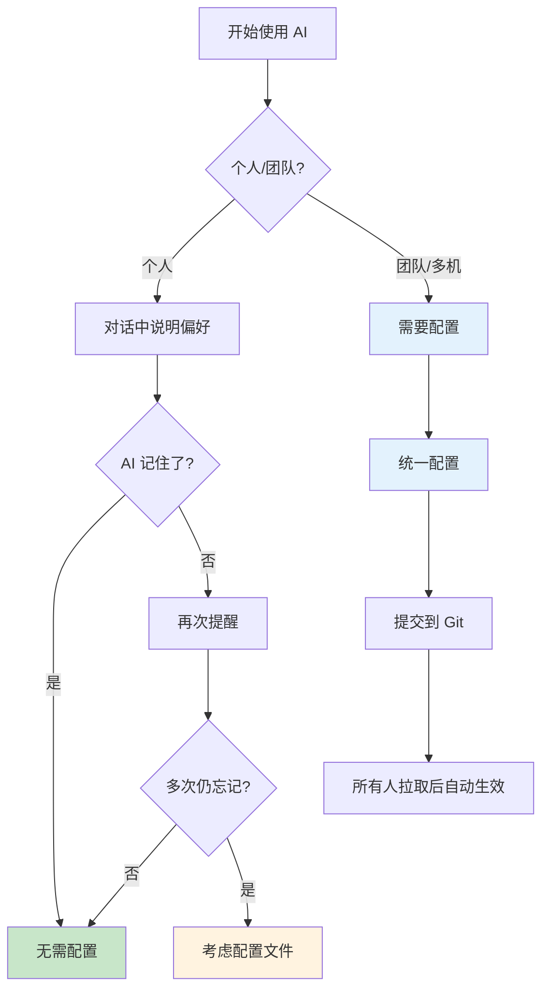
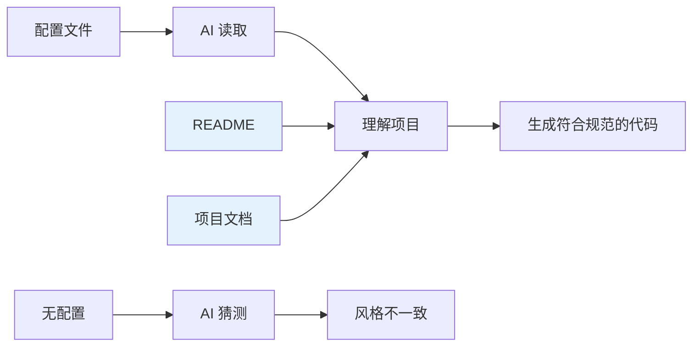
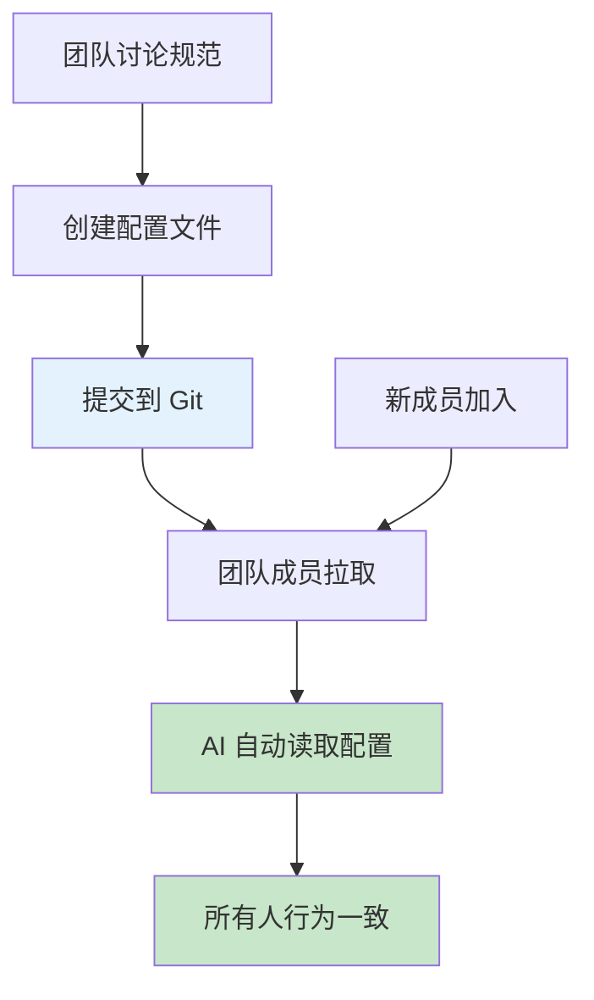
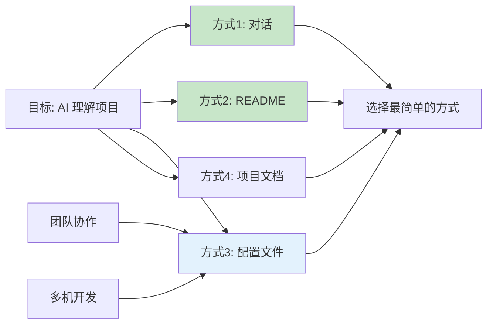

# 2.4 项目规则配置 🟡

> **本节通常可以跳过**。个人开发时，AI 能从对话和项目文档中理解项目，无需额外配置。
>
> **团队协作/多机开发**：需要统一环境、规范、MCP、插件等配置时，本节内容非常有用。

::: warning 重要：个人开发通常不需要配置

在折腾配置文件之前，请先了解：

1. **AI 有记忆**：对话中告诉 AI 的偏好，它会记住
2. **项目文档足够**：README + 第三章的项目文档通常能让 AI 理解项目
3. **配置是补充**：只有在 AI 反复忘记某些规则时，才考虑写入配置文件

:::

## 什么时候需要配置



**需要配置的典型场景**：

| 场景 | 是否需要配置 | 解决方案 |
|------|-------------|----------|
| 个人项目，AI 记得你的偏好 | ❌ 不需要 | 对话中说明即可 |
| 个人项目，有清晰的 README | ❌ 不需要 | 让 AI 先看 README |
| **团队协作/多机开发** | ✅ **需要** | **统一配置，提交 Git** |
| AI 反复忘记某个规则 | ✅ 建议 | 写入配置文件 |
| 需要统一 MCP/插件环境 | ✅ 需要 | settings.json 配置 |

::: tip 团队协作/多机开发

这是**本节最重要的使用场景**：

- **多机开发**：在家和公司电脑之间保持一致
- **团队协作**：确保所有成员的 AI 行为一致
- **统一环境**：MCP 服务器、插件、Hooks 等配置共享

:::

## 更简单的方法：让 AI 自己写

与其手动写配置，不如让 AI 帮你：

**方法一：让 AI 参考官方文档**

```
请根据 Claude Code 官方文档，为我的团队项目创建完整的配置文件。

我的项目：
- Next.js 16 + TypeScript
- 使用 shadcn/ui 组件库
- 用 pnpm 包管理器
- 5人团队，需要统一规范

请生成：
1. CLAUDE.md 项目说明
2. .claude/settings.json 权限配置
```

**方法二：让 AI 参考本教程**

```
请根据《AI 调教指南》2.4 节的内容，为我的团队项目创建配置文件。

项目信息：
[粘贴你的项目说明]

团队情况：
- 前端团队，使用 TypeScript + React
- 需要统一代码风格和 MCP 服务器
```

::: tip

AI 知道如何写配置文件，你只需要提供项目信息即可。

:::

## 配置文件的本质



**核心原则**：配置文件、README、项目文档——本质上都是**让 AI 理解项目的方式**。

| 方式 | 文件 | 作用 | 必要性 |
|------|------|------|--------|
| **项目文档** | README、第三章的文档 | 完整的项目说明 | ✅ 推荐 |
| **配置文件** | CLAUDE.md、.cursorrules | 简洁的规范说明 | ⚠️ 个人可选，团队需要 |
| **对话沟通** | 直接告诉 AI | 快速表达偏好 | ✅ 最简单 |

::: tip 关键洞察

**项目配置文件**（无论叫什么名字）本质相同：
- 都是写给 AI 看的项目说明书
- 核心内容：技术栈 + 编码规范 + 禁止行为
- 只是不同工具用不同文件名

| 工具 | 文件名 |
|------|--------|
| Claude Code | `CLAUDE.md` |
| Cursor | `.cursorrules` |
| Qoder/Trae | `.iderules` |

:::

## CLAUDE.md 模板

如果确实需要配置文件，越简洁越好：

```markdown
# 项目：[项目名称]

## 技术栈
Next.js 16 + TypeScript + Tailwind + shadcn/ui

## 规范
- 禁止 any，严格模式
- PascalCase 命名组件
- 用 pnpm

## 禁止
- 不装新依赖
- 不改 .env
```

**创建方式**：
- Claude Code：在项目根目录创建 `CLAUDE.md`
- Cursor/Qoder/Trae：在 IDE 设置中配置规则文件

::: details 完整模板

```markdown
# 项目说明

## 项目概述
[一句话说明项目做什么]

## 技术栈
- **框架**: Next.js 16 (App Router)
- **语言**: TypeScript (严格模式)
- **数据库**: Prisma + PostgreSQL
- **样式**: Tailwind CSS
- **组件**: shadcn/ui

## 编码规范
- 禁止 `any` 类型
- 组件用 PascalCase，函数用 camelCase
- 使用 pnpm（不要用 npm/yarn）

## 禁止行为
- ❌ 不要安装新依赖除非明确要求
- ❌ 不要修改 .env 文件
- ❌ 不要删除测试文件

## 目录结构
app/         # 页面和 API
components/  # 组件
lib/         # 工具函数
```

:::

## 团队协作配置 ⭐

::: tip 本节重点

团队协作/多机开发是配置文件最重要的使用场景。通过提交配置到 Git，确保所有成员的 AI 行为一致。

:::

### 提交哪些配置到 Git

```bash
# ✅ 应该提交
.claude/settings.json      # 项目级系统配置（不含敏感信息）
.mcp.json                   # MCP 服务器配置（不含敏感信息）
CLAUDE.md                  # 项目说明（Claude Code）
.cursorrules               # 编码规范（Cursor）
.iderules                  # 编码规范（Qoder/Trae）
.claude/skills/            # 团队 Skills（见 2.3 节）

# ❌ 不应该提交
.env                       # 环境变量（包含密钥）
node_modules/              # 依赖包
~/.claude/settings.json    # 用户级配置（个人密钥）
```

### 处理敏感信息

**方法：分层配置**

- **项目级配置**（`.claude/settings.json`）：提交到 Git，不含密钥
- **用户级配置**（`~/.claude/settings.json`）：不提交，包含个人密钥

::: details 配置示例

**用户级配置**（`~/.claude/settings.json`，不提交）：

```json
{
  "env": {
    "GITHUB_TOKEN": "ghp_xxx",
    "OPENAI_API_KEY": "sk_xxx"
  }
}
```

**项目级配置**（`.claude/settings.json`，提交到 Git）：

```json
{
  "permissions": {
    "defaultMode": "plan"
  }
}
```

:::

::: tip 安全原则

- ✅ 项目配置：提交到 Git，不含密钥
- ✅ 用户配置：不提交，包含个人密钥
- ❌ 不要把任何密钥写进项目配置文件

:::

## settings.json 配置详解

::: details 什么是 settings.json

settings.json 是 Claude Code 的系统配置文件，控制权限模式、环境变量、Hooks、MCP 服务器等。

**与 CLAUDE.md 的区别**：
- `CLAUDE.md`：写给 AI 看的项目说明书
- `settings.json`：控制工具行为的系统配置

**配置文件位置**：

| 级别 | 位置 | 作用域 | 优先级 |
|------|------|--------|--------|
| **项目级** | `.claude/settings.json` | 当前项目 | 高 |
| **用户级** | `~/.claude/settings.json` | 所有项目 | 低 |
| **本地级** | `.claude/settings.local.json` | 本地开发 | 最高 |

**优先级规则**：本地级 > 项目级 > 用户级。

:::

::: details 配置结构

```json
{
  "permissions": {
    "defaultMode": "plan"
  },
  "hooks": {},
  "env": {}
}
```

**权限模式选择**：

| 模式 | 说明 | 适用场景 |
|------|------|----------|
| `plan` | 计划模式，只读分析 | 代码审查、学习 |
| `acceptEdits` | 自动接受编辑 | 快速开发 |
| `bypassPermissions` | 绕过权限检查 | 完全信任 |

:::

::: details Hooks 配置

Hooks 在特定事件时自动执行脚本，详见 [2.2 VibeCoding 工作流 - Hooks 自动化](./02-vibecoding-workflow.md#hooks-自动化)。

**基本结构**：

```json
{
  "hooks": {
    "PostToolUse": [
      {
        "matcher": "Write|Edit",
        "hooks": [
          {
            "type": "command",
            "command": "\"$CLAUDE_PROJECT_DIR\"/.claude/hooks/format.sh"
          }
        ]
      }
    ]
  }
}
```

**常用事件**：

| 事件 | 触发时机 | 是否需要 matcher |
|------|----------|------------------|
| `PreToolUse` | 工具调用前 | ✅ 需要 |
| `PostToolUse` | 工具调用后 | ✅ 需要 |
| `UserPromptSubmit` | 用户提交提示时 | ❌ 不需要 |
| `SessionStart` | 会话开始时 | ❌ 不需要 |
| `Notification` | 发送通知时 | ❌ 不需要 |
| `Stop` | 主代理完成响应时 | ❌ 不需要 |

:::

::: details MCP 服务器配置

MCP 服务器配置让 AI 能够连接外部服务。

**项目级配置**（`.mcp.json`，推荐）：

```json
{
  "mcpServers": {
    "github": {
      "type": "http",
      "url": "https://api.githubcopilot.com/mcp/"
    },
    "postgres": {
      "type": "stdio",
      "command": "npx",
      "args": ["-y", "@modelcontextprotocol/server-postgres"],
      "env": {
        "DATABASE_URL": "${DATABASE_URL}"
      }
    }
  }
}
```

**settings.json 中的配置**（旧方式，仍支持）：

```json
{
  "mcpServers": {
    "github": {
      "type": "http",
      "url": "https://api.githubcopilot.com/mcp/"
    }
  }
}
```

**常用 MCP 服务器**：

| MCP | 功能 | 需要配置 |
|-----|------|----------|
| **GitHub** | 仓库操作 | GitHub Token |
| **PostgreSQL** | 数据库查询 | 连接字符串 |
| **Brave Search** | 网络搜索 | API Key |
| **Filesystem** | 文件系统访问 | 允许的路径 |

:::

### 团队配置模板

::: details 前端团队模板

```json
// .claude/settings.json
{
  "permissions": {
    "defaultMode": "acceptEdits",
    "disallowedTools": ["Bash(rm -rf:*)", "Bash(write .env:*)"]
  },
  "env": {
    "PACKAGE_MANAGER": "pnpm"
  },
  "hooks": {
    "PostToolUse": [
      {
        "matcher": "Write|Edit",
        "hooks": [
          {
            "type": "command",
            "command": "pnpm format --write \"$CLAUDE_PROJECT_DIR\"/@file_path"
          }
        ]
      }
    ]
  }
}
```

```json
// .mcp.json
{
  "mcpServers": {
    "filesystem": {
      "type": "stdio",
      "command": "npx",
      "args": ["-y", "@modelcontextprotocol/server-filesystem", "$CLAUDE_PROJECT_DIR"]
    }
  }
}
```

:::

::: details 后端团队模板

```json
// .claude/settings.json
{
  "permissions": {
    "defaultMode": "plan",
    "disallowedTools": ["Bash(DROP TABLE:*)", "Bash(DELETE FROM:*)"]
  }
}
```

```json
// .mcp.json
{
  "mcpServers": {
    "postgres": {
      "type": "stdio",
      "command": "npx",
      "args": ["-y", "@modelcontextprotocol/server-postgres"],
      "env": {
        "DATABASE_URL": "${DATABASE_URL}",
        "PG_READONLY": "true"
      }
    }
  }
}
```

:::

## 团队协作工作流



**实际操作**：

```bash
# 1. 团队负责人创建配置
vim CLAUDE.md
vim .claude/settings.json
vim .mcp.json

# 2. 提交到 Git
git add CLAUDE.md .claude/ .mcp.json
git commit -m "docs: 添加团队 AI 配置"
git push origin main

# 3. 团队成员拉取
git pull origin main

# 4. AI 自动读取，无需额外操作
```

## 核心理念

**配置是手段，不是目的**



**记住**：
1. **对话优先**：先沟通，再配置
2. **文档为主**：README 和项目文档更完整
3. **配置为辅**：团队协作时才必需
4. **让 AI 帮你**：把文档给 AI，让它自己生成配置

## 常见问题

### Q1: CLAUDE.md 和 .cursorrules 有区别吗？

**A**: 本质一样，只是文件名不同。

| 工具 | 文件名 |
|------|--------|
| Claude Code | `CLAUDE.md` |
| Cursor | `.cursorrules` |
| Qoder/Trae | `.iderules` |

**核心内容都是**：技术栈 + 编码规范 + 禁止行为

### Q2: settings.json 修改后不生效？

**A**: 检查以下几点：

1. **JSON 格式**：确保格式正确
2. **文件位置**：确认是项目级还是用户级
3. **优先级**：本地级会覆盖项目级

### Q3: 团队协作如何统一配置？

**A**: 提交到 Git，所有人拉取后自动生效。

```bash
# 提交配置
git add CLAUDE.md .claude/settings.json .mcp.json
git commit -m "docs: 添加团队 AI 配置"
git push

# 成员拉取
git pull
```

### Q4: 如何处理个人密钥？

**A**: 使用分层配置。

- **项目级** (`.claude/settings.json`)：提交到 Git，不含密钥
- **用户级** (`~/.claude/settings.json`)：不提交，包含个人密钥
- 使用 `${VAR_NAME}` 引用环境变量

## 相关内容

- 前置：[2.2 VibeCoding工作流](./02-vibecoding-workflow.md)
- 详见：[2.3 MCP、插件与 Skills](./03-mcp-skills.md)
- 详见：[10.10 Skills 团队知识共享](../10-git-collaboration/10-Skills团队知识共享.md)
- 详见：[10.11 Agent Skills 团队协作](../10-git-collaboration/11-Agent-Skills团队协作.md)
- 后续：[第三章 PRD与文档驱动](../03-prd-doc-driven/index.md)
