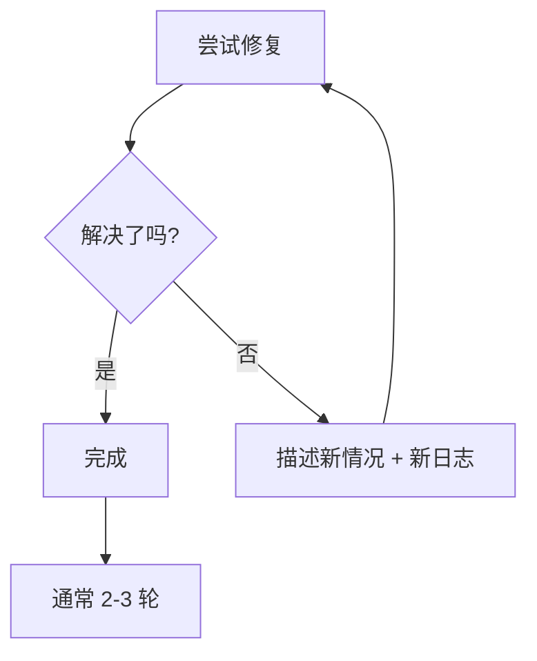
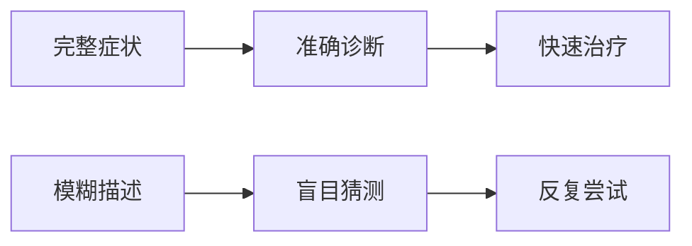

# 2.5 高效调试心法 🟢

> 序言中提到的"调试心法"：提供完整报错日志和循环修复模式。

## 前置知识

::: tip 什么是 调试

调试（Debug）是发现并修复代码错误的过程。
:::

::: tip 什么是 错误日志

错误日志（Error Log）是程序崩溃或异常时输出的详细信息，包含错误类型、位置、堆栈等。
:::

::: tip 什么是 堆栈

堆栈（Stack Trace）是错误发生时的函数调用链，显示错误是从哪一行代码、哪个函数、一层层调用产生的。它能帮你追溯错误的源头。
:::

---

## 调试沟通公式：完整日志 + 操作步骤 + 预期结果

调试时，**如果你不确定问题出在哪里**，你不需要：

- ❌ 分析错误原因
- ❌ 猜测可能的问题
- ❌ 尝试各种修复方法

**你只需要**：

- ✅ 提供完整的错误日志
- ✅ 说明你做了什么操作
- ✅ 告诉 AI 你期望的结果是什么

**AI 会自动**：

- 分析错误类型和根因
- 搜索类似问题和解决方案
- 尝试多种修复方法
- 验证修复是否有效

**关键**：给 AI 足够的上下文，不要让它猜你做了什么。

**示例**：

```bash
# ❌ 不要这样
"报错了，帮我看看"
"代码不工作了"

# ✅ 这样就够了
我运行 pnpm dev 启动项目，终端报错：

[完整错误日志]

我预期的结果是：开发服务器正常启动，能在 localhost:3000 访问
帮我分析并修复这个问题

# 如果第一次没解决
按你的方法改了，现在出现新的错误：

[新错误日志]

请继续分析
```

**循环修复模式**：



---

## 终极大招：让 AI 自己 Build

还有一个更省心的方法：**把整个项目扔给 AI，让它自己跑一遍**。

```bash
# 在 AI 工具中说：
"请帮我运行 pnpm install && pnpm build，如果遇到错误请自行修复，直到构建成功"
```

**为什么有效**：

- AI 能直接看到真实错误，不用你转述
- 小问题（版本冲突、缺失依赖、路径错误）AI 常能自己解决
- 你只看结果，省来回沟通

**适用场景**：

- 接手一个新项目，不知道从哪下手
- 改了半天报错，越改越乱
- CI/CD 挂了，本地又复现不了

**注意**：

- 确保代码已经 git commit，AI 改坏也能回滚
- 第一次 build 可能会多轮修复，耐心等待
- 如果 AI 陷入死循环（来回改同一处），及时打断

---

## 实战案例

### 案例 1：类型错误

**错误日志**：

```
Type error: 'user' is possibly 'undefined'.
  at App (app/page.tsx:15:10)
```

**❌ 错误描述**：

```
"类型错误了，帮我看看"
```

**✅ 正确描述**：

```
TypeScript 报错：

文件: app/page.tsx
行号: 15
错误: 'user' is possibly 'undefined'

代码:
const user = await getUser();
return <div>{user.name}</div>;  // line 15

如何处理可能为 undefined 的情况？
```

**AI 分析**：

```
user 可能为 undefined，需要：
1. 添加类型检查
2. 提供默认值
3. 或使用可选链
```

---

### 案例 2：运行时错误

**错误日志**：

```
Error: connect ECONNREFUSED 127.0.0.1:5432
    at Connection.<anonymous> (node_modules/pg/lib/client.js:89:17)
    at Socket.emit (events.js:315:13)
```

**❌ 错误描述**：

```
"数据库连接失败"
```

**✅ 正确描述**：

```
数据库连接错误：

错误: connect ECONNREFUSED 127.0.0.1:5432

环境：
- 开发环境
- PostgreSQL 应该在本地运行
- .env 中 DATABASE_URL="postgresql://localhost:5432/mydb"

可能的原因：
1. PostgreSQL 没有启动？
2. 端口不对？
3. .env 配置错误？
```

**AI 分析**：

```
ECONNREFUSED 表示服务未运行。
检查：
1. PostgreSQL 是否启动
2. 端口是否正确（默认 5432）
3. 运行命令检查：
   Mac/Linux: brew services list
   Windows: sc query postgresql-x64-[version]
```

---

### 案例 3：构建错误

**错误日志**：

```
✘ [ERROR] Could not resolve "./components/Button"

    app/page.tsx:3:24:
      3 │ import { Button } from "./components/Button";
        ╩                         ~~~~~~~~~~~~~~~~~~~~
    This file does not exist.
```

**❌ 错误描述**：

```
"构建失败了"
```

**✅ 正确描述**：

```
构建错误：

Could not resolve "./components/Button"

文件位置: app/page.tsx:3:24
import { Button } from "./components/Button";

实际情况：
- 项目使用 shadcn/ui
- Button 组件应该在 components/ui/button.tsx

如何修复导入路径？
```

---

## 常见错误模式速查

| 错误类型 | 典型信息 | 解决方向 |
|---------|---------|---------|
| 类型错误 | `Type 'X' is not assignable to type 'Y'` | 检查类型定义，使用类型断言或修改类型 |
| 空值错误 | `Cannot read property 'X' of undefined` | 添加空值检查、可选链、默认值 |
| 导入错误 | `Module not found: Can't resolve 'X'` | 安装依赖、修正路径、检查导出 |
| 网络错误 | `ECONNREFUSED / ENOTFOUND` | 检查服务状态、URL、网络连接 |
| 端口占用 | `Address already in use :3000` | 关闭占用端口的进程或换端口 |
| 权限错误 | `EACCES / Permission denied` | 检查文件权限，使用 sudo 或更改权限 |
| 语法错误 | `Unexpected token / SyntaxError` | 检查语法拼写，注意括号引号匹配 |

---

## 核心理念

**调试是医生诊断的过程**。



**记住**：

1. **完整日志**：不要删减，堆栈信息很重要
2. **操作步骤**：说明你做了什么才触发错误
3. **预期结果**：告诉 AI 你想要什么
4. **循环修复**：不要放弃，通常 2-3 轮解决
5. **反馈结果**：每次修复后告诉 AI 新情况

**调试公式**：

```
完整错误日志
+ 操作步骤（你做了什么）
+ 预期结果（你想要什么）
= 快速解决方案
```

**终极大招公式**：

```
git commit 保存现场
+ 让 AI 自己运行 build
+ 遇到错误让它自己修
= 省心省力
```

---

## 相关内容

- 前置：[2.2 VibeCoding工作流](./02-vibecoding-workflow.md)
