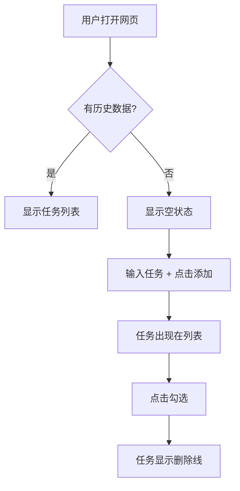

# 3.3 PRD 编写实战 🔴

> **阅读完本节后，你将会收获：**
> - 理解 PRD 的五部分结构及其作用
> - 掌握"初稿-中稿-定稿"迭代原则
> - 学会用 Markdown 和 Mermaid 编写 AI 友好的 PRD
> - 掌握边缘情况处理和范围管理的方法

> 序言中提到的：PRD 是 AI 的执行规范，也是问题定义能力的体现。

---

## PRD 的价值

在 AI 开发中，PRD 的作用与传统开发有所不同。传统开发中，PRD 主要给团队看；在 AI 开发中，PRD 更重要的是给 AI 提供完整的上下文，让它不需要反复猜测意图。

PRD 是"单一事实来源"。当想法在 PRD 中被清晰描述后，AI 的输出会稳定很多，也不会出现需求爆炸的问题。

写 PRD 的过程也是训练问题定义能力的过程。很多人直接让 AI "帮我做个功能"，结果来回修改多次。但先写清楚目标、用户、业务场景和交互逻辑，AI 往往一次就对了。

这种训练的价值超出了单次开发。当你被迫用文字清晰地描述一个需求时，你会发现很多之前模糊的地方。你可能以为自己对产品有一个清晰的愿景，但当真正动笔时，才会意识到很多细节从未被认真思考过。PRD 写作强迫你面对这些空白，要么做出明确的决定，要么承认还需要更多信息。这种思维训练会让你在后续的产品决策中更加敏锐和果断。

---

## PRD 的五部分结构

PRD 分为五个核心部分，对应"初稿-中稿-定稿"的迭代原则：

| 部分 | 对应阶段 | 核心内容 |
|------|---------|---------|
| **第0部分：文档信息** | 始终记录 | 版本、阶段、更新记录 |
| **第一部分：需求背景与目标** | 初稿 | 为什么要做、为谁做、解决什么问题 |
| **第二部分：方案概述** | 中稿 | 业务流程、功能流程、信息架构 |
| **第三部分：细节方案** | 定稿 | 交互说明、边缘情况、非功能需求 |
| **第四部分：上线计划** | 定稿 | 排期、灰度发布 |

**迭代原则**：初稿想清楚"为什么"，中稿想清楚"是什么"，定稿想清楚"怎么做"。每一步都有评审和修改，避免到最后才发现大问题。

这个迭代节奏有其心理学基础。人在面对复杂问题时，往往会陷入"分析瘫痪"——想要一次性想清楚所有细节，结果反而寸步难行。分阶段迭代让你在每个阶段只关注特定的维度。初稿时，你不需要担心技术实现，只需要确认方向正确；中稿时，你不需要纠结按钮的颜色，只需要确认流程合理。这种分层的思考方式，让复杂问题的处理变得可管理。

另一个容易被忽视的好处是，每个版本都是一个"可回退的检查点"。如果在中稿时发现方向有问题，你可以回到初稿重新审视；如果在定稿时发现技术方案不可行，你可以回到中稿调整流程。这种结构化的迭代，让错误可以在早期被发现和纠正，而不是累积到最后爆发。

---

## 第0部分：文档信息

这部分记录文档的版本状态和迭代历史。

### 文档状态

- **当前版本**：如 "v0.5.1" — 0.5是阶段版本，1是该版本的微修订
- **当前阶段**：需求评审 / UI设计中 / 开发中 / 已上线
- **核心干系人**：产品、研发、设计、测试等负责人

版本信息让 AI 知道这是"初稿"还是"定稿"。定稿应该更详细，初稿可以留 TBD（待确定）。

### 更新记录

记录从 v0.1 到 v0.9 的迭代过程：

| 版本号 | 版本状态 | 更新内容 |
|-------|---------|---------|
| v0.1 | 内部评审版 | 初步阐述需求背景、目标和核心价值 |
| v0.5 | 项目评审版 | 补充核心业务流程、功能流程图 |
| v0.9 | 开发前定稿 | 合入UI设计稿，补充边缘情况、埋点方案 |

更新记录让 AI 知道哪些是稳定的、哪些可能还在变化。

---

## 第一部分：需求背景与目标

这是 PRD 的灵魂，对应初稿阶段的核心内容。

### 项目概述

用一两句话概括产品是什么。

| 好的概述 | 差的概述 |
|---------|---------|
| 一个给自己用的极简待办清单网页 | 一个待办清单应用 |

模糊的概述会导致 AI 做出复杂版本。具体的概述能快速设定边界。

概述的撰写是一门压缩的艺术。你需要在极短的篇幅内，传达产品的本质特征。"一个给自己用的极简待办清单网页"这句话包含了多个关键信息："给自己用"说明是个人工具而非团队协作工具；"极简"说明功能有限、界面简洁；"网页"说明技术形态。这些信息共同构成了一个清晰的边界，让 AI 知道什么该做、什么不该做。

### 核心问题

回答三个问题：

1. **目标用户画像**：谁用？（具体特征，不是"所有人"）
2. **用户场景**：什么时间、什么地点、什么情境下用？
3. **核心痛点**：现有方案有什么问题？

| 漏写 | 后果 |
|------|------|
| 没说用户是谁 | 可能做成"所有人都能用"的复杂版 |
| 没说场景 | 可能用不适合的技术（手机端做成桌面版） |
| 没说痛点 | 可能做了"完美"功能，但解决的是伪需求 |

### 用户故事

从用户视角描述需求：

> 作为一名 **[角色]**，我想要 **[完成某项任务]**，以便于 **[实现某个价值]**

这比"我要做一个功能"更贴近用户。用户故事格式强制从用户角度思考，而非从功能角度思考。

用户故事的价值在于它建立了一个"共情框架"。当你写下"作为一名销售经理，我想要快速生成周报，以便于节省周五下午的时间"时，你被迫想象一个具体的人，在具体的场景中，面对具体的困扰。这种想象让你脱离技术实现的角度，从用户的真实处境出发去思考解决方案。很多时候，我们以为用户需要的是某个功能，但实际上他们需要的是功能背后的价值。用户故事帮助你发现这种真正的需求。

### 需求范围管理

明确"做哪些"和"不做哪些"。

**In-Scope（范围内）**：明确要做的功能点

**Out-of-Scope（范围外）**：明确**不做**哪些

范围管理应该在 [3.2 与 AI 确认需求](./02-discuss-with-ai.md) 时完成。这里只是把讨论结果记录下来。

| 不写 Out-of-Scope | 写了 Out-of-Scope |
|-------------------|-------------------|
| AI 可能自动加上"常见功能" | AI 明确知道边界 |
| 范围不断蔓延 | 保持产品聚焦 |

### 需求列表与优先级

将宏观需求拆解为具体需求点，并标注优先级：

| 需求ID | 模块 | 描述 | 优先级 | 状态 |
|--------|------|------|--------|------|
| R001 | 添加任务 | 用户可以添加待办任务 | 高 | 规划中 |
| R002 | 删除任务 | 用户可以删除任务 | 高 | 规划中 |
| R003 | 历史记录 | 查看历史任务 | 低 | V2.0考虑 |

优先级让 AI 知道哪些是核心（P0）、哪些可以延后。

---

## 第二部分：方案概述

对应中稿阶段，用可视化方式展示产品全貌。

### 核心业务流程图

用 Mermaid 描述用户完成核心任务的完整流程。



| 只有文字 | 有流程图 |
|---------|---------|
| AI 可能理解错步骤顺序 | AI 一眼看懂流程 |
| 可能有歧义 | 可视化无歧义 |

流程图让 AI 准确理解业务逻辑，减少误解。

流程图的另一个价值在于它暴露了你思维中的盲点。当你试图用图形描述一个流程时，那些"显然"的步骤会变得具体而可见。你可能会发现，自己从未认真思考过"如果用户没有登录怎么办"，或者"数据加载失败时页面应该显示什么"。流程图强迫你考虑每一个分支、每一个决策点，这种结构化的审视往往能够发现文字描述中遗漏的重要细节。

### 信息架构

列出产品的页面结构和层级关系：

- **首页**
  - 导航栏
  - 任务列表
- **设置页**
  - 主题设置
  - 数据管理

信息架构让 AI 理解产品有哪些页面、它们如何组织。

---

## 第三部分：细节方案

对应定稿阶段，是最详尽的部分，是 AI 写代码的直接依据。

### 页面原型与交互说明

描述每个页面的完整交互流程：

1. **初始状态**：页面刚加载时是什么样
2. **触发操作**：用户做什么
3. **成功状态**：成功后显示什么
4. **失败状态**：失败后显示什么
5. **空状态**：没有数据时显示什么

| 只写"用户可以添加任务" | 写完整交互逻辑 |
|----------------------|-------------|
| AI 不知道加在哪、怎么显示 | AI 知道输入框位置、按钮样式、列表如何更新 |

### 边缘情况处理

这是新手最容易漏掉的部分。

边缘情况的遗漏往往不是因为粗心，而是因为"正常路径偏差"。当我们想象用户使用产品的场景时，大脑会自动填充最理想的流程：用户打开应用，完成操作，满意离开。但真实的用户体验充满了意外——网络波动、手滑误触、突然来电。这些异常情况不是"例外"，而是用户体验的常态组成部分。一个只处理正常情况的系统，在真实环境中会表现得非常脆弱。

| 边缘情况 | 不写会怎样 |
|----------|-----------|
| 用户快速点击按钮两次 | 可能重复提交 |
| 网络出错时 | 用户不知道发生了什么 |
| 数据为空时 | 可能显示空白或报错 |
| 用户中途退出 | 可能数据丢失 |

常见的边缘情况处理：

- 用户快速点击"添加"按钮 → 做防抖处理，0.5秒内只响应一次
- 网络请求失败 → 显示 Toast 提示："网络错误，请重试"
- 任务列表为空 → 显示空状态插图："暂无任务，添加一个吧"

### 非功能性需求

| 需求类型 | 为什么重要 |
|---------|-----------|
| 性能 | 不写 → AI 可能做很重，加载很慢 |
| 兼容性 | 不写 → 可能只支持 Chrome，Safari 用户无法使用 |
| 数据埋点 | 不写 → 上线后无法追踪使用情况 |

---

## 第四部分：上线计划

定义需求的生命周期。

### 上线排期

| 阶段 | 日期 |
|------|------|
| 需求评审 | YYYY-MM-DD |
| UI/UX设计 | YYYY-MM-DD ~ YYYY-MM-DD |
| 研发阶段 | YYYY-MM-DD ~ YYYY-MM-DD |
| 预计上线 | YYYY-MM-DD |

上线排期让 AI 知道项目时间线，合理规划开发顺序。

---

## Markdown 与 Mermaid

PRD 应该使用 Markdown 编写，并用 Mermaid 绘制流程图。

**Markdown 的优势**：
- 格式统一，易于版本管理
- AI 对 Markdown 理解最好
- 支持代码块、表格、列表等丰富格式

**Mermaid 的优势**：
- 文本即图表，修改方便
- AI 能准确理解流程图
- 支持流程图、时序图、状态图等多种图表

告诉 AI "用 Mermaid 画个流程图"即可，不需要记忆语法。

---

## 让 AI 生成 PRD

在 3.2 确认 AI 理解正确后，让它基于模板生成 PRD：

> 请基于我们的讨论，用 PRD 模板生成文档。如果某个字段我们没讨论过，请标注 TBD（待确定）。

生成后的职责：

1. **检查 AI 生成的 PRD** — 确认每个字段基于讨论，不是 AI 猜的
2. **补充 TBD 字段** — 对于"待确定"的部分，补充细节或明确"不需要"
3. **纠正误解** — 发现与讨论不一致的地方，立即纠正

---

## 好 PRD vs 坏 PRD

### 坏 PRD

```markdown
# 待办清单

做一个待办清单功能，用户可以添加任务、勾选完成。
```

**问题**：
- 没说用户是谁 → 可能做成团队版
- 没说核心功能 → 可能加一堆不需要的功能
- 没说 Out-of-Scope → 可能加登录、云同步
- 没说边缘情况 → 快速点击会重复提交
- 没有流程图 → AI 可能理解错业务逻辑

### 好 PRD

```markdown
# 极简待办清单

## 1.1 项目概述
一个给自己用的极简待办清单网页，只有添加和勾选功能。

## 1.2 核心问题
- **目标用户**：我自己（职场人士，每天处理 5-10 个任务）
- **用户场景**：早上打开电脑，快速看今天要做什么
- **核心痛点**：便签纸容易丢，手机备忘录打开麻烦

## 1.5 需求范围
**In-Scope**: 添加任务、查看列表、勾选完成、删除任务
**Out-of-Scope**: 登录注册、云同步、分类标签

## 2.1 核心业务流程
[Mermaid 流程图]

## 3.1 边缘情况处理
- 快速点击"添加" → 0.5秒防抖
- 列表为空 → 显示"暂无任务"
- 刷新页面 → 数据不丢失（localStorage）
```

---

## 常见问题

### Q1: PRD 要写多详细？

**A**: 初稿可以简略，中稿要有流程图，定稿要包含边缘情况。原则是：AI 读了之后，不需要再问"这个按钮放哪"、"失败时怎么处理"这类问题。

### Q2: 可以边开发边写 PRD 吗？

**A**: 不推荐。PRD 是想法的体现，开发前写 PRD 是为了想清楚。边开发边写，很容易出现"写着写着发现不对"，返工成本更高。

### Q3: PRD 写好后就不能改了吗？

**A**: 不是。PRD 应该随需求变化而更新。每次重大变更都要更新版本号和更新记录。

### Q4: 小项目也需要写 PRD 吗？

**A**: 需要。小项目可以写得简单，但结构应该完整。简单项目的 PRD 可能只有几百字，但仍然包含五部分。

---

## 本节核心要点

- ✅ PRD 有五大部分，对应"初稿-中稿-定稿"迭代原则
- ✅ **核心业务流程图**让 AI 准确理解业务逻辑
- ✅ **边缘情况处理**是新手最容易漏掉的
- ✅ **Out-of-Scope**防止 AI 自由发挥
- ✅ 检查 AI 生成的 PRD，确保基于讨论而非猜测
- ✅ 让 AI 把没讨论过的标注 TBD，而非盲目猜测

PRD 写好后，接下来理解 AI 如何执行它。

---

## 相关内容

- 前置：[3.2 与 AI 确认需求](./02-discuss-with-ai.md)
- 详见：[3.4 从 PRD 到代码](./04-coding-agents.md)
