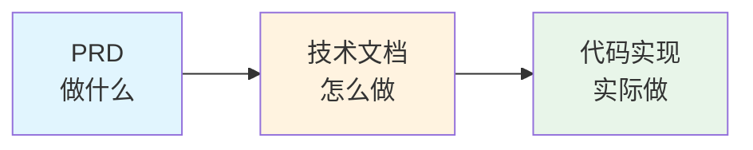
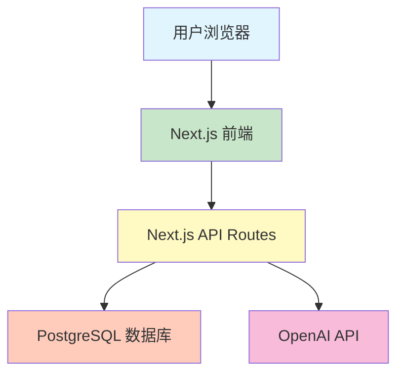
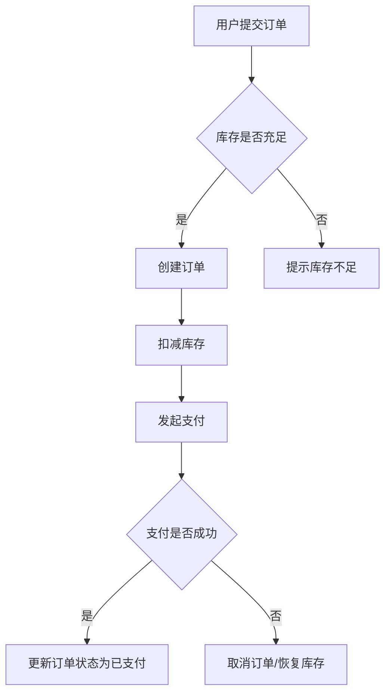

# 4.2 从 PRD 到技术文档 🟢

> **阅读完本节后，你将会收获：**
> - 理解 PRD 与技术文档的明确分工
> - 掌握技术文档的五大组成部分
> - 学会将技术决策记录为文档
> - 理解文档在 AI 开发中的价值

> 在 PRD 迭代到 5 稿、产品方案基本确定后，除了梳理业务逻辑，还需要记录具体的技术实现方案，也就是技术文档。

---

## 引言

PRD 回答了"做什么"，但代码不会直接从 PRD 中生长出来。在动手写代码之前，你需要一份**技术文档**——它是 PRD 到代码的桥梁，是 AI 理解你系统结构的"说明书"。

一份完整的技术文档能让 AI 知道：
- 系统有哪些数据，它们之间什么关系
- 前后端通过哪些接口通信
- 系统由哪些组件构成，业务流程怎么走
- 依赖哪些外部服务

没有这些上下文，AI 只能凭空猜测，生成的代码往往与预期不符。

---

## PRD 与技术文档的分工

两者分工明确：PRD 回答"做什么"，技术文档回答"怎么做"。

### PRD（产品需求文档）

| 内容 | 说明 |
|------|------|
| 目标用户 | 谁会使用这个产品 |
| 核心功能 | 产品需要实现哪些功能 |
| 用户交互 | 用户如何完成操作 |
| 边缘场景 | 异常情况如何处理 |
| 业务流程 | 完整的用户操作流程 |

### 技术文档

| 内容 | 说明 |
|------|------|
| 数据模型 | 有哪些表、字段、关系 |
| API 设计 | 接口列表和职责分工 |
| 架构/流程图 | 系统组件关系和业务流程 |
| 第三方集成 | 外部服务和接入方式 |
| 技术决策 | 选型理由和关键权衡 |

### 两者的关系



PRD 中的每个业务实体，都应该在数据模型中找到对应；PRD 中的每个功能点，都应该在 API 设计中找到对应接口。这种对应关系是检验技术文档完整性的标准。

---

## 技术文档的五大组成部分

技术文档不是模板填空，而是思考过程的记录。下面五个组成部分覆盖了从数据到接口、从架构到依赖的完整技术视角。它们相互配合，构成 AI 理解系统的上下文基础。

### 1. 数据模型

数据模型是 PRD 业务概念的技术映射。它描述系统存储哪些数据、数据的结构、以及数据之间的关系。

**为什么需要：**
- 它是 AI 生成数据库代码的基础上下文
- 它是前后端对接的数据契约
- 它决定了系统的扩展性

**需要记录：**
- 有哪些表（对应 PRD 中的业务实体）
- 每个表的字段（对应实体的属性）
- 表之间的关系（一对多、多对多）

**示例：**

```markdown
## 数据模型

### 用户表（users）
- id: 主键
- email: 邮箱（唯一）
- name: 昵称
- created_at: 创建时间

### 文章表（posts）
- id: 主键
- title: 标题
- content: 内容
- author_id: 作者ID（外键，关联 users）
- created_at: 创建时间

关系：一个用户可以有多篇文章（一对多）
```

::: tip ORM Schema 即文档

使用 Drizzle 等 ORM 时，Schema 定义文件本身就是数据模型文档。它能直观展示表结构、字段类型和表关系，AI 也能准确理解。

具体的数据库设计和实现，参见第八章。

:::

### 2. API 设计

API 设计定义系统对外提供的接口，是前后端协作的契约。

**为什么需要：**
- 它是前后端分工的边界
- 它是 AI 生成接口代码的依据
- 清晰的 API 定义能减少沟通成本

**需要记录：**
- 接口路径和 HTTP 方法
- 接口职责（做什么）
- 请求参数和返回值（简要说明）

**示例：**

```markdown
## API 设计

### 文章相关
- GET /api/posts - 获取文章列表
- GET /api/posts/:id - 获取单篇文章
- POST /api/posts - 创建文章（需登录）
- PATCH /api/posts/:id - 更新文章（需本人）
- DELETE /api/posts/:id - 删除文章（需本人）

### 评论相关
- GET /api/posts/:id/comments - 获取文章评论
- POST /api/posts/:id/comments - 发表评论（需登录）
```

::: tip 后续学习

HTTP 协议细节、RESTful 规范、状态码含义等内容，在 4.4 API 与 HTTP 基础中详细讲解。

:::

### 3. 架构/流程图

架构图展示系统组件关系，流程图展示业务逻辑的流转。

**为什么需要：**
- 让 AI 快速理解系统整体结构
- 帮助团队成员建立共同认知
- 发现设计中的遗漏或矛盾

**架构图示例：**



**流程图示例（用户下单流程）：**



::: tip 后续学习

前后端分离架构、全栈框架的工作原理，在 4.5 前后端分离概念中详细讲解。

:::

### 4. 第三方集成

记录系统依赖的外部服务和接入方式。

**为什么需要：**
- 外部服务是系统能力的延伸
- 需要记录关键配置和限制（如限流）
- 便于排查集成问题

**需要记录：**
- 使用了哪些外部服务
- 用来做什么
- 关键配置项（环境变量名）
- 限流、超时等限制

**示例：**

```markdown
## 第三方集成

### OpenAI API
- 用途：AI 对话功能
- 环境变量：OPENAI_API_KEY
- 限制：每分钟 60 次请求

### 高德地图
- 用途：地理位置展示
- 环境变量：AMAP_KEY
```

::: tip 后续学习

API 集成的具体步骤、错误处理、安全实践，在 4.6 API 集成实战中详细讲解。

:::

### 5. 技术决策记录

记录关键的技术选型和决策理由。

**为什么需要：**
- 避免日后反复讨论同一问题
- 帮助新成员理解系统为何如此设计
- 为后续重构或扩展提供背景

**需要记录：**
- 技术栈选择（与 4.1 技术栈决策框架衔接）
- 关键权衡（如 Supabase vs Neon）
- 放弃的方案及原因

**示例：**

```markdown
## 技术决策

### 技术栈：Next.js + PostgreSQL
- 决策理由：全栈框架开发效率高，AI 对 Next.js 理解最好
- 备选方案：Vite + Express（放弃原因：需要维护两个项目）

### 数据库托管：Neon
- 决策理由：轻量、无服务器架构、与 Drizzle 配合好
- 备选方案：Supabase（放弃原因：暂时不需要 Auth 等附加功能）
```

---

## AI 时代的文档价值

在 AI 辅助开发的时代，技术文档的价值被放大了。过去，文档主要是给人看的——帮助团队成员理解系统，或是给自己留备忘。现在，它还多了一个重要读者：AI。

AI 需要上下文才能准确工作。当你告诉它"帮我写一个用户登录功能"时，如果没有文档说明用户表有哪些字段、登录接口的返回格式，AI 只能凭空猜测。猜测意味着试错，试错意味着时间浪费。

一份清晰的技术文档，相当于给 AI 提供了一份"系统说明书"。它知道数据结构，就能生成符合你架构的代码；它知道 API 规范，就能写出前后端能对接的接口。文档越清晰，AI 的猜测越少，开发效率越高。

::: tip 文档是 AI 的上下文

技术文档提供了结构化的上下文，让 AI 知道"用什么技术"、"数据结构是什么"、"接口怎么定义"。没有文档，AI 只能从代码中反推，效率更低，错误更多。

:::

---

## 文档与代码同步

技术文档写完了，但工作还没结束。文档最大的敌人是过时——今天写的规范，下周代码变了，文档就成了"历史档案"。保持文档与代码同步，是技术文档发挥价值的前提。

保持同步的诀窍是"变更即更新"：每次修改代码时，问自己这个改动是否影响了文档中的描述？如果是，立即更新。这种习惯一旦养成，维护文档的成本远低于处理文档不一致带来的问题。

文档与代码脱节的后果：
- 新成员根据文档理解架构，却发现代码结构完全不同
- AI 依据过时的 API 设计生成代码，导致集成失败
- 几个月后回顾项目，被自己的文档搞得困惑

**建议做法：**
1. 先写文档后写代码 — 文档是思考的过程
2. 变更即更新 — 代码改动后同步更新文档
3. 定期审查 — 检查文档是否与实际代码一致

---

## 简化实践：最小可行文档

对于个人或小团队，不必拘泥于形式，可以将 PRD 和技术文档合并为**项目文档**。但需要清楚区分哪些是产品层面的思考，哪些是技术层面的决策。

**无论项目大小，以下五大组成部分不可省略：**

| 组成部分 | 为什么不可省略 |
|----------|---------------|
| 数据模型 | AI 需要知道存什么数据 |
| API 设计 | 前后端需要知道怎么通信 |
| 架构/流程图 | AI 需要理解系统结构和业务逻辑 |
| 第三方集成 | AI 需要知道外部依赖和配置 |
| 技术决策 | AI 需要理解选型理由，避免偏离方向 |

**可以简化的：**
- 详细程度：小项目可以用表格代替大段文字
- 文档形式：可以用注释、README 代替独立文档
- 图表工具：可以用文字描述代替复杂图表

**简单的组织方式：**

```markdown
# 项目文档

## 1. 产品部分
### 1.1 需求背景
### 1.2 核心功能
### 1.3 用户故事

## 2. 技术部分
### 2.1 技术栈
### 2.2 数据模型
### 2.3 API 设计
### 2.4 架构图
### 2.5 第三方集成
### 2.6 部署方案
```

---

## 常见问题

### Q1: 文档要写到多详细？

以"能让 AI 理解"为标准。数据模型要明确表和字段，API 要列出接口和职责，架构图要展示组件关系。具体实现细节（如 Drizzle 语法、HTTP 状态码）不需要在 4.2 展开，后续章节会讲。

### Q2: 可以让 AI 生成技术文档吗？

可以。在 PRD 确定后，让 AI 根据需求生成技术方案框架，然后人工审核和补充。技术决策部分需要你亲自确认，因为涉及业务理解和权衡。

### Q3: 代码变了，文档忘了更新怎么办？

养成变更即更新的习惯。或者让 AI 帮忙：告诉它"我改了数据模型，帮我更新技术文档"。

### Q4: 架构图和流程图必须用专业工具画吗？

不需要。用文字描述、ASCII 图、或简单的 Mermaid 语法都可以。关键是把系统结构和业务流程表达清楚。

---

## 本节核心要点

- ✅ PRD 回答"做什么"，技术文档回答"怎么做"
- ✅ 技术文档五大组成部分：数据模型、API 设计、架构/流程图、第三方集成、技术决策
- ✅ 五大组成部分不可省略，但可以简化详细程度
- ✅ 保持文档与代码同步，避免"过时地图"
- ✅ 文档是 AI 的重要上下文来源
- ✅ 具体实现细节参见后续章节

理解了技术文档的作用和组成，接下来了解编程的基本构件。

---

## 相关内容

- 前置：[3.3 PRD 编写实战](../03-prd-doc-driven/03-prd-template-guide.md)
- 前置：[4.1 技术栈决策框架](./01-tech-stack-decision.md)
- 详见：[4.3 如何读懂 AI 生成的代码](./03-programming-basics.md)
- 详见：[4.4 API 与 HTTP 基础](./04-api-and-http.md)
- 详见：[4.5 前后端分离概念](./05-frontend-backend-separation.md)
- 详见：[4.6 配置文件格式](./06-config-formats.md)
- 详见：[4.7 API 集成实战](./07-api-integration.md)
