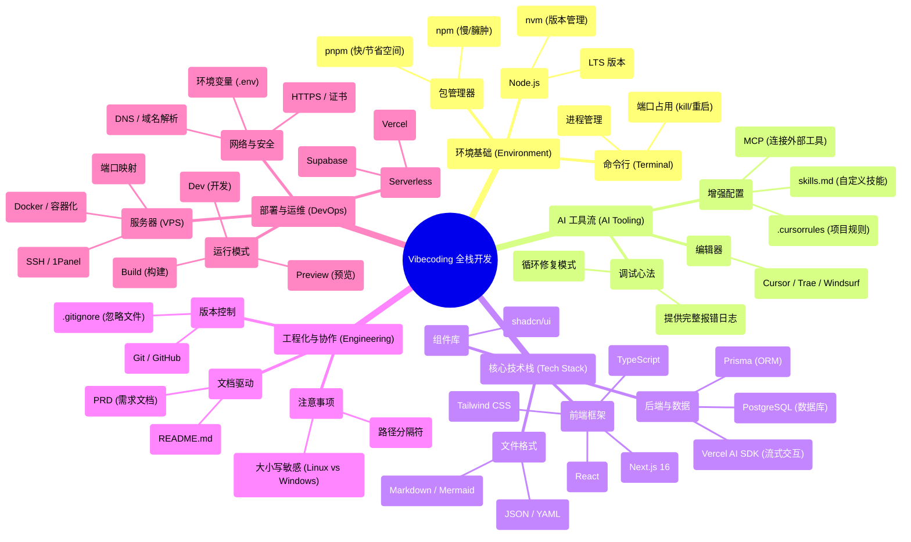

# 进阶篇：从想法到产品的100小时

如果你翻开这本进阶教程的目录，会看到满眼的技术名词：环境搭建、包管理器、数据库、部署……

这看起来很像传统编程教育的内容列表。但我想先告诉你：**这些不是重点，只是工具。**

在过去十年里，编程教育似乎陷入了一个巨大的误区：一上来就教你语法、数据结构、算法，好像掌握了这些就能做产品。看起来没错。但实际上，从"会写代码"到"能做产品"，中间隔着巨大的鸿沟。

更麻烦的是，很多人以为做软件就是写代码。但事实恰恰相反——**代码从来不是软件的出发点，而是解决方案的最后一个环节。**

你看，任何一个软件项目，都始于一个**问题**。

它可以是一个商业问题：一家餐厅每天高峰期排队两小时，老板想减少顾客的等待时间。

它可以是一个科学问题：一个实验室每天产生海量的实验数据，研究人员想自动分析出趋势。

它可以是一个个人问题：你想记录自己读过的每一本书，整理出每本书带给你的启发。

它甚至可以是一个虚构的问题：你就是想练习某项技术，于是给自己编了一个需求。

为了解决这个问题，你需要先形成一个**解决方案**。

这个方案包含很多维度：需要设计什么流程、制定什么规则、分配什么角色、怎么协调各方。这些才是项目的核心。

只有当方案中某些部分需要自动化、规模化、或者超越人力极限时，你才会想到：**"这部分可以用软件来实现"**。

这时候，代码才开始登场。

所以，**写代码是在相当中后期的阶段才需要做的事情。**

---

## 鸿沟正在消失

但时代的钟摆已经摆动到了新的位置。

在 AI 编程工具出现之前，从"想法"到"产品"之间，横亘着一道名为"实现能力"的巨大鸿沟。

你有想法，但你不会写代码。或者你会写一点，但写出来的代码质量不够高，跑不起来，跑起来也到处是 bug。

或者你有钱能雇人开发，但沟通成本高得离谱，做出来的东西总差点意思。

或者你咬牙自己做，花了几个月时间，最后发现产品根本不是用户想要的。

于是，想法就止步于想法。

我见过太多这样的人：他们有敏锐的商业嗅觉，有丰富的行业经验，有对用户需求的深刻理解。但就是因为他们不会写代码，他们的想法永远停留在笔记本上，停留在酒桌上的聊天里，停留在深夜的辗转反侧中。

这道鸿沟，挡住了多少可能改变世界的产品。

现在，这道鸿沟正在被填平。

这就像摄影技术的发展史。

以前你想拍一张像样的照片，需要懂什么？光圈、快门、对焦、ISO、白平衡……你得把这一堆复杂原理搞明白，还得买一堆昂贵的设备。大多数人光是想想就放弃了。

现在呢？手机相机自动帮你处理了所有技术细节。你只需要关注两件事：你想拍什么，怎么拍才好看。

AI 编程工具也是如此。

它们帮你处理了代码细节，你只需要关注产品本身——**你想解决什么问题，如何解决。**

这并不意味着你可以完全不懂技术。你仍然需要理解技术的原理和边界，就像你用手机拍照也需要知道"光线太暗会拍糊"。

但你不需要死记硬背每一行代码的写法，就像你不需要知道手机相机的底层算法。

**门槛降低了，但天花板还在那里，甚至更高了。**

而且还有一个更重要的变化正在发生。

过去我们总觉得：得先有大模型，再做应用。大模型公司在前面探路，我们跟着就好。

但你现在去各行各业看看，**AI 的爆发场景，恰恰不是在大模型公司，而是在那些离真实问题最近的地方**。

这对你意味着什么？意味着你不必等待 AI 公司推出什么新功能。你只需要理解你身边的那个问题，然后用现有的 AI 工具去解决它。在这个过程中，你对 AI 的理解会自然生长。

---

## 谁是老师

这还有一个更深层的变化正在发生。

在人类漫长历史中，经验与智慧总是随着年龄增长而积累——长辈教导晚辈，师父传授徒弟，这是数千年来不变的规律。

但这背后有一个前提：世界变化足够慢，过去的经验足以应对未来的挑战。

当技术迭代的速度超过了人类积累经验的速度，这个前提就崩塌了。

你有没有见过这样的场景：

一个刚刚入门的年轻人，可能比他精通技术的老师更懂如何调试服务器；一个刚开始学编程的学生，可能比他钻研了十年的前辈更敏锐地发现 AI 工具的价值；一个刚入行的运营，可能比她的资深同事更快地用 AI 工具把工作自动化。

这不是年龄的错，而是时代加速度的必然结果。

当"经验"还没来得及沉淀为"智慧"，技术就已经翻新了好几轮。

于是我们看到一种悄然发生的角色互换：不再是父辈单向传授知识，而是年轻一代成为向导。

这不是对传统的否定。恰恰相反，这是对"谁在前面探路"这一问题的重新回答。

在这个时代，最先拥抱新技术的人，就天然拥有了带领他人穿越迷雾的责任。

这不取决于资历、学历或职位，只取决于你是否敢于在别人观望时先迈出那一步。

**当世界变化太快，最危险的不是走错路，而是站在原地不动。**

---

## 另一条路

在这本进阶教程里，你不会看到"从语法开始学编程"的传统路径。

相反，你会看到一条实干家的路径：

从一个问题开始，形成一个解决方案，然后用 AI 工具把这个方案变成产品。

我用一种复盘笔记的方式，把每一章的序言写出来——它不是百科式的知识点堆砌，而是把当时的决策、踩坑、纠结、取舍都写清楚，让你先获得一条能走通的路径与核心理念。

这不是一本教你"怎么做"的手册，而是一本告诉你"我是怎么走过来的"的笔记。

---

### 一个人就是一支队伍

为了让你理解我们即将学到的这套路径的独特之处，有必要先看看现代软件开发的传统流程是怎样的。

**在大型互联网公司，一个看似简单的功能上线，背后是一套完整而复杂的流程：**

首先是**需求阶段**：产品经理撰写需求文档，组织需求评审会，PM、开发、测试一起围坐在会议室里讨论半天。

然后是**技术设计阶段**：后端和前端分别撰写技术方案，再组织技术评审会，甚至上下游团队的开发也要参与进来。

接下来是**开发阶段**：编码、单元测试、接口自测、前后端联调。每个人对着自己的屏幕敲代码，然后再凑到一起对接口。

然后是**测试阶段**：开发者自测通过后，"提测"交给 QA 团队，QA 进行手动测试和自动化测试，发现 Bug 再打回给开发修复。一来一回，几天就过去了。

再然后是**上线阶段**：代码合并、预发环境验证、灰度发布——先给 5% 用户，再 10%、50%，最后 100% 全量。每一步都小心翼翼，生怕出什么问题。

最后是**迭代阶段**：以两周为一个迭代周期，持续规划和交付新功能。整个流程像一台精密的机器，周而复始地运转。

这套流程的好处是什么？规范、可控、风险低。

但问题也很明显：慢、重、门槛高。

一个功能从提出到上线，往往需要几周甚至几个月。而且每个环节都需要专人负责——产品经理、后端开发、前端开发、测试工程师……

对于个人或小团队来说，这套流程几乎是难以复制的。你哪来那么多人？哪来那么多时间？

---

**而在 AI 时代，这套流程被压缩和重构了：**

**需求阶段**：你自己就是产品经理，写 PRD 让 AI 理解。你不需要掌握专业的产品术语，你只需要把你想做的事情说清楚。

**技术设计阶段**：AI 帮你生成技术方案，你只需要审核和调整。就像有一个经验丰富的架构师坐在你旁边，随时给你提建议。

**开发阶段**：AI 帮你写代码，你只需要描述需求、检查结果。你不需要背诵每一个 API 的用法，不需要记得每一个框架的细节。

**测试阶段**：AI 帮你写测试用例，自动化执行。你不再需要花大量时间写重复的测试代码，也不担心漏掉什么边界情况。

**上线阶段**：一键部署到云平台，自动完成构建和发布。你不需要自己配置服务器，不需要自己搭建 CI/CD 流水线。

**迭代阶段**：根据数据和反馈快速调整，以天甚至小时为单位迭代。你想改一个功能，几分钟就能看到效果。

你看，从几周到几分钟，从数十人到一个人。这不是夸张，而是正在发生的现实。

注意，这并不意味着流程消失了。

而是很多环节被 AI 自动化了，或者说一个人可以兼任多个角色。

你不需要写每一行代码，但你仍然需要理解每个环节在做什么，为什么这么做，出了问题怎么排查。

**这就是本教程要教你的：不是取代流程，而是掌握流程的核心，用 AI 提升效率。**

---

### 100 小时走完全程

本篇以「从零基础到上线的避坑指南」为主线，带你用一条完整的产品交付流程串起全栈开发：

**第一步：技术选型与环境准备**（第 1-2 章）

先搭台子，再唱戏。选择合适的技术栈，配置开发环境，掌握与 AI 协作的基本方法。没有这些基础，后面的想法再好也落不了地。

**第二步：问题定义与方案设计**（第 3 章）

写 PRD，明确要解决什么问题、如何解决。这一步很多人会跳过，觉得直接开始写代码更痛快。但相信我，把问题想清楚，后面会省下无数时间。

你可能注意到：**实际项目流程是"先想清楚问题，再选技术"，但教程顺序是反的。**

这是有意为之。PRD 里会出现 Next.js、Prisma、数据库这些技术名词，如果你连这些是什么都不知道，文档就看不下去。所以先让你把环境搭起来、工具用顺手，对技术有个基本感觉，再来学习如何规范地写 PRD。

**第三步：产品实现**（第 4-8 章）

UI/UX 设计让产品好看好用，数据存储让信息持久化，安全机制保护用户隐私，自动化测试保证质量。每一步都有具体的工具和方法。

**第四步：发布与迭代**（第 9-16 章）

从本地到公网，让世界看到你的产品；从个人到团队，学会协作和分享；从上线到持续改进，让产品在反馈中进化。

在这条路径的终点，等待你的不是"成为程序员"，而是"成为一个能用产品解决问题的人"。**代码是手段，不是目的**——你的目标是解决问题、创造价值，而代码只是帮你实现这个目标的工具之一。

---

## 停下来想，不如跑起来做

在这个充满了不确定性与加速度的时代，过度思考往往是行动的敌人。

你有没有过这样的经历：

你想做一个产品，但总觉得自己的准备还不够充分。你想学一个技术，但总觉得要先看完所有的教程。你想解决一个问题，但总觉得可能有更好的方案。

于是你在原地踏步，看着别人已经跑远了。

不要等到想法完美无缺才开始做产品，不要等到看清了终局才开始起跑。

因为在真实世界里，从来没有什么完美的开局。

那些你羡慕的成功产品，很多都是从简陋的 MVP 开始的。那些你佩服的创业者，很多都是在摸索中不断调整方向的。

**在这个时代，想，都是问题；做，才是答案。**

---

## 你需要做什么

说到这里，你可能会问：如果 AI 能做这么多事，那我还需要做什么？

这是个好问题。

AI 确实替代了我们。但它替代掉的部分，恰恰是我们原来不愿意干、干不动、甚至压根就不该人干的部分。

那些繁琐的、重复的、高危的、枯燥的工作，AI 拿走了。

而它留给我们的，或者说它逼着我们去做的，是去开拓新的可能，是去干那些只有人才能干好的事。

把这个关系想清楚，你就知道该怎么跟 AI 共处了：

**把重复琐碎交给 AI，把判断创造留给自己。**

**把苦活累活交给 AI，把品味思考留给自己。**

**把机械执行交给 AI，把灵感创意留给自己。**

AI 能帮你生成代码，但它不能帮你决定要做什么产品。

AI 能帮你写测试用例，但它不能帮你理解用户真正的需求。

AI 能帮你优化性能，但它不能帮你发现那个值得解决的问题。

**那些需要判断、品味、连接、创造的工作，永远是人的领地。**

---

## 开始之前

所以，使用这本教程的正确姿势是：

不要把它当成一本教科书，从头到尾啃完。

把它当成一个地图，一个向导，一个随时可以求助的朋友。

当你遇到具体问题时，翻开对应的章节，看看我是怎么走过来的。当你陷入困惑时，读读那些序言，看看当时的心路历程。当你不知道下一步该做什么时，对照着章节总览，找一个方向先动起来。

**学习不是背诵，而是模仿。**

**成长不是等待，而是行动。**

100 小时后，你会惊讶于自己能做成什么。

不，可能用不了 100 小时。

**慢慢来，会很快。**

这不是终点，而是起点。

本教程不是让你读完之后成为全栈工程师，而是让你在读的过程中，开始做一个能解决问题的人。

**不要被"可能出错"的想象吓住，而要被"可能做成"的愿景驱动。** 你要做的，是看见那个能解决问题的产品，然后动身去实现它。

让我们一起，进化。

Eyre

2026 年 1 月 1 日

::: tip 旧版进阶

如果你更想先阅读偏知识地图/知识陈列的旧版内容：前往 [进阶版（旧）](/Advanced-old/)。
:::

::: info 教程进度说明
部分章节正文/图片待补充，内容可能随迭代调整。就像写代码一样——先搭框架，再打磨细节。敬请期待正式版发布，感谢你的耐心！
:::

---

## 章节总览

| 章节 | 主题 | 状态 |
|---|---|---|
| 1 | [环境搭建](/Advanced/01-environment-setup/) | ✅ 序言可阅读 |
| 2 | [AI怎么用](/Advanced/02-ai-tuning-guide/) | ✅ 序言可阅读 |
| 3 | [从需求到文档](/Advanced/03-prd-doc-driven/) | ✅ 序言可阅读 |
| 4 | [必须知道的开发知识](/Advanced/04-dev-fundamentals/) | ✅ 序言可阅读 |
| 5 | [好看好用的界面](/Advanced/05-ui-ux/) | ✅ 序言可阅读 |
| 6 | [数据存在哪里](/Advanced/06-data-persistence-database/) | ✅ 序言可阅读 |
| 7 | [连接前后端](/Advanced/07-backend-api/) | ✅ 序言可阅读 |
| 8 | [谁能访问我的数据](/Advanced/08-auth-security/) | ✅ 序言可阅读 |
| 9 | [功能测试](/Advanced/09-testing-automation/) | ✅ 序言可阅读 |
| 10 | [公网访问](/Advanced/10-localhost-public-access/) | ✅ 序言可阅读 |
| 11 | [协作开发](/Advanced/11-git-collaboration/) | ✅ 序言可阅读 |
| 12 | [无服务器自动部署](/Advanced/12-serverless-deploy-cicd/) | ✅ 序言可阅读 |
| 13 | [域名解析与接入](/Advanced/13-domain-dns/) | ✅ 序言可阅读 |
| 14 | [部署到服务器](/Advanced/14-vps-ops-deploy/) | ✅ 序言可阅读 |
| 15 | [SEO、分享与数据统计](/Advanced/15-seo-analytics/) | ✅ 序言可阅读 |
| 16 | [用户反馈与产品迭代](/Advanced/16-user-feedback-iteration/) | ✅ 序言可阅读 |

---

## 知识点概览

---

::: info 教程进度说明
部分章节正文/图片待补充，内容可能随迭代调整。就像写代码一样——先搭骨架，再打磨细节。我们会持续提升品质，感谢你的耐心！
:::

