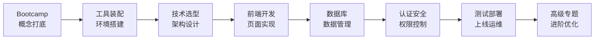

# 下部预告：Vibe Coding 全栈实战教程

你已经学会了 Vibe Coding 的基础心法。

但故事还没有结束。

## 从"能做出来"到"做得专业"

基础版教会你"从0到1"。

进阶版将带你"从1到100"。

**你将学到的不再只是"怎么用 AI 写代码"，而是"怎么用 AI 构建真实的产品"。**

## 进阶版核心内容预览

进阶版包含 **Bootcamp（第0章）+ 12 个核心章节**，覆盖全栈开发的完整生命周期：

### 各章节详解

| 章节 | 主题 | 你将学到 |
|:----:|:-----|:---------|
| **0** | Bootcamp 概念打底 | 计算机基础、命令行、前端三件套、开发环境配置、Docker 入门 |
| **1** | 概念与准备 | 工具装配、Vibe Coding 心法进阶、第一次部署、AI 协作工作流 |
| **2** | 技术选型与架构 | Next.js + TypeScript + Prisma 全景、渲染策略、分层架构 |
| **3** | 前端开发 | React 组件、状态管理、路由系统、UI 组件库实战 |
| **4** | 数据库与数据 | PostgreSQL、Prisma ORM、数据建模、CRUD 操作 |
| **5** | 产品与文档 | PRD 进阶、技术文档、API 文档自动生成 |
| **6** | 认证与安全 | 用户认证、权限管理、安全最佳实践 |
| **7** | API 设计规范 | RESTful 设计、数据校验、错误处理 |
| **8** | 项目规则与协作 | Git 工作流、代码规范、团队协作 |
| **9** | 测试与质量 | 单元测试、集成测试、E2E 测试 |
| **10** | 部署与运维 | Vercel 部署、Docker 容器化、CI/CD 流水线 |
| **11** | 发布与复盘 | 版本管理、用户反馈、迭代优化 |
| **12** | 高级专题 | SEO 优化、性能调优、AI SDK 集成、实时通信 |

## 核心技术栈

进阶版将使用这套 **2025 年主流全栈技术栈**：

| 层级 | 技术选型 | 为什么选它 |
|:----:|:---------|:-----------|
| **框架** | Next.js 16+ (App Router) | 全栈能力、极致性能、AI 友好 |
| **语言** | TypeScript | 类型安全、减少 Bug、AI 生成代码更可靠 |
| **数据库** | PostgreSQL + Prisma | 类型安全 ORM、强大生态 |
| **样式** | Tailwind CSS + shadcn/ui | 原子化 CSS、开箱即用组件 |
| **部署** | Vercel / Docker | 零配置部署 / 自主可控 |

::: tip 💡 为什么是这套技术栈？
这套技术栈有几个特点：
1. **AI 擅长** —— 大模型对这些技术的理解最深，生成的代码质量最高
2. **社区活跃** —— 遇到问题容易找到答案
3. **文档完善** —— 学习曲线相对平缓
4. **工业级** —— 可以用于生产环境，不是"玩具"
:::

## 进阶版适合谁？

进阶版适合**已完成基础版**，并且：

- [x] 能独立用 AI 工具做出简单项目
- [x] 理解 MVP、Prompt、用户旅程等核心概念
- [x] 想做更复杂、更专业的产品
- [x] 有耐心学习更系统的技术知识
- [x] 愿意投入更多时间深入学习

## 预计学习时长

| 学习目标 | 预计时长 | 适合人群 |
|:--------|:---------|:---------|
| 快速过一遍 | 2-3 周 | 有编程基础，想了解全栈流程 |
| 系统学习 | 4-6 周 | 想扎实掌握，边学边做项目 |
| 深入实践 | 8-12 周 | 想做出可发布的完整产品 |

::: info 📖 学习建议
进阶版内容较多，不建议一口气学完。

推荐的节奏是：
1. 每周学习 1-2 个章节
2. 每个章节都跟着动手实践
3. 遇到问题先问 AI，再查文档
4. 定期回顾，巩固知识

**记住：做出来比学完更重要。**
:::

## 从基础到进阶的知识桥梁

下面这张表展示了基础版和进阶版的知识衔接：

| 领域 | 基础版（已掌握） | 进阶版（将深入） |
|:-----|:----------------|:----------------|
| **思维方法** | MVP、灵魂三问、用户旅程 | PRD 进阶、技术文档、架构设计 |
| **工具使用** | Bolt.new / Claude / Cursor 基础 | IDE 深度配置、AI 协作工作流优化 |
| **前端** | 简单 HTML/CSS/JS | React、Next.js、组件化开发 |
| **数据存储** | LocalStorage | PostgreSQL、Prisma、数据建模 |
| **部署** | Vercel 一键部署 | Docker 容器化、CI/CD 流水线 |
| **安全** | 基本安全意识 | 认证系统、权限管理、安全审计 |
| **质量保证** | AI 帮你 Debug | 自动化测试、代码审查 |

## 准备好了吗？

进阶之路不会轻松。

但你已经证明了自己：

- 你学完了基础版
- 你做出了自己的项目
- 你克服了"我不会编程"的心理障碍

**这些，都是最难的部分。**

接下来的路，只是把你已经掌握的能力，用到更大的舞台上。

原进阶草稿已下线，后续会推出实战流进阶版：从一个项目的完整周期带大家开发，并在这个过程中随时补充需要的知识点，敬请期待。

进阶入口保留在这里：[进阶篇](/Advanced/)。

**我们在那里见。** 🚀
